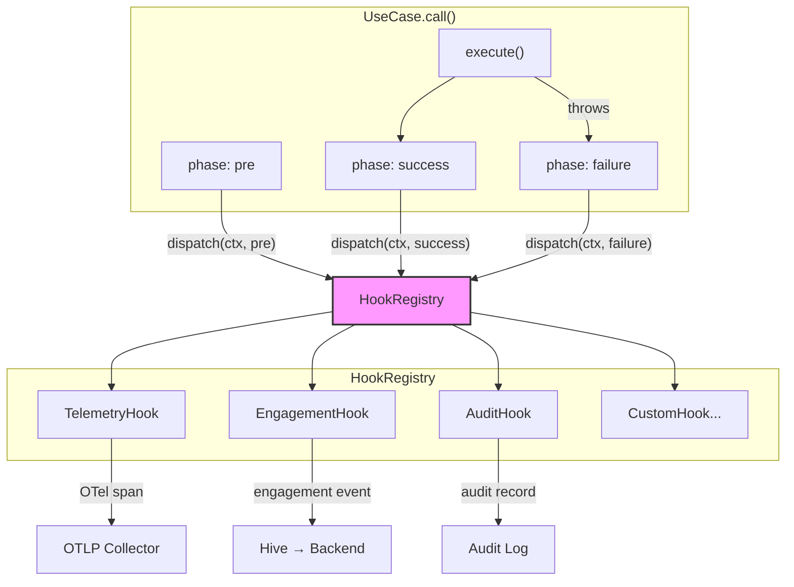
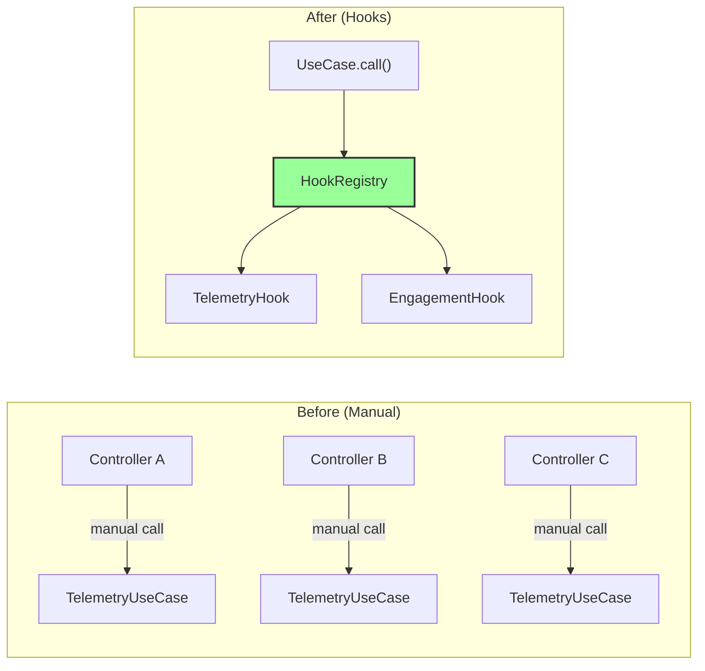
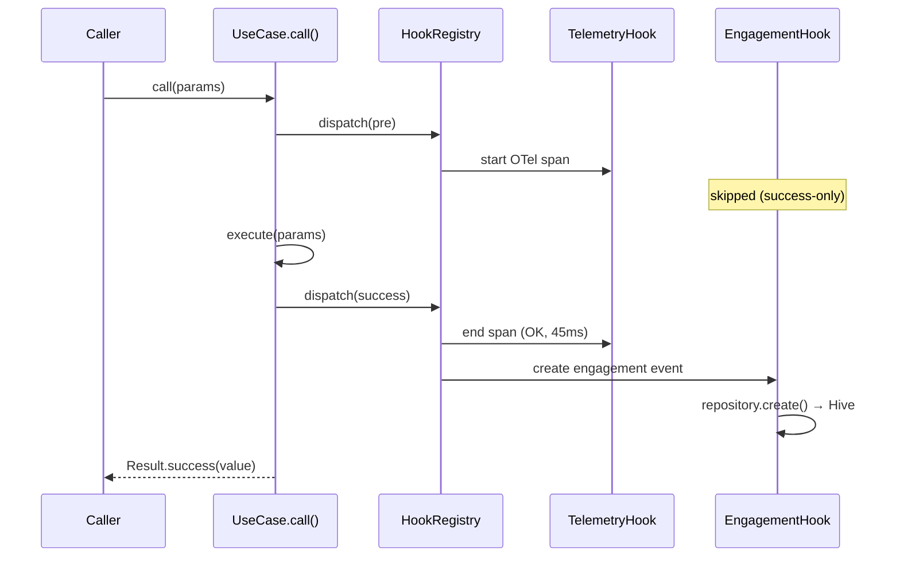
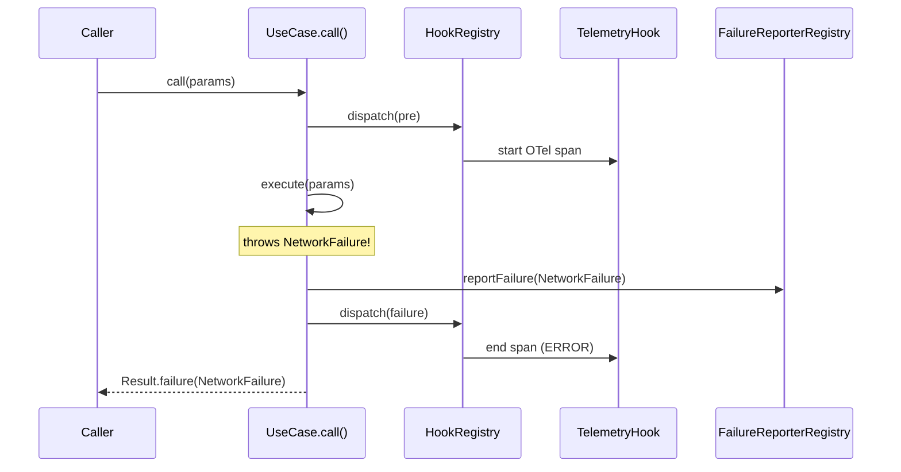
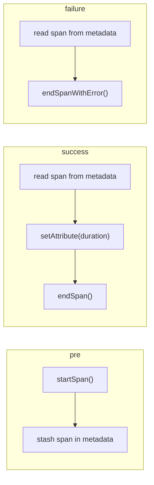
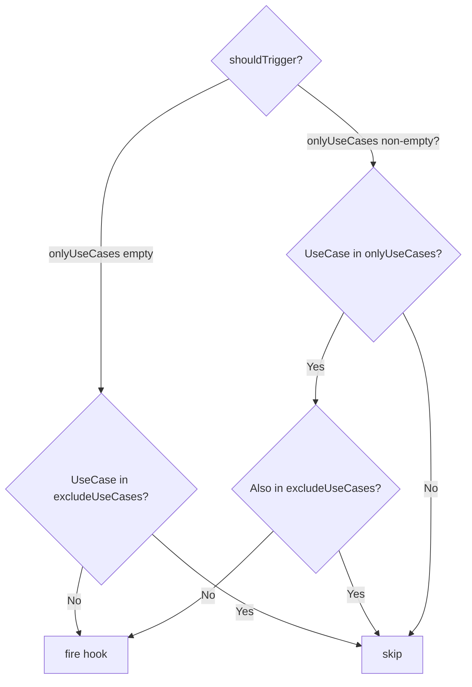
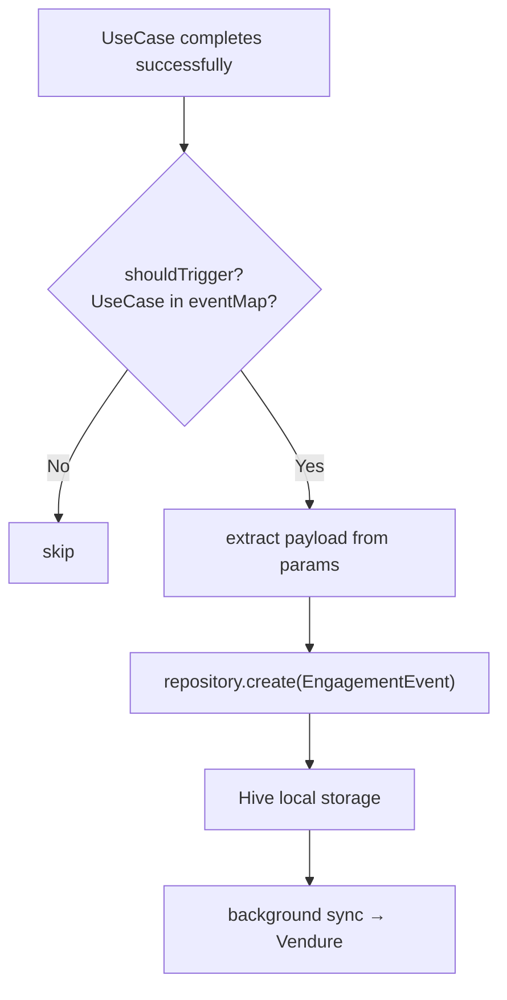
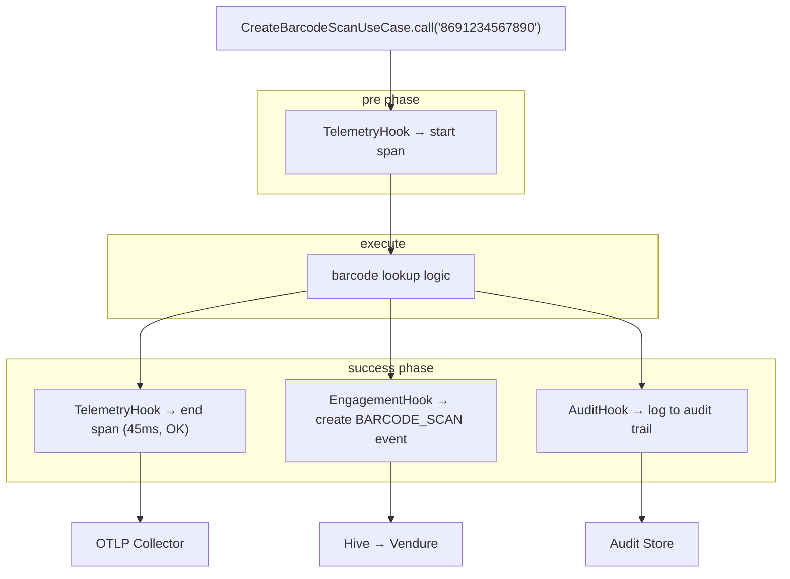
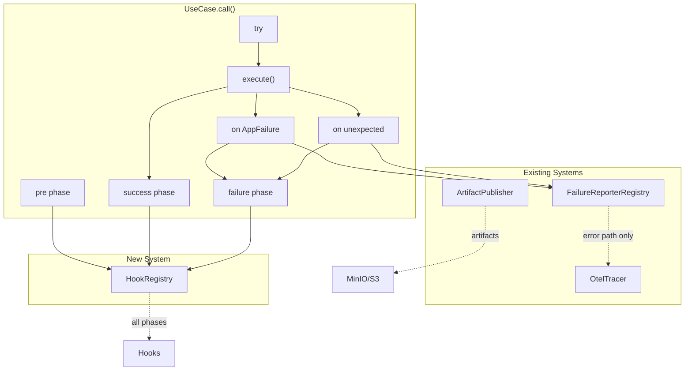

# UseCase Hook System

Intercept any UseCase execution at pre/success/failure phases for telemetry, engagement tracking, audit logging, and more — with zero controller-level boilerplate.

## Overview

The Hook System is Zuraffa's framework-level interception mechanism for `UseCase.call()`. It allows you to register hooks that fire automatically when any UseCase executes, without modifying controllers or adding manual tracking calls.

Every `UseCase.call()` and `StreamUseCase.call()` dispatches to all registered hooks at three phases: **before execution**, **on success**, and **on failure**. Hooks filter which phases and which UseCases they care about.

This replaces the common anti-pattern of manually calling telemetry/analytics UseCases from every controller. Instead, you register one hook in `main()` and it fires automatically.

## Architecture



### Existing vs New



## Key Concepts

- **Hook**: A class that extends `Hook` and implements `execute()`. Each hook declares which phases it fires on and which UseCases it cares about.
- **HookPhase**: `pre` (before `execute()`), `success` (after successful `execute()`), `failure` (after `execute()` throws).
- **HookContext**: Immutable context passed to every hook. Contains UseCase name, params, result/failure, duration, trace IDs, and a shared metadata bag.
- **HookRegistry**: Global singleton. All hooks register here. Dispatches to all matching hooks in priority order.
- **Fire-and-forget**: Hook errors are caught and logged. They never block the UseCase or propagate to the caller.

## How It Works

### Dispatch Flow



### Failure Flow



## Core Types

### HookContext

```dart
/// Immutable context passed to every hook during UseCase execution.
class HookContext {
  /// Runtime type of the UseCase (e.g. 'GetDealListUseCase').
  final String useCaseName;

  /// The input parameters passed to the UseCase.
  final Object? params;

  /// The successful result (only set in `success` phase).
  final Object? result;

  /// The failure (only set in `failure` phase).
  final AppFailure? failure;

  /// Execution duration (null in `pre` phase).
  final Duration? duration;

  /// When the UseCase was invoked.
  final DateTime timestamp;

  /// W3C trace ID from the active OTel span (if configured).
  final String? traceId;

  /// Arbitrary metadata — hooks can write in `pre`, read in `success`/`failure`.
  final Map<String, dynamic> metadata;

  /// Convenience: get params cast to expected type.
  P paramsAs<P>() => params as P;

  /// Convenience: get result cast to expected type.
  R resultAs<R>() => result as R;
}
```

The `metadata` map is shared across all phases of a single UseCase invocation. A hook can stash a value in `pre` and read it back in `success` or `failure`. This is how `TelemetryHook` passes the OTel span from `pre` to `success`/`failure`.

### HookPhase

```dart
enum HookPhase {
  pre,       // Before execute() is called
  success,   // After execute() completed successfully
  failure,   // After execute() threw an AppFailure
}
```

### Hook

```dart
abstract class Hook {
  /// Unique identifier for this hook.
  String get id;

  /// Priority order for execution (lower runs first).
  int get priority => 0;

  /// Which phases this hook should fire on.
  /// Default: all three phases.
  Set<HookPhase> get phases => const {
    HookPhase.pre,
    HookPhase.success,
    HookPhase.failure,
  };

  /// Whether this hook should fire for the given context + phase.
  ///
  /// Override to filter by UseCase name, params type, duration, etc.
  /// This is checked before [execute] is called.
  ///
  /// Common filtering patterns:
  /// - **Whitelist**: only fire for specific UseCases
  /// - **Blacklist**: fire for all except excluded ones
  /// - **Phase-based**: only fire on certain phases (also see [phases])
  /// - **Result-based**: only fire if result meets certain criteria
  bool shouldTrigger(HookContext context, HookPhase phase) => true;

  /// The hook's execution logic. Must be resilient (never throw).
  Future<void> execute(HookContext context, HookPhase phase);
}
```

### HookRegistry

```dart
class HookRegistry {
  static final HookRegistry instance = HookRegistry._();

  void register(Hook hook);
  void unregister(String id);
  void clear();

  bool get isEnabled;
  set isEnabled(bool value);

  List<Hook> get hooks;  // sorted by priority

  void dispatch(HookContext context, HookPhase phase);
}
```

## Built-in Hook: TelemetryHook

Ships with Zuraffa. Auto-wraps every UseCase in an OpenTelemetry span.



### What It Records

| Attribute             | Value                               |
| --------------------- | ----------------------------------- |
| Span name             | `usecase.{UseCaseName}`             |
| `usecase.name`        | Runtime type of the UseCase         |
| `usecase.phase`       | `started`, `success`, or `failure`  |
| `usecase.duration_ms` | Execution time (on success/failure) |
| Error (on failure)    | Failure type, message, stack trace  |

### Usage

```dart
void main() async {
  // 1. Set up OTel backend
  await Zuraffa.enableOtelReporting(
    collectorEndpoint: Uri.parse('https://otel.example.com/v1/traces'),
    serviceName: 'my_app',
  );

  // 2. Register telemetry hook — that's it
  Zuraffa.registerHook(TelemetryHook());

  runApp(MyApp());
}
```

### Filtering Which UseCases to Trace

`TelemetryHook` supports two complementary filters:

- **`onlyUseCases`** (whitelist): If non-empty, the hook fires **only** for UseCases in this set. All others are skipped.
- **`excludeUseCases`** (blacklist): The hook fires on all UseCases **except** those in this set.

If both are provided, `excludeUseCases` wins — a UseCase in both sets is excluded.



**Default behavior** (no filters): traces ALL UseCases.

```dart
// Trace everything (default)
Zuraffa.registerHook(TelemetryHook());
```

**Whitelist mode** — trace only specific UseCases:

```dart
Zuraffa.registerHook(TelemetryHook(
  onlyUseCases: {
    'GetDealListUseCase',
    'CreateBarcodeScanUseCase',
    'AskBeautyQuestionUseCase',
  },
));
```

**Blacklist mode** — trace everything except noisy ones:

```dart
Zuraffa.registerHook(TelemetryHook(
  excludeUseCases: {
    'WatchConnectivityUseCase',
    'GetCacheUseCase',
    'PollServerUseCase',
  },
));
```

**Both combined** — trace a subset, minus one exception:

```dart
Zuraffa.registerHook(TelemetryHook(
  onlyUseCases: {
    'GetDealListUseCase',
    'CreateBarcodeScanUseCase',
    'AskBeautyQuestionUseCase',
    'SyncEngagementEventsUseCase',  // normally traced...
  },
  excludeUseCases: {
    'SyncEngagementEventsUseCase',  // ...but not the sync itself
  },
));
```

## App-Specific Hook Example: EngagementHook

A real-world hook from ZikZak that tracks user engagement events (barcode scans, deal likes, searches, etc.).



### Implementation

```dart
class EngagementHook extends Hook {
  EngagementHook(this._repository);

  final EngagementEventRepository _repository;

  static const _eventMap = <String, EngagementEventType>{
    'CreateBarcodeScanUseCase':         EngagementEventType.barcodeScan,
    'AskBeautyQuestionUseCase':         EngagementEventType.askZikzak,
    'CreateTrackedSearchQueryUseCase':  EngagementEventType.searchTerm,
    'EngageDealUseCase':                EngagementEventType.dealLike,
    'ShareDealUseCase':                 EngagementEventType.dealShare,
    'ShareListingUseCase':              EngagementEventType.listingShare,
    'VisitListingLinkUseCase':          EngagementEventType.visitLink,
    'ShareProductLinkUseCase':          EngagementEventType.linkShare,
  };

  @override
  String get id => 'zikzak-engagement';

  @override
  Set<HookPhase> get phases => const {HookPhase.success};

  @override
  bool shouldTrigger(HookContext context, HookPhase phase) =>
      _eventMap.containsKey(context.useCaseName);

  @override
  Future<void> execute(HookContext context, HookPhase phase) async {
    final eventType = _eventMap[context.useCaseName]!;
    final payload = _extractPayload(context);

    await _repository.create(
      EngagementEvent(
        id: '',
        createdAt: DateTime.now(),
        eventType: eventType,
        payload: payload,
        isSynced: false,
      ),
    );
  }

  String? _extractPayload(HookContext context) {
    return switch (context.useCaseName) {
      'CreateBarcodeScanUseCase' => context.paramsAs<String?>(),
      'AskBeautyQuestionUseCase' => context.paramsAs<String?>(),
      'CreateTrackedSearchQueryUseCase' => context.params as String?,
      _ => null,
    };
  }
}
```

### Registration

```dart
void main() async {
  await Zuraffa.enableOtelReporting(...);
  Zuraffa.registerHook(TelemetryHook());
  Zuraffa.registerHook(EngagementHook(getIt<EngagementEventRepository>()));
  runApp(MyApp());
}
```

## Multiple Hooks Coexisting



Each hook is independent. They don't know about each other. Adding a new hook requires zero changes to existing hooks.

## Separation of Concerns

| Aspect                | TelemetryHook                   | EngagementHook                    |
| --------------------- | ------------------------------- | --------------------------------- |
| **Question answered** | How is my app performing?       | What is my user doing?            |
| **Lives in**          | Zuraffa (framework)             | ZikZak (app)                      |
| **Phases**            | pre, success, failure           | success only                      |
| **Fires on**          | All UseCases (minus excludes)   | Specific mapped UseCases          |
| **Side effect**       | OTel span → collector           | EngagementEvent → Hive → sync     |
| **Data**              | Timing, failure type, trace IDs | Event type, payload, demographics |
| **Consumer**          | DevOps / SRE / Jaeger           | Marketing / Analytics / Backend   |
| **Failure behavior**  | Records the error               | Ignores it (not an engagement)    |

## Zuraffa Facade API

```dart
// Generic hook registration
Zuraffa.registerHook(MyHook());

// Unregister by ID
Zuraffa.unregisterHook('my-hook');

// Global enable/disable (GDPR compliance, debug mode)
Zuraffa.hooksEnabled = false;
```

## Integration with Existing Systems

The Hook System sits alongside Zuraffa's existing interception mechanisms:



| System                      | Phase Coverage        | Purpose                                                 |
| --------------------------- | --------------------- | ------------------------------------------------------- |
| **FailureReporterRegistry** | Failure only          | Batch error reporting to OTel/Sentry                    |
| **ArtifactPublisher**       | On-demand             | Upload artifacts (HTML, images) to MinIO                |
| **OtelTracer**              | Manual                | Explicit span wrapping (now automated by TelemetryHook) |
| **HookRegistry**            | pre, success, failure | Generic interception for any purpose                    |

## Performance Considerations

### Dispatch Overhead

When no hooks are registered, `HookRegistry.dispatch()` returns immediately (one `isEmpty` check). When hooks are registered, each dispatch does:

1. Filter by phase (set membership check)
2. Filter by `shouldTrigger()` (custom logic)
3. Call `execute()` on matching hooks (fire-and-forget)

For a UseCase with 2 registered hooks where only 1 matches:

- 2 phase checks (set lookups)
- 2 `shouldTrigger()` calls
- 1 `execute()` call (async, non-blocking)

This is negligible compared to the actual UseCase execution time.

### Global Kill Switch

```dart
// Disable all hooks instantly (no unregister needed)
Zuraffa.hooksEnabled = false;

// Useful for:
// - GDPR compliance (user opts out of analytics)
// - Debug mode (remove hook noise from logs)
// - Performance profiling (isolate UseCase execution time)
```

## Extension Ideas

The generic `Hook` base enables future hooks without framework changes:

| Hook              | Phases       | Purpose                                                  |
| ----------------- | ------------ | -------------------------------------------------------- |
| `FeatureFlagHook` | pre          | Check remote config before execution, abort if disabled  |
| `CacheHook`       | pre, success | Read from cache before execute, write result to cache    |
| `RateLimitHook`   | pre          | Enforce rate limits on specific UseCases                 |
| `AuditLogHook`    | success      | Record state-changing operations to an audit trail       |
| `RetryHook`       | failure      | Automatically retry idempotent UseCases with backoff     |
| `AnalyticsHook`   | success      | Send events to Firebase Analytics / Amplitude / Mixpanel |

All share the same `HookRegistry`, same `UseCase.call()` dispatch, same `HookContext`. The framework only knows about `Hook` — everything else is convention.

## Troubleshooting

### Hook Not Firing

**Symptom**: Registered a hook but it never executes.
**Cause**: Usually a `shouldTrigger()` or `phases` mismatch.
**Solution**: Check that your hook's `phases` set includes the phase you expect, and that `shouldTrigger()` returns `true` for your UseCase. The UseCase name in `HookContext.useCaseName` is the runtime type string (e.g. `'GetDealListUseCase'`).

### Hook Error Silently Swallowed

**Symptom**: Hook throws an exception but nothing happens.
**Cause**: By design — hook errors are caught and logged to prevent cascading failures.
**Solution**: Check the `HookRegistry` logger output (`Logger('HookRegistry')`). The warning includes the hook ID, phase, and error.

### Infinite Recursion

**Symptom**: Stack overflow when a hook calls a UseCase.
**Cause**: Hook calls a UseCase via `.call()`, which triggers hooks again.
**Solution**: Hooks should call repositories/datasources directly, not UseCases via `.call()`. If a UseCase must be called, use `.execute()` (bypasses `.call()` and hook dispatch). But the preferred pattern is repository-direct, as shown in the `EngagementHook` example.

## Related Documentation

- [ADR-006: UseCase Hook System](../adr/006-usecase-hook-system.md) — Architecture decision record
- [Plugin API Reference](../PLUGIN_API_REFERENCE.md) — Code generation plugin system (different from runtime hooks)
- [Failure Reporting](../BREAKING_CHANGES.md) — Existing error reporting pipeline
- Zuraffa source: `lib/src/domain/usecase.dart` — Integration point
- Zuraffa source: `lib/src/core/otel_tracer.dart` — OTel integration used by TelemetryHook

---

_Last updated: 2026-06-28_
_Session: Hook system proposal for framework-level telemetry and engagement tracking_
