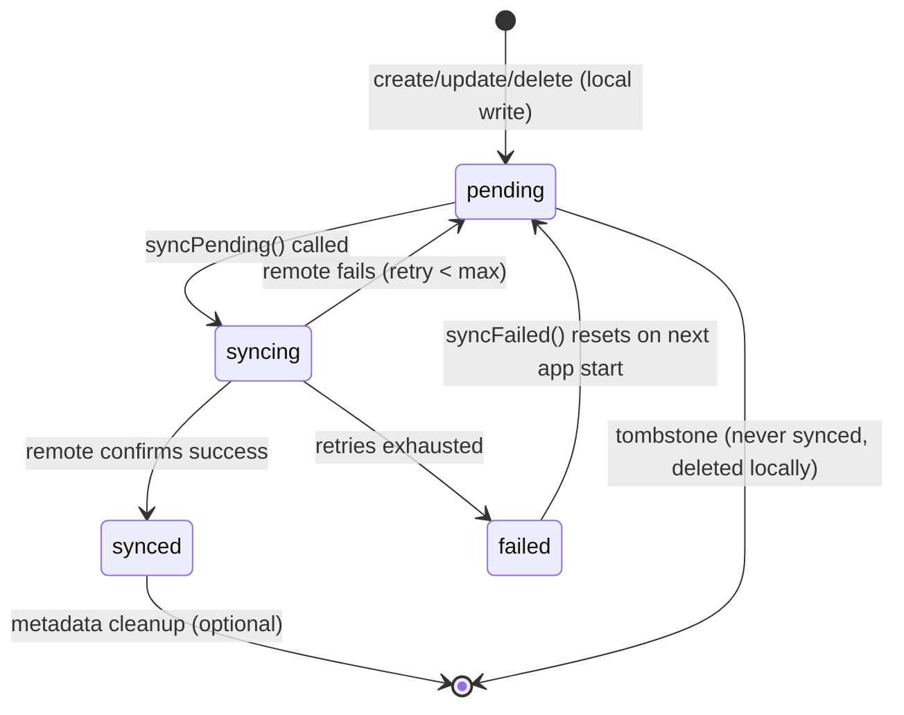
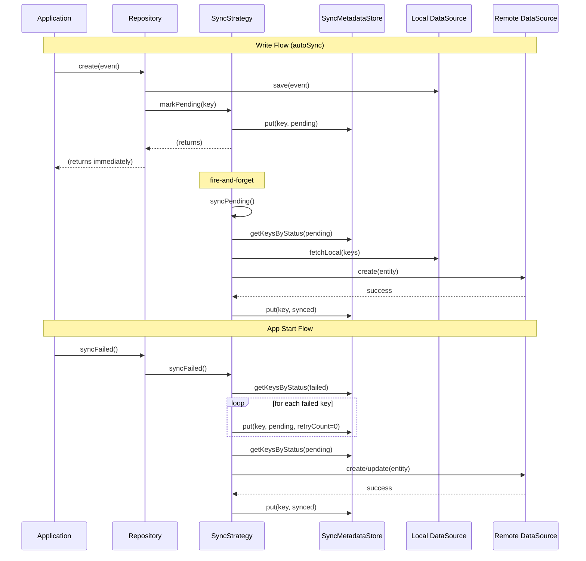

# Offline-First Sync Plugin

The Zuraffa sync plugin adds **local-first (offline-first) persistence** to generated Clean Architecture repositories. It is the architectural inverse of the existing cache plugin: where `--cache` treats remote as the source of truth and local as a temporary cache, `--sync` treats **local as the source of truth** with background synchronization to remote.

## Architecture

### Plugin Structure

The sync plugin follows the exact same structure as `CachePlugin`:

```
lib/src/plugins/sync/
├── sync_plugin.dart                    # Plugin class (mirrors cache_plugin.dart)
├── builders/
│   ├── sync_builder.dart              # File generator (mirrors cache_builder.dart)
│   ├── sync_metadata_store.dart       # Hive-backed metadata persistence
│   ├── push_only_sync_strategy.dart   # Default push-only strategy
│   └── bidirectional_sync_strategy.dart # Extended strategy with pull support
├── capabilities/
│   └── create_sync_capability.dart    # Capability for enabling sync
└── generators/
    └── sync_repository_generator.dart # Sync-aware repository method bodies
```

### Core Domain Types (lib/src/core/)

```mermaid
classDiagram
    class SyncStatus {
        <<enum>>
        pending
        syncing
        synced
        failed
    }
    class SyncOperation {
        <<enum>>
        create
        update
        delete
    }
    class SyncDirection {
        <<enum>>
        push
        bidirectional
    }
    class SyncMetadata {
        +SyncStatus status
        +int retryCount
        +DateTime? lastAttemptAt
        +String? lastError
        +DateTime? deletedAt
        +SyncOperation operation
        +bool isTombstone
    }
    class SyncConfig {
        +int batchSize
        +int maxRetries
        +int backoffBaseMs
        +int backoffMaxMs
        +bool autoSync
        +SyncDirection direction
        +int backoffDelayFor(int retryCount)
    }
    class SyncStrategy~T~ {
        <<abstract>>
        +syncPending({CancelToken?})
        +syncFailed({CancelToken?})
        +pullRemote({CancelToken?})
        +getPendingCount()
        +getSyncStatus(String key)
        +markPending(String key, {SyncOperation})
        +markDeleted(String key)
    }
    class PushOnlySyncStrategy~T~ {
        +_fetchLocal
        +_createRemote
        +_updateRemote
        +_deleteRemote
        +_keyResolver
        +_metadataStore
        +_config
    }
    class BidirectionalSyncStrategy~T~ {
        +pullRemote()
    }
    class SyncMetadataStore {
        +Box~SyncMetadata~ _box
        +get(String key)
        +put(String key, SyncMetadata)
        +remove(String key)
        +getKeysByStatus(SyncStatus)
        +countByStatus(SyncStatus)
    }

    SyncStrategy~T~ <|-- PushOnlySyncStrategy~T~
    PushOnlySyncStrategy~T~ <|-- BidirectionalSyncStrategy~T~
    SyncStrategy~T~ --> SyncMetadata : uses >
    SyncStrategy~T~ --> SyncConfig : configures >
    SyncMetadata --> SyncStatus
    SyncMetadata --> SyncOperation
    SyncConfig --> SyncDirection
    PushOnlySyncStrategy~T~ --> SyncMetadataStore : manages >
```

### SyncStatus State Machine



## How It Works

### Sync-Enabled Repository

When `--sync` is passed to `zfa make`, the repository generator creates a repository with **local-first** data flow:

```mermaid
flowchart LR
    subgraph "Write Path (create/update/delete)"
        A[Repository Method] --> B[Write to Local DataSource]
        B --> C[markPending/markDeleted in MetadataStore]
        C --> D[Return instantly to caller]
        C --> E{autoSync?}
        E -->|Yes| F[Fire syncPending (unawaited)]
        E -->|No| G[Done]
    end

    subgraph "Read Path (get/getList)"
        H[Repository Method] --> I[Read from Local DataSource]
        I --> J[Return instantly]
    end

    subgraph "Sync Path (background)"
        F --> K[Process pending records in batches]
        K --> L[Push to remote with retry/backoff]
        L --> M[Mark as synced on success]
        L --> N[Handle failures]
        N --> O[Retry with backoff or mark failed]
    end
```

### Repository Constructor (Generated)

```dart
class DataProductRepository
    with Loggable, FailureHandler
    implements ProductRepository {
  DataProductRepository(
    this._localDataSource,      // Hive-backed local storage
    this._remoteDataSource,     // Remote API (e.g. Vendure GraphQL)
    this._syncMetadataStore,    // Separate Hive box for sync status
    this._syncStrategy,         // Swappable sync behavior strategy
  );
}
```

### Generated Method Patterns

| Method | Behavior | Network? |
|--------|----------|----------|
| `create(entity)` | Write to local + mark pending | ❌ Instant |
| `update(params)` | Write to local + mark pending | ❌ Instant |
| `delete(params)` | Hard-delete from local + tombstone | ❌ Instant |
| `get(params)` | Read from local only | ❌ Instant |
| `getList(params)` | Read from local only | ❌ Instant |
| `syncPending()` | Delegate to SyncStrategy.syncPending() | ✅ Background |
| `syncFailed()` | Reset failed → pending + retry | ✅ Background |
| `pullRemote()` | Delegate to SyncStrategy.pullRemote() | ✅ Background |

## Sync Strategy Architecture

### Dual Sync Mode

The sync plugin has **two distinct sync methods** for different use cases:

#### `syncPending()` — Fast, lightweight

- Processes only `SyncStatus.pending` records
- These are fresh, never-failed records
- Used by `autoSync` after each local write (fire-and-forget)
- Returns quickly when nothing is pending

#### `syncFailed()` — Retry recovery

- Resets `SyncStatus.failed` records to `pending` with fresh `retryCount=0`
- Then processes them through the same pipeline
- Used on app start / explicit retry
- Only invoked when needed (not on every write)



### Callback-Based Design

`PushOnlySyncStrategy` lives in the Zuraffa framework and cannot know about specific entity types or datasource interfaces. It accepts **callback functions** that generated or manual code wires up:

```dart
PushOnlySyncStrategy<EngagementEvent>(
  fetchLocal: (keys) async {
    // Fetch entities from local Hive box by their IDs
    final all = await localDataSource.getList(ListQueryParams());
    return all.where((e) => keys.contains(e.id)).toList();
  },
  createRemote: (entity) => remoteDataSource.create(entity),
  updateRemote: (entity) => remoteDataSource.update(entity),
  deleteRemote: (key) async { /* remote cleanup */ },
  keyResolver: (entity) => entity.id,
  metadataStore: metadataStore,
  config: config,
);
```

### Retry & Backoff Strategy

```mermaid
flowchart TD
    A[Sync Pending Records] --> B[Process batch of records]
    B --> C[Call remote create/update]
    C --> D{Success?}
    D -->|Yes| E[Mark as synced]
    D -->|No| F[Increment retryCount]
    F --> G{retryCount >= maxRetries?}
    G -->|No| H[Backoff: delay = min(base * 2^count, max)]
    H --> I[Status = pending, retry later]
    G -->|Yes| J[Status = failed]
    I --> K[Next sync cycle picks it up]
    J --> L[syncFailed on app start]
    L --> M[Reset retryCount = 0, status = pending]
    M --> A
```

**Backoff formula**: `delay = min(backoffBaseMs * 2^retryCount, backoffMaxMs)` with defaults: base=1s, max=60s, maxRetries=5.

## autoSync Mode

When `SyncConfig(autoSync: true)`, each `markPending()` / `markDeleted()` call also fires a **fire-and-forget** `syncPending()` call. This means:

1. **Write happens** — entity saved to local instantly
2. **Metadata written** — status set to `pending`
3. **autoSync fires** — `syncPending()` runs in the background (unawaited)
4. **If online** — record is pushed to remote immediately
5. **If offline** — record stays `pending` for next cycle or app restart sync

```dart
// In PushOnlySyncStrategy.markPending():
@override
Future<void> markPending(String key, {SyncOperation operation}) async {
  await _metadataStore.put(key, SyncMetadata(status: SyncStatus.pending, ...));
  _maybeAutoSync();  // ← fires syncPending() if autoSync is enabled
}

void _maybeAutoSync() {
  if (!_config.autoSync) return;
  logger.fine('autoSync triggered');
  unawaited(syncPending());  // fire-and-forget
}
```

### autoSync + syncFailed Separation

| Trigger | Method | What It Processes | When |
|---------|--------|-------------------|------|
| After each write | `syncPending()` | Only `pending` records (fresh, never-failed) | autoSync (fire-and-forget) |
| On app start | `syncFailed()` | Resets `failed` → `pending`, then processes | `InitializeConfigsUseCase` → retry use case |

This separation ensures:
- **autoSync never hammers the server** with failed-record retries
- **Failed records still retry** but only on explicit triggers (app start, manual)
- **No infinite loop** — each sync cycle is bounded by `maxRetries` and terminates

## Infinite Loop Safety

The call graph has been verified to contain NO cycles:

```
Write → markPending → _maybeAutoSync → unawaited(syncPending())
  → processes pending records once → max 5 retries per record → terminates
  → NEVER calls itself, markPending, markDeleted, or syncFailed ←

App start → syncFailed() → reset failed → process → terminates
         → syncPending() → process pending → terminates
```

Key invariants:
- `syncPending()` never calls itself, `markPending()`, `markDeleted()`, or `syncFailed()`
- `syncFailed()` never calls itself, `markPending()`, or `markDeleted()`
- `_handleFailure()` only updates metadata — never triggers a new sync
- `_syncEntity()` on success marks as `synced` (terminal state)
- Each sync cycle is bounded by `maxRetries` (default 5) per record
- New cycles only start from external triggers (write or explicit use case call)

## Cache vs Sync Compatibility

`--cache` and `--sync` are **mutually exclusive** on the same entity:

```text
--cache  = remote is source of truth, local is temporary cache + TTL
--sync   = local is source of truth, remote is sync target
```

Trying both produces: `Cannot enable both --cache and --sync on the same entity. Cache is remote-first; sync is local-first. They are architecturally incompatible.`

## SyncMetadataStore

A separate Hive box that tracks sync status per record **without polluting the domain entity**:

```dart
class SyncMetadataStore {
  final Box<SyncMetadata> _box;

  Future<SyncMetadata?> get(String key);
  Future<void> put(String key, SyncMetadata metadata);
  Future<void> remove(String key);
  Future<List<String>> getKeysByStatus(SyncStatus status);
  Future<int> countByStatus(SyncStatus status);
}
```

| Property | Value |
|----------|-------|
| Box name | `sync_metadata_<entity_snake>` |
| Key | Entity `id` field if present, else `entity.hashCode.toString()` |
| Value | `SyncMetadata` (requires Hive adapter) |

## Related Files

| File | Purpose |
|------|---------|
| `lib/src/core/sync_strategy.dart` | Abstract `SyncStrategy<T>` interface |
| `lib/src/core/sync_status.dart` | `SyncStatus` enum |
| `lib/src/core/sync_operation.dart` | `SyncOperation` enum |
| `lib/src/core/sync_metadata.dart` | `SyncMetadata` data class |
| `lib/src/core/sync_config.dart` | `SyncConfig` with batching, retry, autoSync |
| `lib/src/core/sync_direction.dart` | `SyncDirection` enum |
| `lib/zuraffa.dart` | Exports all sync types |
| `lib/src/plugins/sync/sync_plugin.dart` | Plugin class registered in plugin loader |
| `lib/src/commands/sync_command.dart` | CLI command: `zfa sync <Entity>` |
| `lib/src/plugins/sync/builders/sync_builder.dart` | Generates sync support files |
| `lib/src/plugins/sync/builders/sync_metadata_store.dart` | Hive-backed sync status store |
| `lib/src/plugins/sync/builders/push_only_sync_strategy.dart` | Default sync strategy |
| `lib/src/plugins/sync/builders/bidirectional_sync_strategy.dart` | Push + pull strategy |
| `lib/src/plugins/repository/generators/implementation_generator_synced.dart` | Generated sync repository methods |
| `lib/src/plugins/di/di_plugin.dart` | DI registration for sync components |
| `specs/010-offline-first-sync/` | Full specification and design artifacts |

---
*Last updated: 2026-07-01*
*Added during implementation of Offline-First Sync Plugin (040-deal-engagement-lifecycle / 010-offline-first-sync)*
