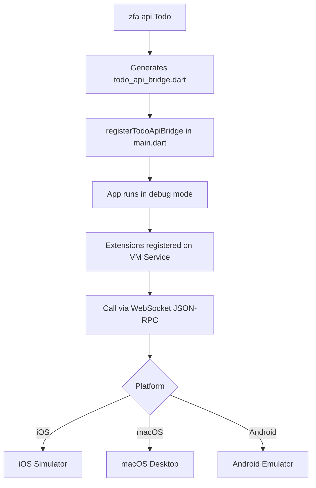

# VM Service API Plugin — Development & Testing Guide

How to develop, test, and debug the `--with=vmapi` plugin using the Zuraffa example app.

## Overview



## Prerequisites

- Zuraffa example app built and running in debug mode
- `websockets` Python package: `pip3 install --break-system-packages websockets`
- The VM Service URI printed in the terminal after `flutter run`

## Quick Test

```bash
cd ~/Developer/zuraffa/example

# Run the app on macOS
flutter run -d macos

# In another terminal, grab the VM Service URI from the output:
#   A Dart VM Service on macOS is available at: http://127.0.0.1:57363/nK4du51zEKA=/

# Test with the helper script (auto-discovers isolate ID)
./call_api.sh "http://127.0.0.1:57363/nK4du51zEKA=/" ext.zuraffa._list

# Create a todo
./call_api.sh "http://127.0.0.1:57363/nK4du51zEKA=/" ext.zuraffa.todo.createTodo \
  '{"title":"Test todo","isCompleted":false}'

# List all todos
./call_api.sh "http://127.0.0.1:57363/nK4du51zEKA=/" ext.zuraffa.todo.getTodoList
```

## Testing by Platform

### iOS Simulator

```bash
flutter run -d "iPhone 17 Pro"
```

Use `call_api.sh` with the iOS VM Service URI.

### macOS Desktop

```bash
flutter run -d macos
```

Use `call_api.sh` with the macOS VM Service URI.

### Manual WebSocket Test (Python)

```python
import json, asyncio, websockets

async def test():
    uri = 'ws://127.0.0.1:57363/nK4du51zEKA=/ws'
    iso = 'isolates/7671355826297799'  # from getVM
    
    async with websockets.connect(uri) as ws:
        msg = {
            'jsonrpc': '2.0',
            'method': 'ext.zuraffa.todo.createTodo',
            'params': {
                'isolateId': iso,
                'args': json.dumps({'title': 'From Python', 'isCompleted': False})
            },
            'id': '1'
        }
        await ws.send(json.dumps(msg))
        print(json.loads(await asyncio.wait_for(ws.recv(), timeout=10)))

asyncio.run(test())
```

## Finding the Isolate ID

The VM Service requires `isolateId` in every RPC call. Find it with:

```bash
curl -s http://127.0.0.1:<port>/<token>=/getVM | python3 -c "
import json, sys
d = json.load(sys.stdin)
for i in d['result']['isolates']:
    if not i['isSystemIsolate']:
        print(i['id'])
"
```

Or use `call_api.sh` which auto-discovers it.

## Common Issues

### "Method not found" even though extension is registered
**Cause**: Missing `isolateId` in the WebSocket RPC params, or using HTTP GET instead of WebSocket.
**Fix**: Use WebSocket JSON-RPC with `{'params': {'isolateId': 'isolates/...'}}`. HTTP GET does not work for custom extensions in Flutter 3.44+.

### "GetIt: Object/factory ... is not registered"
**Cause**: The UseCase referenced in the bridge handler isn't registered in the DI container.
**Fix**: Add the UseCase registration to `example/lib/src/di/usecases/index.dart`.

### "HiveError: Box not found"
**Cause**: `setupDependencies()` failed silently — the `catchError` in `main.dart` starts the app without Hive.
**Fix**: Check the debug console for errors. Ensure `Hive.initFlutter()` and `initAllCaches()` complete successfully.

### "type 'Null' is not a subtype of type 'num'"
**Cause**: Zorphy `fromJson()` requires all non-nullable primitive fields. Missing `id`, `createdAt`, etc.
**Fix**: Bridge handler should pre-fill defaults before calling `fromJson()`.

## Key Files

| File | Role |
|------|------|
| `example/lib/main.dart` | App entry — calls `ZuraffaApiBridge.init()` + `registerTodoApiBridge()` |
| `example/lib/src/api/bridges/todo_api_bridge.dart` | Generated bridge — registers Todo UseCases as extensions |
| `example/lib/src/di/usecases/todo_usecases_di.dart` | DI registration for all 7 Todo UseCases |
| `example/call_api.sh` | Shell helper — auto-discovers isolate and calls extensions |
| `example/call_ext.dart` | Dart script for calling extensions |
| `lib/src/core/api_bridge.dart` | Core bridge implementation |
| `lib/src/core/api_endpoint.dart` | Endpoint metadata model |
| `lib/src/plugins/api/api_plugin.dart` | CLI plugin: `zfa api <Entity>` |

---
*Last updated: 2026-07-09*
*Session: Validated VM Service API on iOS and macOS, fixed DI gap, fixed test scripts*
