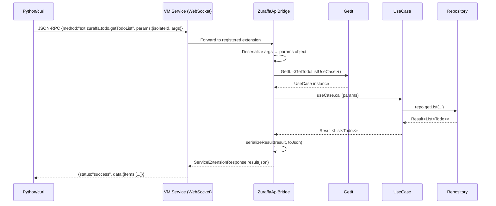
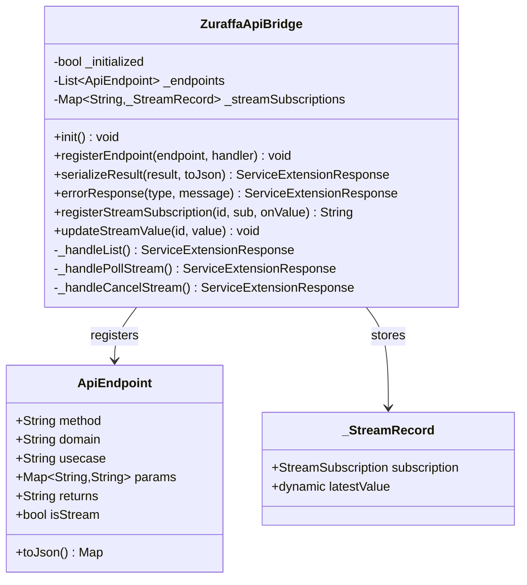

# VM Service API Bridge (`ZuraffaApiBridge`)

Auto-generates VM Service extensions for every registered UseCase, making them callable via WebSocket JSON-RPC at runtime. The bridge introspects GetIt registrations and exposes each UseCase as `ext.zuraffa.<domain>.<usecase>`.

## Overview



## Architecture



## Naming Convention

```
ext.zuraffa.<domain>.<usecaseName>
```

Three built-in meta-extensions:

| Extension | Purpose |
|-----------|---------|
| `ext.zuraffa._list` | Returns JSON catalog of all registered UseCase endpoints |
| `ext.zuraffa._pollStream` | Polls latest value from a StreamUseCase subscription |
| `ext.zuraffa._cancelStream` | Cancels a StreamUseCase subscription |

## Usage

### 1. Enable in `main()`

```dart
import 'package:example/src/api/bridges/todo_api_bridge.dart';

void main() {
  // ... after DI setup ...
  ZuraffaApiBridge.init();
  registerTodoApiBridge();  // generated by `zfa api Todo`
}
```

### 2. Generated Bridge (what `zfa api Todo` produces)

```dart
void registerTodoApiBridge() {
  if (kReleaseMode) return;

  ZuraffaApiBridge.registerEndpoint(
    endpoint: const ApiEndpoint(
      method: 'ext.zuraffa.todo.createTodo',
      domain: 'todo',
      usecase: 'createTodo',
      params: {'args': 'Todo'},
      returns: 'Todo',
      isStream: false,
    ),
    handler: _handleCreateTodo,
  );
}

Future<developer.ServiceExtensionResponse> _handleCreateTodo(
  String method, Map<String, String> args,
) async {
  try {
    final json = jsonDecode(args['args'] ?? '{}') as Map<String, dynamic>;
    // Auto-fill non-nullable required fields
    if (!json.containsKey('id') || json['id'] == null) json['id'] = 0;
    if (!json.containsKey('createdAt') || json['createdAt'] == null) {
      json['createdAt'] = DateTime.now().toIso8601String();
    }
    final params = Todo.fromJson(json);
    final useCase = GetIt.I<CreateTodoUseCase>();
    final result = await useCase(params);
    return ZuraffaApiBridge.serializeResult(result, (v) => v.toJson());
  } catch (e, st) {
    developer.log('Bridge error: $method', error: e, stackTrace: st);
    return ZuraffaApiBridge.errorResponse('unknown', e.toString());
  }
}
```

### 3. Calling from a Script

```bash
# Auto-discovers isolate ID, calls extension
./call_api.sh http://127.0.0.1:50385/XXX=/ ext.zuraffa.todo.getTodoList
```

Or with arguments:
```bash
./call_api.sh http://127.0.0.1:50385/XXX=/ ext.zuraffa.todo.createTodo \
  '{"title":"Test","isCompleted":false}'
```

## Key Design Decisions

### Single Serialization Authority

`ZuraffaApiBridge.serializeResult()` is the ONE place that converts `Result<T, AppFailure>` → JSON. Generated handlers must call it — never re-implement the serialization locally. This ensures every response has the same shape:

```json
// Success
{"status": "success", "data": {...}}

// Failure
{"status": "error", "failure": {"type": "typeName", "message": "..."}}
```

### Error Response Shape

`errorResponse(type, message)` produces a consistent error structure. Every catch block in generated handlers calls this — never constructs the JSON inline.

### Stream UseCases

For `Stream<Result<T, AppFailure>>` UseCases, the bridge:
1. Registers a subscription ID
2. Returns `{"status": "streaming", "subscriptionId": "abc123"}` immediately
3. Caches the latest emitted value
4. Exposes `_pollStream` for the caller to retrieve values
5. Exposes `_cancelStream` to clean up

## Safety

| Gate | Behavior |
|------|----------|
| `kReleaseMode` | `init()` and all `register*()` are no-ops |
| `kProfileMode` | Opt-in via `Zuraffa.enableApiInProfile = true` |
| Handler crashes | Caught, returned as structured error — never crash app |
| Wrong isolate ID | Silently routes to wrong handler — always resolve dynamically from `getVM` |

## Key Files

| File | Role |
|------|------|
| `lib/src/core/api_bridge.dart` | Core bridge: init, registration, serialization, stream management |
| `lib/src/core/api_endpoint.dart` | Endpoint metadata model |
| `lib/src/plugins/api/api_plugin.dart` | CLI plugin: `zfa api <Entity>` |
| `lib/src/plugins/api/builders/api_bridge_builder.dart` | Codegen: generates `register*ApiBridge()` functions |
| `example/lib/src/api/bridges/todo_api_bridge.dart` | Example: Todo UseCase bridge |
| `example/call_api.sh` | Script: one-liner extension caller |

## Known Issues

### UseCases Must Be Registered in DI

The bridge calls `GetIt.I<UseCaseType>()` — if the UseCase isn't registered, the extension returns a `status:error` response, not "Method not found". Every UseCase exposed via the bridge must have a corresponding DI registration.

### Non-Nullable Entity Fields Need Defaults in Create Handlers

`Entity.fromJson()` crashes on missing non-nullable primitives. Generated `create*` handlers should auto-fill `id`, `createdAt`, etc. The template in `api_bridge_builder.dart` should detect non-nullable fields during codegen.

---
*Last updated: 2026-07-09*
*Session: Validated bridge implementation on iOS and macOS, fixed DI registration gap and test scripts*
