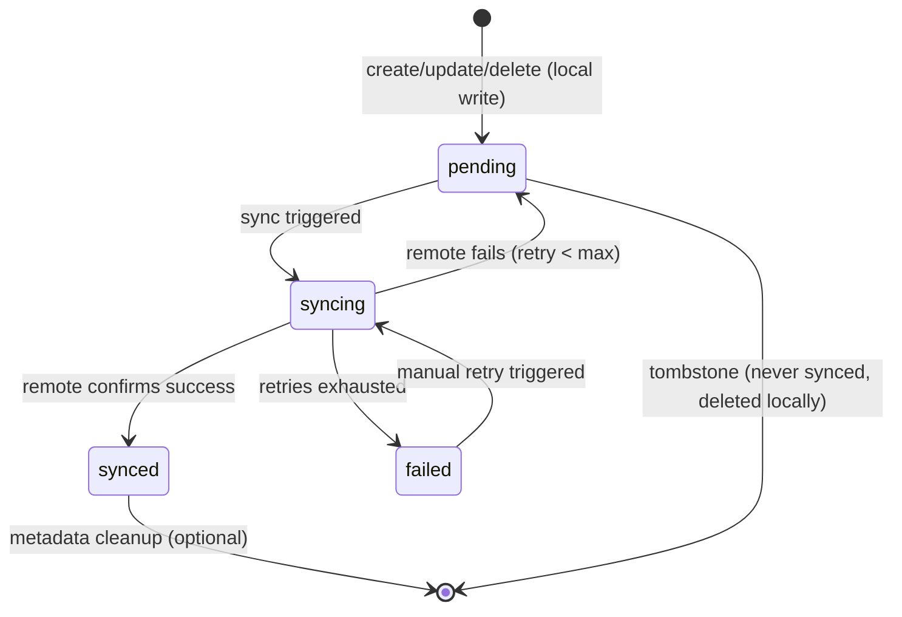

# Data Model: Offline-First Sync Plugin

**Date**: 2026-06-28 | **Feature**: 010-offline-first-sync

## Core Domain Types

These types live in Zuraffa's core library (`lib/src/core/`) and are exported via `lib/zuraffa.dart`. They are available to all projects using Zuraffa.

### SyncStatus (Enum)

The synchronization state of a single record.

```dart
enum SyncStatus {
  /// Written locally, not yet pushed to remote.
  pending,

  /// Currently being transmitted to remote.
  syncing,

  /// Successfully transmitted to remote.
  synced,

  /// Transmission failed after maximum retries.
  failed,
}
```

**State transitions**:



---

### SyncMetadata (Data Class)

The metadata record stored in the sync metadata store. Maps 1:1 to an entity instance (keyed by entity identifier).

```dart
class SyncMetadata {
  final SyncStatus status;
  final int retryCount;
  final DateTime? lastAttemptAt;
  final String? lastError;
  final DateTime? deletedAt;  // null = not deleted; non-null = tombstone
  final SyncOperation operation;  // what operation needs syncing
}
```

| Field | Type | Description |
|-------|------|-------------|
| `status` | `SyncStatus` | Current sync state |
| `retryCount` | `int` | Number of failed sync attempts (reset on success) |
| `lastAttemptAt` | `DateTime?` | When the last sync attempt occurred |
| `lastError` | `String?` | Error message from last failed attempt |
| `deletedAt` | `DateTime?` | Tombstone timestamp (non-null = record was deleted locally, pending remote delete) |
| `operation` | `SyncOperation` | What operation to sync (create, update, delete) |

---

### SyncOperation (Enum)

The type of operation that needs to be synced to remote.

```dart
enum SyncOperation {
  /// Entity was created locally, needs remote create.
  create,

  /// Entity was updated locally, needs remote update.
  update,

  /// Entity was deleted locally, needs remote delete (tombstone).
  delete,
}
```

---

### SyncStrategy\<T\> (Abstract Interface)

Domain-level interface defining the sync contract. Injected into sync-enabled repositories.

```dart
abstract class SyncStrategy<T> {
  /// Push all pending local changes to the remote data source.
  Future<void> syncPending({CancelToken? cancelToken});

  /// Pull remote data and merge into local storage.
  /// Only available in bidirectional strategies.
  Future<void> pullRemote({CancelToken? cancelToken});

  /// Get count of records pending sync.
  Future<int> getPendingCount();

  /// Get sync status for a specific record by key.
  Future<SyncStatus> getSyncStatus(String key);

  /// Mark a record as pending sync.
  /// Called by the repository after a local create or update.
  Future<void> markPending(String key, {SyncOperation operation = SyncOperation.create});

  /// Mark a record as deleted (tombstone).
  /// Called by the repository after a local delete.
  Future<void> markDeleted(String key);
}
```

---

## Data Layer Types

These types live in the data layer and are generated by the SyncPlugin.

### SyncMetadataStore

Hive-backed store for `SyncMetadata`. Uses a dedicated Hive box per entity.

```dart
class SyncMetadataStore {
  final Box<SyncMetadata> _box;

  SyncMetadataStore(this._box);

  Future<SyncMetadata?> get(String key);
  Future<void> put(String key, SyncMetadata metadata);
  Future<void> remove(String key);
  Future<List<String>> getKeysByStatus(SyncStatus status);
  Future<int> countByStatus(SyncStatus status);
  Future<void> clear();
}
```

**Hive box name**: `sync_metadata_<entity_snake>` (e.g., `sync_metadata_engagement_event`)

**Key strategy**: Entity `id` field if present, else `entity.hashCode.toString()`

---

### PushOnlySyncStrategy\<T\>

Default strategy implementation. Pushes local changes to remote.

| Dependency | Type | Purpose |
|------------|------|---------|
| `localDataSource` | `LocalDataSource<T>` | Read pending entities for transmission |
| `remoteDataSource` | `RemoteDataSource<T>` | Transmit entities to remote |
| `metadataStore` | `SyncMetadataStore` | Track sync status per record |
| `config` | `SyncConfig` | Batch size, retry, backoff settings |

**Push algorithm**:

1. Query `metadataStore.getKeysByStatus(SyncStatus.pending | SyncStatus.failed)`
2. Process in batches of `config.batchSize` (default: 50)
3. For each record:
   - Set status → `syncing`
   - Fetch full entity from `localDataSource` by key
   - Call appropriate remote method based on `SyncOperation`:
     - `create` → `remoteDataSource.create(entity)`
     - `update` → `remoteDataSource.update(entity)`
     - `delete` → `remoteDataSource.delete(key)`
   - On success: set status → `synced`, reset `retryCount`
   - On failure: increment `retryCount`, set `lastError`, `lastAttemptAt`
     - If `retryCount >= config.maxRetries`: set status → `failed`
     - Else: set status → `pending` (will be retried next sync)
4. For tombstones (`deletedAt != null`): after successful remote delete, remove metadata entry

**Backoff calculation**: `delay = min(config.backoffBaseMs * 2^retryCount, config.backoffMaxMs)`

---

### BidirectionalSyncStrategy\<T\>

Extended strategy for bidirectional sync. Push first, then pull.

| Additional Dependency | Type | Purpose |
|----------------------|------|---------|
| `conflictResolver` | `ConflictResolver<T>` | Resolve conflicts between local and remote versions |

**Pull algorithm** (after push completes):

1. Call `remoteDataSource.getList(queryParams)` to fetch all remote records
2. For each remote record:
   - If exists locally with `SyncStatus.synced`: replace local with remote (remote-wins)
   - If exists locally with `SyncStatus.pending`: conflict! Use `conflictResolver`
   - If not exists locally: save to local + set status → `synced`
3. For local records not in remote result set:
   - If `SyncStatus.synced`: delete locally (was deleted on server)
   - If `SyncStatus.pending`: keep (still needs to be pushed)

---

### SyncConfig

Configuration for sync behavior. Passed to strategy constructors.

```dart
class SyncConfig {
  final int batchSize;          // default: 50
  final int maxRetries;         // default: 5
  final int backoffBaseMs;      // default: 1000 (1 second)
  final int backoffMaxMs;       // default: 60000 (60 seconds)
  final SyncDirection direction; // push or bidirectional
}
```

---

## Repository Integration

### Sync-Enabled Repository Constructor

```dart
class DataProductRepository
    with Loggable, FailureHandler
    implements ProductRepository {
  DataProductRepository(
    this._localDataSource,
    this._remoteDataSource,
    this._syncMetadataStore,
    this._syncStrategy,
  );

  final ProductLocalDataSource _localDataSource;
  final ProductDataSource _remoteDataSource;
  final SyncMetadataStore _syncMetadataStore;
  final SyncStrategy<Product> _syncStrategy;
}
```

### Generated Method Bodies

| Method | Implementation |
|--------|---------------|
| `get(params)` | `return _localDataSource.get(params);` |
| `getList(params)` | `return _localDataSource.getList(params);` |
| `create(entity)` | `final saved = await _localDataSource.create(entity); await _syncStrategy.markPending(saved.id, operation: SyncOperation.create); return saved;` |
| `update(params)` | `final saved = await _localDataSource.update(params); await _syncStrategy.markPending(saved.id, operation: SyncOperation.update); return saved;` |
| `delete(params)` | `await _localDataSource.delete(params); await _syncStrategy.markDeleted(params.id);` |
| `syncPending(cancelToken)` | `return _syncStrategy.syncPending(cancelToken: cancelToken);` |
| `pullRemote(cancelToken)` | `return _syncStrategy.pullRemote(cancelToken: cancelToken);` |

### Entity Key Resolution (Generated)

For entities with `id` field:
```dart
String _syncKey(Product entity) => entity.id;
```

For entities without `id` field:
```dart
String _syncKey(AppConfig entity) => entity.hashCode.toString();
```
