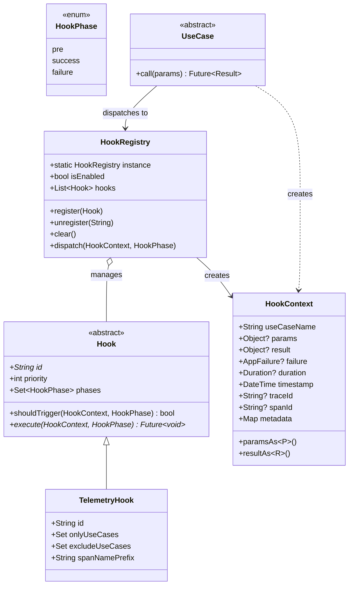
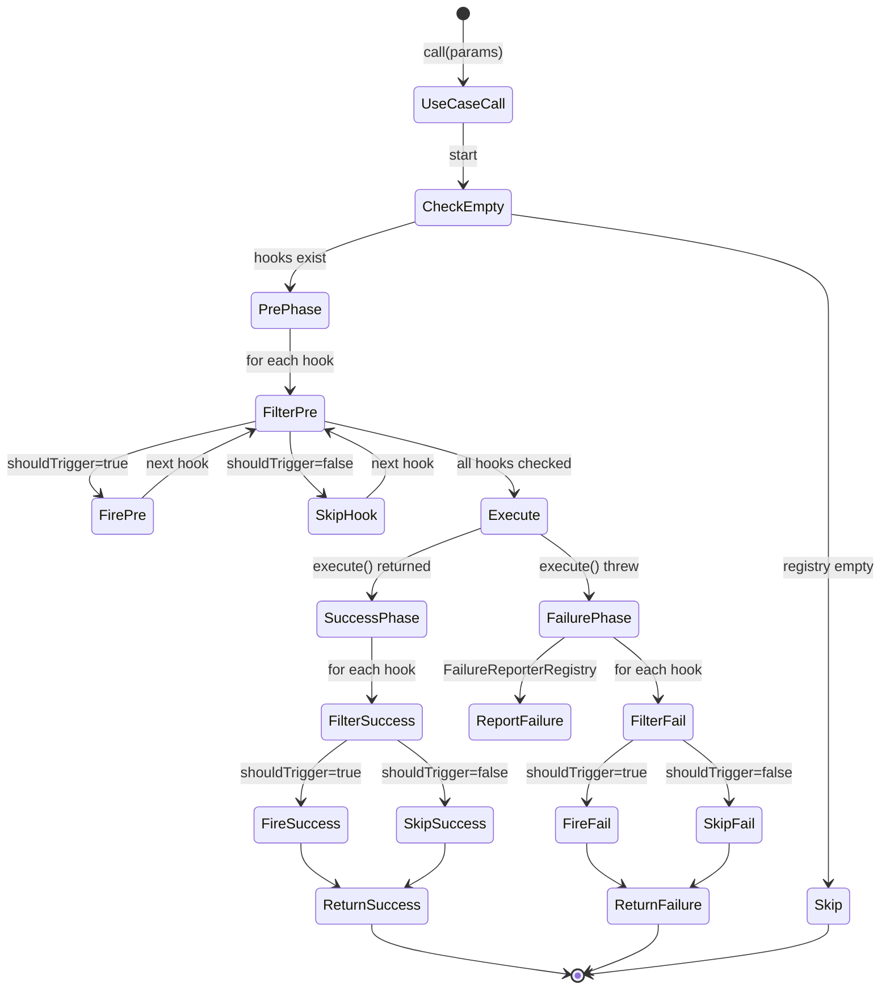

# Data Model: UseCase Hook System

**Feature**: 011-usecase-hook-system
**Date**: 2026-06-28

## Core Types

### 1. `HookPhase` (Enum)

The three interception points during UseCase execution.

| Value | Description | When It Fires |
|-------|-------------|---------------|
| `pre` | Before `execute()` is called | After cancellation check, before business logic |
| `success` | After `execute()` completed successfully | Before returning `Result.success()` |
| `failure` | After `execute()` threw an error | Before returning `Result.failure()` |

---

### 2. `HookContext` (Immutable Value Object)

The context passed to every hook during dispatch. Created once per UseCase invocation, shared across all three phases (the `metadata` map is mutable and passed by reference).

| Field | Type | Nullable | Description |
|-------|------|----------|-------------|
| `useCaseName` | `String` | No | Runtime type of the UseCase (e.g., `'GetDealListUseCase'`) |
| `params` | `Object?` | Yes | The input parameters passed to the UseCase |
| `result` | `Object?` | Yes | The successful result (only set in `success` phase) |
| `failure` | `AppFailure?` | Yes | The failure (only set in `failure` phase) |
| `duration` | `Duration?` | Yes | Execution duration (null in `pre` phase) |
| `timestamp` | `DateTime` | No | When the UseCase was invoked |
| `traceId` | `String?` | Yes | W3C trace ID from active OTel span |
| `spanId` | `String?` | Yes | W3C span ID from active OTel span |
| `metadata` | `Map<String, dynamic>` | No | Shared mutable bag for cross-phase data (passed by reference) |

**Convenience methods**:
- `P paramsAs
()` — cast params to expected type
- `R resultAs<R>()` — cast result to expected type

---

### 3. `Hook` (Abstract Base Class)

| Member | Type | Default | Description |
|--------|------|---------|-------------|
| `id` | `String` | (abstract) | Unique identifier for this hook |
| `priority` | `int` | `0` | Execution order (lower runs first) |
| `phases` | `Set<HookPhase>` | `{pre, success, failure}` | Which phases this hook fires on |
| `shouldTrigger(context, phase)` | `bool` | `true` | Whether this hook should fire for the given context |
| `execute(context, phase)` | `Future<void>` | (abstract) | The hook's side-effect logic. Must be resilient (never throw). |

---

### 4. `HookRegistry` (Singleton)

| Member | Type | Description |
|--------|------|-------------|
| `instance` | `HookRegistry` | Global singleton |
| `isEnabled` | `bool` | Global kill switch (default: `true`) |
| `hooks` | `List<Hook>` | All registered hooks, sorted by priority (read-only) |
| `register(hook)` | `void` | Register a hook (throws if ID exists) |
| `unregister(id)` | `void` | Remove a hook by ID |
| `clear()` | `void` | Remove all hooks |
| `dispatch(context, phase)` | `void` | Fire-and-forget dispatch to all matching hooks |

---

### 5. `TelemetryHook` (Built-in, extends `Hook`)

| Member | Type | Default | Description |
|--------|------|---------|-------------|
| `id` | `String` | `'zuraffa-telemetry'` | Fixed identifier |
| `phases` | `Set<HookPhase>` | `{pre, success, failure}` | All three phases |
| `onlyUseCases` | `Set<String>` | `{}` (empty = all) | Whitelist — if non-empty, only these UseCases are traced |
| `excludeUseCases` | `Set<String>` | `{}` | Blacklist — these UseCases are never traced (wins over whitelist) |
| `spanNamePrefix` | `String` | `'usecase'` | Prefix for span names |

---

## Type Relationships

---

## Dispatch Flow (State Machine)

