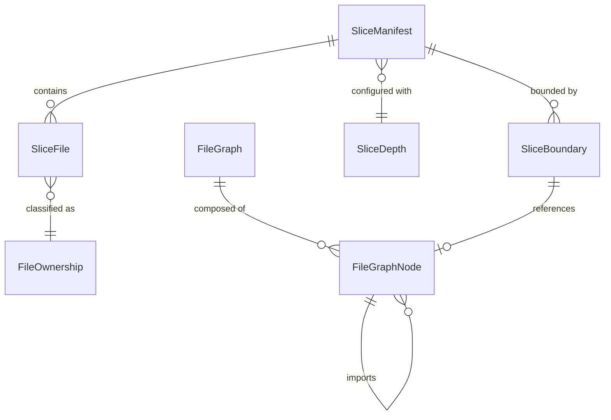
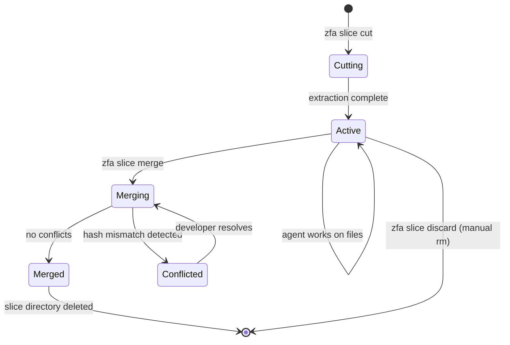
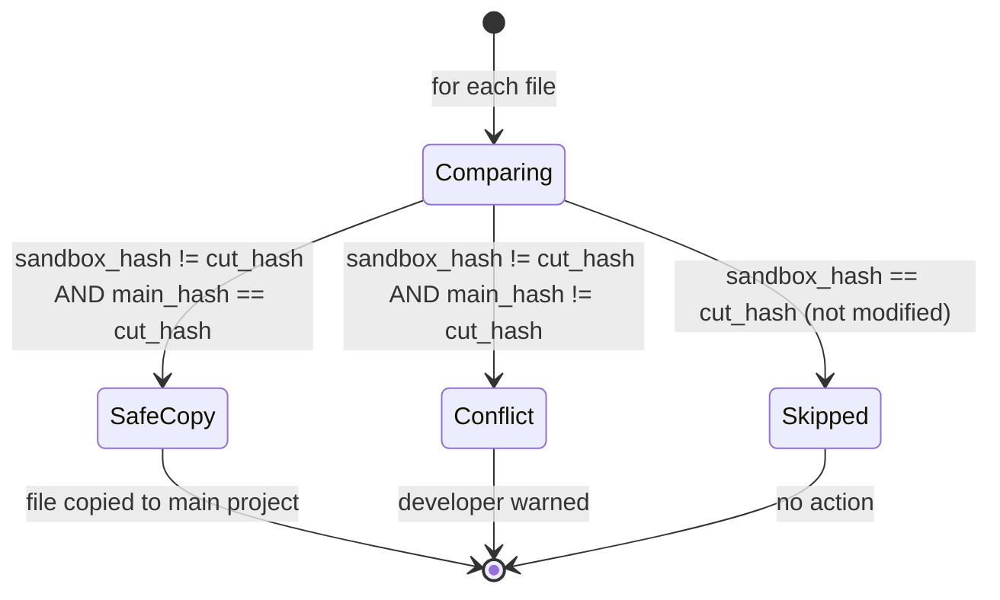

# Data Model: Slice Plugin

## Entities

### SliceDepth (enum)

Controls how deep the dependency graph traversal goes.

| Value          | Included Layers                                                | Use Case                    |
| -------------- | -------------------------------------------------------------- | --------------------------- |
| `view`         | View, Controller, State                                        | Pure UI styling work        |
| `presentation` | View, Controller, Presenter, State                             | UI + business logic wiring  |
| `feature`      | Presentation + Domain (usecases, interfaces, entities)         | Full feature work (default) |
| `full`         | All layers including Data (repos impl, datasources, providers) | Integration/data layer work |

### FileOwnership (enum)

Classification of a file's relationship to the slice.

| Value       | Meaning                                                                 | Agent Guidance                       |
| ----------- | ----------------------------------------------------------------------- | ------------------------------------ |
| `owned`     | Unique to this feature's page directory                                 | Safe to modify freely                |
| `shared`    | Used by multiple features (entities, shared widgets, domain interfaces) | Modify with caution; merge will warn |
| `framework` | External package (SDK, pub dependency)                                  | Read-only; not included in slice     |

### SliceFile

A file included in a slice, with metadata for ownership and merge tracking.

| Field          | Type            | Description                                                                                  |
| -------------- | --------------- | -------------------------------------------------------------------------------------------- |
| `relativePath` | `String`        | Path relative to project root (e.g., `lib/src/presentation/pages/profile/profile_view.dart`) |
| `ownership`    | `FileOwnership` | owned / shared                                                                               |
| `hashAtCut`    | `String`        | SHA-256 hash of file contents at extraction time                                             |
| `layer`        | `String`        | Architecture layer: `presentation`, `domain`, `data`, `di`, `routing`, `other`               |

### SliceBoundary

An abstract interface at the edge of the slice where traversal stopped.

| Field                | Type      | Description                                                                        |
| -------------------- | --------- | ---------------------------------------------------------------------------------- |
| `typeName`           | `String`  | The abstract type name (e.g., `CustomerRepository`, `AuthService`)                 |
| `interfaceFile`      | `String`  | Path to the abstract interface file                                                |
| `diRegistrationFile` | `String?` | Path to the DI file that registers the concrete implementation (null if not found) |
| `mockStrategy`       | `String`  | How to mock: `auto` (generate stub), `existing` (use project's mock), `none`       |

### SliceManifest

The persistent record of a slice. Serialized as `slice.yaml`.

| Field         | Type                  | Description                                                           |
| ------------- | --------------------- | --------------------------------------------------------------------- |
| `name`        | `String`              | Slice name (e.g., `profile_feature`)                                  |
| `createdAt`   | `DateTime`            | When the slice was cut                                                |
| `depth`       | `SliceDepth`          | Extraction depth                                                      |
| `entries`     | `List<String>`        | Entry point paths (relative to project root)                          |
| `projectRoot` | `String`              | Absolute path to the source project                                   |
| `packageName` | `String`              | Dart package name from pubspec.yaml                                   |
| `branch`      | `String`              | Git branch at cut time                                                |
| `exportedTo`  | `String?`             | Export target: GitHub repo URL or tarball path (null if not exported) |
| `files`       | `List<SliceFile>`     | All files included in the slice                                       |
| `boundaries`  | `List<SliceBoundary>` | Interfaces at the traversal edge                                      |

### FileGraphNode

A node in the project-wide dependency graph.

| Field        | Type           | Description                                           |
| ------------ | -------------- | ----------------------------------------------------- |
| `filePath`   | `String`       | Absolute path to the Dart file                        |
| `imports`    | `List<String>` | Resolved absolute paths of imported files             |
| `diTypes`    | `List<String>` | Types resolved via `getIt<T>()` in this file          |
| `companions` | `List<String>` | Paths to companion files (`.g.dart`, `.freezed.dart`) |

### FileGraph

The project-wide file dependency graph.

| Field         | Type                         | Description                |
| ------------- | ---------------------------- | -------------------------- |
| `nodes`       | `Map<String, FileGraphNode>` | File path → node           |
| `packageName` | `String`                     | The project's package name |
| `projectRoot` | `String`                     | The project root directory |

**Key operations**:

- `buildFromEntries(List<String> entries, SliceDepth depth)` → `FileGraph` — builds the subgraph reachable from entries at the given depth
- `getTransitiveClosure(String filePath)` → `Set<String>` — all files reachable from a given file
- `getBoundaries()` → `List<SliceBoundary>` — interfaces at the edge where traversal stopped

### SliceExportFormat (enum)

Supported export targets.

| Value    | Description                                         |
| -------- | --------------------------------------------------- |
| `tarGz`  | `.tar.gz` archive with filtered `pubspec.yaml`      |
| `github` | Private GitHub repository with `SLICE.md` as README |

## Relationships

## State Transitions

### Slice Lifecycle

### File Merge Decision

