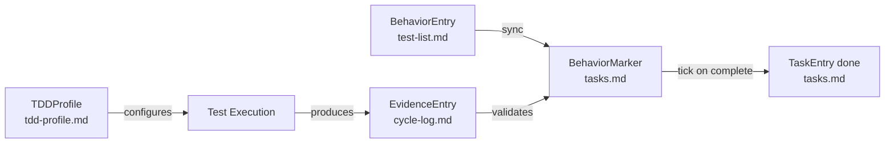

# Data Model: Spec-Kit Boundary Scripts

**Feature**: 1444-spec-kit-boundary-scripts  
**Date**: 2026-09-10  
**Purpose**: Define the core entities and data structures manipulated by the bash boundary scripts

---

## Overview

The spec-kit boundary scripts operate on four main categories of markdown files in the `.specify/` structure. This document defines the entities that model the data extracted from and written to these files.

---

## 1. BehaviorMarker

Represents a `[behavior: <id>]` marker in `tasks.md` that links a task to a test behavior.

### Fields

| Field | Type | Description |
|-------|------|-------------|
| `id` | `String` | Behavior identifier (e.g., `A1`, `U2`, `C3`) |
| `status` | `String` | Task completion status: `pending` or `done` |
| `line_number` | `Integer` | Line number in tasks.md where marker appears |
| `task_text` | `String` | Full text of the task line including checkbox |

### Example

```json
{
  "id": "A1",
  "status": "pending",
  "line_number": 15,
  "task_text": "- [ ] Implement user login [behavior: A1]"
}
```

### Markdown Representation

```markdown
- [ ] Implement user login [behavior: A1]
- [x] Validate email format [behavior: U1]
```

### Parsing Rules

- Checkbox patterns: `- [ ]` (pending) or `- [x]` (done)
- Marker pattern: `[behavior: <id>]` where `<id>` is alphanumeric
- Malformed markers (no ID, no checkbox) are skipped
- Multiple markers on same line: only first is considered
- Case-sensitive matching for behavior IDs

---

## 2. BehaviorEntry

Represents one behavior definition from `test-list.md`.

### Fields

| Field | Type | Description |
|-------|------|-------------|
| `id` | `String` | Behavior identifier (e.g., `A1`, `U2`) |
| `description` | `String` | Full behavior description text |
| `category` | `String` | Test category: `acceptance`, `unit`, or `characterization` |
| `line_number` | `Integer` | Line number in test-list.md |

### Example

```json
{
  "id": "A1",
  "description": "User can login with email and password",
  "category": "acceptance",
  "line_number": 7
}
```

### Markdown Representation

```markdown
## Acceptance Tests

- **A1**: User can login with email and password
- **A2**: User sees error message on invalid credentials

## Unit Tests

- **U1**: `validateEmail` returns true for valid emails
- **U2**: `validateEmail` returns false for invalid emails
```

### Parsing Rules

- Section headers define category: `## Acceptance Tests`, `## Unit Tests`, `## Characterization Tests`
- Entry pattern: `- **<id>**: <description>`
- ID format: uppercase letter + digits (e.g., `A1`, `U12`, `C3`)
- Description: everything after `: ` to end of line
- Duplicate IDs: later entries override earlier ones (or error, depending on script policy)

---

## 3. TDDProfile

Parsed TDD stack configuration from `tdd-profile.md`.

### Fields

| Field | Type | Description |
|-------|------|-------------|
| `engine` | `String` | Test engine type (e.g., `dart_test`, `flutter_test`, `jest`) |
| `test_command` | `String` | Command to run tests (e.g., `dart test`) |
| `verify_command` | `String` | Command to run verification/coverage (optional) |
| `plan_command` | `String` | Command to plan/list tests (optional) |

### Example

```json
{
  "engine": "dart_test",
  "test_command": "dart test",
  "verify_command": "dart test --coverage",
  "plan_command": "dart test --list"
}
```

### Markdown Representation

```markdown
---
engine: dart_test
test_command: dart test
verify_command: dart test --coverage
plan_command: dart test --list
---

# TDD Profile: Dart Test

This project uses Dart's built-in test framework...
```

### Parsing Rules

- YAML frontmatter between `---` delimiters
- Required fields: `engine`, `test_command`
- Optional fields: `verify_command`, `plan_command`
- Multiple engine declarations: take first or error
- Missing frontmatter: error with exit 1

---

## 4. EvidenceEntry

One red-green-refactor evidence record from `cycle-log.md`.

### Fields

| Field | Type | Description |
|-------|------|-------------|
| `phase` | `String` | Cycle phase: `RED`, `GREEN`, or `REFACTOR` |
| `behavior_id` | `String` | Behavior identifier this evidence relates to |
| `timestamp` | `String` | ISO 8601 timestamp (e.g., `2026-09-10T14:23:00Z`) |
| `evidence_text` | `String` | Full evidence description (multiline) |

### Example

```json
{
  "phase": "RED",
  "behavior_id": "A1",
  "timestamp": "2026-09-10T14:23:00Z",
  "evidence_text": "Test `test/features/auth/login_test.dart` fails with:\nExpected: true\n  Actual: false"
}
```

### Markdown Representation

```markdown
## 2026-09-10 14:23 - RED - A1

Behavior: User can login with email and password

Evidence: Test `test/features/auth/login_test.dart` fails with:
```
Expected: true
  Actual: false
```

---

## 2026-09-10 14:45 - GREEN - A1

Behavior: User can login with email and password

Evidence: Test `test/features/auth/login_test.dart` passes.

---
```

### Parsing Rules

- Entry header: `## <timestamp> - <phase> - <behavior_id>`
- Timestamp format: `YYYY-MM-DD HH:MM` (convert to ISO 8601)
- Phase: must be `RED`, `GREEN`, or `REFACTOR`
- Evidence body: all content between header and next `---` delimiter
- Malformed entries: skip and continue parsing (don't fail entire file)
- Empty log: return empty array `[]`

---

## 5. TaskEntry

One task line from `tasks.md` (comprehensive structure for future expansion).

### Fields

| Field | Type | Description |
|-------|------|-------------|
| `checkbox` | `String` | Checkbox state: `[ ]` or `[x]` |
| `text` | `String` | Full task description (without checkbox) |
| `behavior_id` | `String?` | Extracted behavior ID if marker present, else `null` |
| `line_number` | `Integer` | Line number in tasks.md |
| `indent_level` | `Integer` | Indentation depth (0 = top-level, 1 = sub-task, etc.) |

### Example

```json
{
  "checkbox": "[ ]",
  "text": "Implement user login [behavior: A1]",
  "behavior_id": "A1",
  "line_number": 15,
  "indent_level": 0
}
```

### Markdown Representation

```markdown
- [ ] Implement authentication flow
  - [ ] Implement user login [behavior: A1]
  - [x] Validate email format [behavior: U1]
- [ ] Add error handling
```

### Parsing Rules

- Task pattern: `<indent>- <checkbox> <text>`
- Indent level: count leading spaces/tabs (2 spaces or 1 tab = 1 level)
- Behavior marker: extract `[behavior: <id>]` if present
- Non-task lines (headings, blank lines): skip
- Invalid checkboxes (e.g., `[?]`): skip or normalize

---

## 6. SyncResult

Result object returned by `sync-behaviors-to-tasks.sh` (for JSON output).

### Fields

| Field | Type | Description |
|-------|------|-------------|
| `inserted` | `Integer` | Number of new behavior markers inserted |
| `updated` | `Integer` | Number of existing markers updated |
| `skipped` | `Integer` | Number of behaviors skipped (already present) |
| `errors` | `Array<String>` | List of error messages encountered |

### Example

```json
{
  "inserted": 3,
  "updated": 1,
  "skipped": 2,
  "errors": []
}
```

---

## 7. TickResult

Result object returned by `tick-behavior-task.sh` (for JSON output).

### Fields

| Field | Type | Description |
|-------|------|-------------|
| `behavior_id` | `String` | The behavior ID that was ticked |
| `previous_status` | `String` | Status before tick: `pending` or `done` |
| `new_status` | `String` | Status after tick: always `done` |
| `line_number` | `Integer` | Line number where change was made |

### Example

```json
{
  "behavior_id": "A1",
  "previous_status": "pending",
  "new_status": "done",
  "line_number": 15
}
```

---

## Relationships Between Entities



**Workflow**:
1. `test-list.md` contains behavior definitions (BehaviorEntry)
2. `sync-behaviors-to-tasks.sh` creates/updates BehaviorMarkers in `tasks.md`
3. `tdd-profile.md` defines how to run tests (TDDProfile)
4. Test execution produces evidence entries (EvidenceEntry) in `cycle-log.md`
5. `tick-behavior-task.sh` marks BehaviorMarkers as done when evidence is green

---

## Validation Rules

### Cross-File Consistency

- **Behavior IDs**: Must be unique within `test-list.md`
- **Behavior Markers**: Should reference IDs that exist in `test-list.md`
- **Evidence Entries**: Should reference behavior IDs that exist in `test-list.md`
- **Task Ticks**: Can only tick behaviors that have markers in `tasks.md`

### Data Integrity

- **Atomic Updates**: All writes to `tasks.md` must be atomic (temp file + mv)
- **Preserve Order**: Syncing behaviors should preserve existing task order in `tasks.md`
- **No Data Loss**: Failed operations must not corrupt or truncate files
- **Idempotency**: Running sync twice with same input should produce same output

---

## Edge Cases and Error Handling

### Duplicate Behavior IDs

**In test-list.md**:
- **Policy**: Later entries override earlier ones (warning logged)
- **Alternative**: Reject with error (strict mode)

### Missing Behavior References

**In tasks.md markers referencing non-existent behaviors**:
- **Policy**: Leave intact, log warning
- **Rationale**: User may be working on behavior in test-list.md

### Malformed Markers

**In tasks.md with invalid format**:
- **Policy**: Skip during parsing, preserve during write
- **Example**: `[behavior: ]` (no ID) → ignored

### Concurrent Modifications

**Multiple processes writing to same file**:
- **Policy**: Last write wins (atomic mv guarantees consistency)
- **Future Enhancement**: Advisory locks or merge detection

---

## JSON Schema Definitions

### BehaviorMarker Schema

```json
{
  "$schema": "http://json-schema.org/draft-07/schema#",
  "type": "object",
  "required": ["id", "status", "line_number", "task_text"],
  "properties": {
    "id": { "type": "string", "pattern": "^[A-Z][0-9]+$" },
    "status": { "type": "string", "enum": ["pending", "done"] },
    "line_number": { "type": "integer", "minimum": 1 },
    "task_text": { "type": "string" }
  }
}
```

### TDDProfile Schema

```json
{
  "$schema": "http://json-schema.org/draft-07/schema#",
  "type": "object",
  "required": ["engine", "test_command"],
  "properties": {
    "engine": { "type": "string" },
    "test_command": { "type": "string" },
    "verify_command": { "type": "string" },
    "plan_command": { "type": "string" }
  }
}
```

### EvidenceEntry Schema

```json
{
  "$schema": "http://json-schema.org/draft-07/schema#",
  "type": "object",
  "required": ["phase", "behavior_id", "timestamp", "evidence_text"],
  "properties": {
    "phase": { "type": "string", "enum": ["RED", "GREEN", "REFACTOR"] },
    "behavior_id": { "type": "string", "pattern": "^[A-Z][0-9]+$" },
    "timestamp": { "type": "string", "format": "date-time" },
    "evidence_text": { "type": "string" }
  }
}
```

---

## Summary

This data model provides the foundation for the four bash boundary scripts:

1. **sync-behaviors-to-tasks.sh**: Maps BehaviorEntry → BehaviorMarker
2. **read-tdd-profile.sh**: Parses and emits TDDProfile
3. **read-cycle-evidence.sh**: Extracts and emits EvidenceEntry array
4. **tick-behavior-task.sh**: Updates BehaviorMarker status to `done`

Each entity is designed to be parseable with the three-tier cascade (jq → python3 → grep/sed) and serializable as JSON for downstream consumers.
