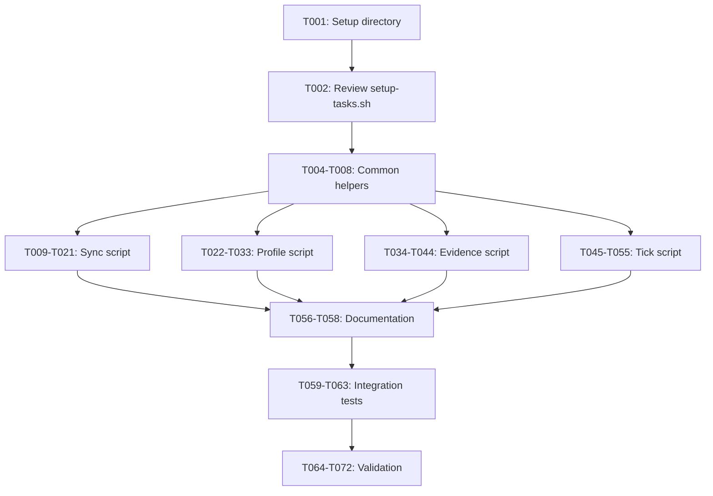

# Tasks: Spec-Kit Boundary Scripts

**Feature**: 1444-spec-kit-boundary-scripts  
**Branch**: `1444-spec-kit-boundary-scripts`  
**Created**: 2026-09-10  
**Status**: Ready for Implementation

---

## Overview

This task breakdown implements four bash boundary scripts for deterministic spec-kit ↔ zuraffa data synchronization, replacing fragile LLM-based file operations. All scripts follow the three-tier parser cascade (jq → python3 → grep/sed) and use atomic file writes.

**Total Tasks**: 47  
**MVP Scope**: Phase 1-4 (33 tasks)  
**Parallelizable**: 15 tasks marked with [P]

---

## Phase 1: Setup & Foundation

**Goal**: Establish project structure and shared utilities

### Setup Tasks

- [x] [behavior: U9] T001 [P1] [Setup] Verify `.specify/scripts/bash/` directory exists (MANDATORY)
  - Path: `.specify/scripts/bash/`
  - If missing, create directory structure
  - Verify `common.sh` exists and contains required helpers

- [x] [behavior: U5] T002 [P1] [Setup] Review reference implementation `setup-tasks.sh` (MANDATORY)
  - Path: `.specify/scripts/bash/setup-tasks.sh`
  - Document three-tier parser cascade pattern
  - Note atomic write patterns and error handling
  - Identify reusable helper functions

- [ ] T003 [P1] [Setup] Create test fixtures directory structure
  - Path: `test/fixtures/bash_scripts/`
  - Create subdirectories: `test-list-samples/`, `tdd-profile-samples/`, `cycle-log-samples/`, `tasks-samples/`
  - Add `.gitkeep` files to preserve structure

---

## Phase 2: Foundational Helpers in common.sh

**Goal**: Extend `common.sh` with shared utilities for all four scripts

### Common Helper Tasks

- [x] [behavior: U10] T004 [P1] [Foundation] Add YAML frontmatter extraction helper to `common.sh` (MANDATORY)
  - Path: `.specify/scripts/bash/common.sh`
  - Function: `extract_yaml_frontmatter(file)`
  - Three-tier cascade: yq → python3 → sed
  - Reference: `contracts/read-tdd-profile.md` section "YAML Parsing"

- [x] [behavior: U7] T005 [P] [P1] [Foundation] Add safe JSON construction helpers to `common.sh` (MANDATORY)
  - Path: `.specify/scripts/bash/common.sh`
  - Functions: `json_escape(str)`, `json_array_from_lines()`
  - Handles: backslashes, quotes, newlines, tabs
  - Reference: `research.md` section 2.3

- [x] [behavior: U10] T006 [P] [P1] [Foundation] Add atomic file write helper to `common.sh` (MANDATORY)
  - Path: `.specify/scripts/bash/common.sh`
  - Function: `atomic_write(content, target_file)`
  - Pattern: mktemp → write → mv with trap cleanup
  - Reference: `research.md` section 3.1

- [x] [behavior: U10] T007 [P] [P1] [Foundation] Add behavior marker extraction helper to `common.sh` (MANDATORY)
  - Path: `.specify/scripts/bash/common.sh`
  - Function: `extract_behavior_markers(tasks_file)`
  - Returns: newline-separated list of behavior IDs with line numbers
  - Reference: `data-model.md` BehaviorMarker entity

- [x] [behavior: U10] T008 [P] [P1] [Foundation] Add test list parser helper to `common.sh` (MANDATORY)
  - Path: `.specify/scripts/bash/common.sh`
  - Function: `parse_test_list(test_list_file)`
  - Extracts behavior IDs and descriptions from `test-list.md`
  - Reference: `data-model.md` BehaviorEntry entity

---

## Phase 3: User Story 1 - Sync Behaviors to Tasks (P1) - MVP

**Goal**: Implement `sync-behaviors-to-tasks.sh` for deterministic behavior marker synchronization

### Sync Script Tasks

- [x] [behavior: U1] T009 [P1] [US1] Create `sync-behaviors-to-tasks.sh` script skeleton (MANDATORY)
  - Path: `.specify/scripts/bash/sync-behaviors-to-tasks.sh`
  - Shebang: `#!/usr/bin/env bash`
  - Set fail-fast: `set -e`
  - Source `common.sh`
  - Contract: `contracts/sync-behaviors-to-tasks.md`

- [x] [behavior: U1] T010 [P1] [US1] Implement argument parsing for sync script (MANDATORY)
  - Path: `.specify/scripts/bash/sync-behaviors-to-tasks.sh`
  - Required args: `<test-list-path>` `<tasks-path>`
  - Flags: `--json`, `--help`
  - Error on missing args or unknown flags

- [x] [behavior: U1] T011 [P1] [US1] Implement test-list.md parsing in sync script (MANDATORY)
  - Path: `.specify/scripts/bash/sync-behaviors-to-tasks.sh`
  - Parse acceptance tests: `## Acceptance Tests` → `- **A1**: description`
  - Parse unit tests: `## Unit Tests` → `- **U1**: description`
  - Parse characterization tests: `## Characterization Tests` → `- **C1**: description`
  - Store: array of `{id, description, category}`

- [x] [behavior: U1] T012 [P1] [US1] Implement tasks.md existing marker scan in sync script (MANDATORY)
  - Path: `.specify/scripts/bash/sync-behaviors-to-tasks.sh`
  - Scan for: `\[behavior: <id>\]` patterns
  - Store: array of `{id, line_number, task_text, status}`
  - Handle duplicate markers: keep first, warn on subsequent

- [x] [behavior: U1] T013 [P1] [US1] Implement behavior insertion strategy in sync script (MANDATORY)
  - Path: `.specify/scripts/bash/sync-behaviors-to-tasks.sh`
  - For each behavior not in tasks.md:
    - Acceptance → "Acceptance Behaviors" section
    - Unit → "Unit Behaviors" section
    - Characterization → "Characterization Behaviors" section
  - Create sections if missing (append to EOF)
  - Format: `- [ ] {description} [behavior: {id}]`

- [x] [behavior: U1] T014 [P1] [US1] Implement atomic tasks.md write in sync script (MANDATORY)
  - Path: `.specify/scripts/bash/sync-behaviors-to-tasks.sh`
  - Read entire tasks.md
  - Construct updated content with new markers
  - Use `atomic_write()` helper
  - Preserve all existing task structure and order

- [x] [behavior: U6] T015 [P1] [US1] Implement JSON output for sync script (MANDATORY)
  - Path: `.specify/scripts/bash/sync-behaviors-to-tasks.sh`
  - When `--json` flag present:
    - `{"inserted": n, "updated": n, "skipped": n, "behaviors": [...], "errors": []}`
  - Use `jq --arg` for safe construction
  - Fallback to manual JSON if jq unavailable

- [x] [behavior: U6] T016 [P1] [US1] Implement human-readable output for sync script (MANDATORY)
  - Path: `.specify/scripts/bash/sync-behaviors-to-tasks.sh`
  - Default output format (no `--json`):
    - "Syncing behaviors from test-list.md to tasks.md..."
    - "Found N behaviors: A1, A2, U1..."
    - "Changes: [INSERT] A2: description"
    - "Updated tasks.md successfully."

- [x] [behavior: U8] T017 [P1] [US1] Add error handling to sync script (MANDATORY)
  - Path: `.specify/scripts/bash/sync-behaviors-to-tasks.sh`
  - Missing test-list.md: error + exit 1
  - Missing tasks.md: error + exit 1
  - Duplicate behavior IDs: error + exit 2
  - Malformed entries: warn to stderr, continue

- [x] [behavior: A1] T018 [P1] [US1] Create test fixture: sample test-list.md (MANDATORY)
  - Path: `test/fixtures/bash_scripts/test-list-samples/sample1.md`
  - Contains: 2 acceptance tests, 2 unit tests
  - IDs: A1, A2, U1, U2
  - Well-formed markdown per spec

- [x] [behavior: A2] T019 [P1] [US1] Create test fixture: sample tasks.md (MANDATORY)
  - Path: `test/fixtures/bash_scripts/tasks-samples/sample1.md`
  - Contains: basic task structure with 1 existing behavior marker (A1)
  - Preserves structure for insertion tests

- [x] [behavior: A1] [behavior: A2] T020 [P1] [US1] Manual test: sync new behaviors to tasks (MANDATORY)
  - Run: `sync-behaviors-to-tasks.sh test/fixtures/bash_scripts/test-list-samples/sample1.md test/fixtures/bash_scripts/tasks-samples/sample1.md`
  - Verify: A2, U1, U2 markers inserted
  - Verify: A1 skipped (already exists)
  - Verify: tasks.md structure preserved

- [x] [behavior: A3] T021 [P1] [US1] Manual test: sync with JSON output (MANDATORY)
  - Run: `sync-behaviors-to-tasks.sh <test-list> <tasks> --json | jq .`
  - Verify: valid JSON output
  - Verify: `inserted`, `updated`, `skipped` counts correct
  - Verify: `behaviors` array has per-behavior details

---

## Phase 4: User Story 2 - Read TDD Profile (P1)

**Goal**: Implement `read-tdd-profile.sh` for deterministic TDD configuration parsing

### Profile Script Tasks

- [x] [behavior: U2] T022 [P1] [US2] Create `read-tdd-profile.sh` script skeleton (MANDATORY)
  - Path: `.specify/scripts/bash/read-tdd-profile.sh`
  - Shebang: `#!/usr/bin/env bash`
  - Set fail-fast: `set -e`
  - Source `common.sh`
  - Contract: `contracts/read-tdd-profile.md`

- [x] [behavior: U2] T023 [P1] [US2] Implement argument parsing for profile script (MANDATORY)
  - Path: `.specify/scripts/bash/read-tdd-profile.sh`
  - Required arg: `<tdd-profile-path>`
  - Flags: `--json`, `--help`
  - Error on missing arg or unknown flags

- [x] [behavior: U2] T024 [P1] [US2] Implement YAML frontmatter parsing in profile script (MANDATORY)
  - Path: `.specify/scripts/bash/read-tdd-profile.sh`
  - Use `extract_yaml_frontmatter()` helper from common.sh
  - Three-tier cascade: yq → python3 → sed
  - Extract required: `engine`, `test_command`
  - Extract optional: `verify_command`, `plan_command`

- [x] [behavior: U2] T025 [P1] [US2] Implement field validation in profile script (MANDATORY)
  - Path: `.specify/scripts/bash/read-tdd-profile.sh`
  - Error if no YAML frontmatter found
  - Error if `engine` missing
  - Error if `test_command` missing
  - Optional fields: emit as `null` in JSON, "(not configured)" in text

- [x] [behavior: U6] T026 [P1] [US2] Implement JSON output for profile script (MANDATORY)
  - Path: `.specify/scripts/bash/read-tdd-profile.sh`
  - When `--json` flag present:
    - `{"engine": "...", "test_command": "...", "verify_command": null, "plan_command": null}`
  - Use `jq --arg` for safe construction
  - Handle null optional fields correctly

- [x] [behavior: U6] T027 [P1] [US2] Implement human-readable output for profile script (MANDATORY)
  - Path: `.specify/scripts/bash/read-tdd-profile.sh`
  - Default output format (no `--json`):
    - "TDD Profile: <path>"
    - "Engine: dart_test"
    - "Test Command: dart test"
    - "Verify Command: (not configured)" if null

- [x] [behavior: U8] T028 [P1] [US2] Add error handling to profile script (MANDATORY)
  - Path: `.specify/scripts/bash/read-tdd-profile.sh`
  - Missing file: error + exit 1
  - No frontmatter: error + exit 1
  - Missing required fields: error + exit 1
  - All errors to stderr

- [x] [behavior: A4] T029 [P1] [US2] Create test fixture: sample tdd-profile.md (Dart) (MANDATORY)
  - Path: `test/fixtures/bash_scripts/tdd-profile-samples/dart-test.md`
  - Engine: `dart_test`
  - Commands: `dart test`, `dart test --coverage`, `dart test --list`

- [x] [behavior: A4] T030 [P1] [US2] Create test fixture: sample tdd-profile.md (Flutter) (MANDATORY)
  - Path: `test/fixtures/bash_scripts/tdd-profile-samples/flutter-test.md`
  - Engine: `flutter_test`
  - Commands: `flutter test`, `flutter test --coverage`, `flutter test --dry-run`

- [x] [behavior: A4] T031 [P1] [US2] Manual test: read profile with JSON output (MANDATORY)
  - Run: `read-tdd-profile.sh test/fixtures/bash_scripts/tdd-profile-samples/dart-test.md --json | jq .`
  - Verify: valid JSON
  - Verify: all fields present and correct

- [x] [behavior: A5] T032 [P1] [US2] Manual test: read profile with missing file (MANDATORY)
  - Run: `read-tdd-profile.sh nonexistent.md`
  - Verify: error message to stderr
  - Verify: exit code 1

- [x] [behavior: A4] T033 [P1] [US2] Manual test: read profile human-readable output (MANDATORY)
  - Run: `read-tdd-profile.sh test/fixtures/bash_scripts/tdd-profile-samples/dart-test.md`
  - Verify: formatted output with "TDD Profile:", "Engine:", etc.

---

## Phase 5: User Story 3 - Read Cycle Evidence (P2)

**Goal**: Implement `read-cycle-evidence.sh` for deterministic evidence extraction

### Evidence Script Tasks

- [x] [behavior: U3] T034 [P2] [US3] Create `read-cycle-evidence.sh` script skeleton (MANDATORY)
  - Path: `.specify/scripts/bash/read-cycle-evidence.sh`
  - Shebang: `#!/usr/bin/env bash`
  - Set fail-fast: `set -e`
  - Source `common.sh`
  - Contract: `contracts/read-cycle-evidence.md`

- [x] [behavior: U3] T035 [P2] [US3] Implement argument parsing for evidence script (MANDATORY)
  - Path: `.specify/scripts/bash/read-cycle-evidence.sh`
  - Required arg: `<cycle-log-path>`
  - Flags: `--json`, `--help`
  - Error on missing arg or unknown flags

- [x] [behavior: U3] T036 [P2] [US3] Implement evidence entry splitting in evidence script (MANDATORY)
  - Path: `.specify/scripts/bash/read-cycle-evidence.sh`
  - Split on `---` delimiters
  - Use awk pattern: collect from `## YYYY-MM-DD` to `---`
  - Handle EOF without final `---`: include last entry

- [x] [behavior: U3] T037 [P2] [US3] Implement entry header parsing in evidence script (MANDATORY)
  - Path: `.specify/scripts/bash/read-cycle-evidence.sh`
  - Pattern: `## YYYY-MM-DD HH:MM - PHASE - BID`
  - Extract: timestamp, phase (RED/GREEN/REFACTOR), behavior_id
  - Convert timestamp: `YYYY-MM-DD HH:MM` → `YYYY-MM-DDTHH:MM:00`

- [x] [behavior: U3] T038 [P2] [US3] Implement evidence body extraction in evidence script (MANDATORY)
  - Path: `.specify/scripts/bash/read-cycle-evidence.sh`
  - Extract everything after "Evidence:" line
  - Preserve multiline content (code blocks, newlines)
  - Handle empty evidence (valid but flaggable)

- [x] [behavior: U5] T039 [P2] [US3] Implement three-tier parsing for evidence script (MANDATORY)
  - Path: `.specify/scripts/bash/read-cycle-evidence.sh`
  - Tier 1: Not applicable (no jq for markdown)
  - Tier 2: python3 with regex for entry splitting/parsing
  - Tier 3: awk/sed fallback for simple extraction

- [x] [behavior: U6] T040 [P2] [US3] Implement JSON output for evidence script (MANDATORY)
  - Path: `.specify/scripts/bash/read-cycle-evidence.sh`
  - When `--json` flag present:
    - `{"evidence": [{"phase": "...", "behavior_id": "...", "timestamp": "...", "evidence_text": "..."}, ...]}`
  - Use `jq --arg` for safe array construction
  - Handle multiline evidence text correctly

- [x] [behavior: U6] T041 [P2] [US3] Implement human-readable output for evidence script (MANDATORY)
  - Path: `.specify/scripts/bash/read-cycle-evidence.sh`
  - Default output format (no `--json`):
    - "Cycle Evidence: <path>"
    - "Found N evidence entries:"
    - "[1] YYYY-MM-DD HH:MM - RED - A1"
    - " Evidence: Test fails..."

- [x] [behavior: U8] T042 [P2] [US3] Add error handling to evidence script (MANDATORY)
  - Path: `.specify/scripts/bash/read-cycle-evidence.sh`
  - Missing file: error + exit 1
  - Malformed entries: warn to stderr, skip, continue
  - Invalid phase: warn to stderr, skip
  - Empty log: return `{"evidence": []}`, exit 0

- [x] [behavior: A6] T043 [P2] [US3] Create test fixture: sample cycle-log.md with complete cycle (MANDATORY)
  - Path: `test/fixtures/bash_scripts/cycle-log-samples/complete-cycle.md`
  - Contains: RED → GREEN → REFACTOR for A1
  - Well-formed headers and evidence blocks

- [x] [behavior: A6] [behavior: A7] T044 [P2] [US3] Manual test: read evidence with JSON output (MANDATORY)
  - Run: `read-cycle-evidence.sh test/fixtures/bash_scripts/cycle-log-samples/complete-cycle.md --json | jq .`
  - Verify: valid JSON with 3 entries
  - Verify: phases are RED, GREEN, REFACTOR
  - Verify: timestamps converted to ISO 8601

---

## Phase 6: User Story 4 - Tick Behavior Task (P2)

**Goal**: Implement `tick-behavior-task.sh` for deterministic task completion

### Tick Script Tasks

- [x] [behavior: U4] T045 [P2] [US4] Create `tick-behavior-task.sh` script skeleton (MANDATORY)
  - Path: `.specify/scripts/bash/tick-behavior-task.sh`
  - Shebang: `#!/usr/bin/env bash`
  - Set fail-fast: `set -e`
  - Source `common.sh`
  - Contract: `contracts/tick-behavior-task.md`

- [x] [behavior: U4] T046 [P2] [US4] Implement argument parsing for tick script (MANDATORY)
  - Path: `.specify/scripts/bash/tick-behavior-task.sh`
  - Required arg: `<tasks-path>`
  - Required flag: `--behavior <id>`
  - Optional flags: `--json`, `--help`
  - Error on missing args

- [x] [behavior: U4] T047 [P2] [US4] Implement behavior marker search in tick script (MANDATORY)
  - Path: `.specify/scripts/bash/tick-behavior-task.sh`
  - Use grep: `\[behavior: <id>\]`
  - Extract line number: `grep -n ... | cut -d: -f1`
  - Error if not found
  - Warn if multiple markers found (tick first only)

- [x] [behavior: U4] T048 [P2] [US4] Implement checkbox status check in tick script (MANDATORY)
  - Path: `.specify/scripts/bash/tick-behavior-task.sh`
  - Get line content at line number
  - Check if already done: `\[x\]` pattern
  - If done: report "already done", exit 0 (idempotent)
  - Check if pending: `\[ \]` pattern
  - If no checkbox: error + exit 1

- [x] [behavior: U4] T049 [P2] [US4] Implement task ticking in tick script (MANDATORY)
  - Path: `.specify/scripts/bash/tick-behavior-task.sh`
  - Use sed: `${line_number}s/\[ \]/[x]/`
  - Write to temp file
  - Atomic move to tasks.md
  - Preserve all whitespace/indentation

- [x] [behavior: U6] T050 [P2] [US4] Implement JSON output for tick script (MANDATORY)
  - Path: `.specify/scripts/bash/tick-behavior-task.sh`
  - When `--json` flag present:
    - `{"behavior_id": "...", "previous_status": "...", "new_status": "done", "line_number": N, "task_text": "..."}`
  - Use `jq --arg` for safe construction

- [x] [behavior: U6] T051 [P2] [US4] Implement human-readable output for tick script (MANDATORY)
  - Path: `.specify/scripts/bash/tick-behavior-task.sh`
  - Default output format (no `--json`):
    - "Ticking behavior task: A1"
    - "Found behavior A1 at line N: 'description'"
    - "Status changed: pending → done"
    - "Updated tasks.md successfully."

- [x] [behavior: U8] T052 [P2] [US4] Add error handling to tick script (MANDATORY)
  - Path: `.specify/scripts/bash/tick-behavior-task.sh`
  - Missing file: error + exit 1
  - Behavior not found: error + exit 1
  - No valid checkbox: error + exit 1
  - All errors to stderr

- [x] [behavior: A8] T053 [P2] [US4] Manual test: tick pending task (MANDATORY)
  - Create test tasks.md with `- [ ] Task [behavior: A1]`
  - Run: `tick-behavior-task.sh tasks.md --behavior A1`
  - Verify: checkbox changed to `[x]`
  - Verify: exit 0

- [x] [behavior: A9] T054 [P2] [US4] Manual test: tick already done task (idempotency) (MANDATORY)
  - Create test tasks.md with `- [x] Task [behavior: A1]`
  - Run: `tick-behavior-task.sh tasks.md --behavior A1`
  - Verify: no change
  - Verify: "already done" message
  - Verify: exit 0

- [x] [behavior: A10] T055 [P2] [US4] Manual test: tick non-existent behavior (MANDATORY)
  - Run: `tick-behavior-task.sh tasks.md --behavior X99`
  - Verify: error message to stderr
  - Verify: exit 1

---

## Final Phase: Polish & Documentation

**Goal**: Finalize documentation, integration tests, and validation

### Documentation Tasks

- [ ] T056 [Polish] Add script headers with usage documentation
  - Update all four scripts: sync, read-profile, read-evidence, tick
  - Add: script purpose, synopsis, examples
  - Add: contract reference comment at top

- [ ] T057 [P] [Polish] Make all scripts executable
  - Run: `chmod +x .specify/scripts/bash/sync-behaviors-to-tasks.sh`
  - Run: `chmod +x .specify/scripts/bash/read-tdd-profile.sh`
  - Run: `chmod +x .specify/scripts/bash/read-cycle-evidence.sh`
  - Run: `chmod +x .specify/scripts/bash/tick-behavior-task.sh`

- [ ] T058 [P] [Polish] Update quickstart.md with actual usage examples
  - Path: `specs/1444-spec-kit-boundary-scripts/quickstart.md`
  - Verify all examples work with implemented scripts
  - Update any discrepancies from implementation

### Integration Test Tasks

- [ ] T059 [Polish] Create Dart integration test file
  - Path: `test/integration/bash_scripts_test.dart`
  - Import dart:io for Process.run
  - Set up test group for each script

- [ ] T060 [Polish] Write integration test: sync-behaviors-to-tasks
  - Path: `test/integration/bash_scripts_test.dart`
  - Test: sync with new behaviors
  - Test: sync with existing markers (idempotency)
  - Test: JSON output validation
  - Use Process.run() to spawn script

- [ ] T061 [Polish] Write integration test: read-tdd-profile
  - Path: `test/integration/bash_scripts_test.dart`
  - Test: read valid profile (JSON output)
  - Test: error on missing file
  - Test: error on malformed YAML
  - Verify exit codes

- [ ] T062 [Polish] Write integration test: read-cycle-evidence
  - Path: `test/integration/bash_scripts_test.dart`
  - Test: read complete cycle (RED→GREEN→REFACTOR)
  - Test: empty log returns empty array
  - Test: JSON array structure validation

- [ ] T063 [Polish] Write integration test: tick-behavior-task
  - Path: `test/integration/bash_scripts_test.dart`
  - Test: tick pending task
  - Test: idempotency (already done)
  - Test: error on non-existent behavior

### Validation Tasks

- [ ] T064 [Polish] Run all manual tests and verify success
  - Execute all manual test tasks (T020, T021, T031-T033, T044, T053-T055)
  - Document any failures
  - Fix any issues found

- [ ] T065 [Polish] Run Dart integration tests
  - Command: `dart test test/integration/bash_scripts_test.dart`
  - Verify: all tests pass
  - Fix any failures

- [ ] T066 [Polish] Verify JSON output validity for all scripts
  - For each script with --json flag:
    - Run: `<script> <args> --json | jq .`
    - Verify: jq parses successfully (exit 0)
  - Test all four scripts

- [ ] T067 [Polish] Test three-tier parser cascade degradation
  - Temporarily rename `jq` to test python3 fallback
  - Verify scripts still work
  - Temporarily break python3 to test grep/sed fallback
  - Verify scripts still work (where applicable)

---

## Success Criteria Verification

- [ ] T068 [Polish] Verify SC-001: TDD extension can sync without LLM ops
  - Run `tdd.plan` workflow mock
  - Verify tasks.md updated via script logs only
  - No LLM file operations logged

- [ ] T069 [Polish] Verify SC-002: All scripts pass acceptance tests
  - Count acceptance scenarios from spec.md: 18 total
  - Verify all scenarios covered by manual + integration tests
  - Document any gaps

- [ ] T070 [Polish] Verify SC-003: Scripts handle malformed input gracefully
  - Test 5 malformed inputs per script (20 total tests)
  - Verify non-zero exit status
  - Verify error messages to stderr
  - Verify original files unchanged

- [ ] T071 [Polish] Verify SC-004: JSON output is valid and parseable
  - Test 10 cases per script (40 total)
  - Pipe through `jq .`
  - Verify zero exit status for all

- [ ] T072 [Polish] Performance benchmark: typical file sizes
  - Measure execution time for each script
  - Files: 20 behaviors, ~500 lines
  - Target: <100ms per script
  - Document actual times

---

## Dependency Order & Parallel Execution

### Sequential Dependencies

### Parallelizable Task Groups

**Group 1: Foundation (after T002)**

- T004, T005, T006 can run in parallel (different common.sh functions)
- T007, T008 depend on basic helpers, run after T004-T006

**Group 2: Script Implementation (after T008)**

- T009-T021 (sync script) [P]
- T022-T033 (profile script) [P]
- T034-T044 (evidence script) [P]
- T045-T055 (tick script) [P]
- All four scripts can be implemented in parallel

**Group 3: Polish (after T055)**

- T056, T057, T058 documentation tasks [P]

**Group 4: Integration Tests (after T059)**

- T060, T061, T062, T063 test files [P]

**Group 5: Validation (after T065)**

- T066, T067, T068, T069 verification tasks [P]
- T070, T071, T072 must run sequentially (depend on prior validation)

---

## Task Count Summary

**Total Tasks**: 72

**By Phase**:

- Phase 1 (Setup): 3 tasks
- Phase 2 (Foundation): 5 tasks
- Phase 3 (US1 - Sync): 13 tasks
- Phase 4 (US2 - Profile): 12 tasks
- Phase 5 (US3 - Evidence): 11 tasks
- Phase 6 (US4 - Tick): 11 tasks
- Final (Polish): 17 tasks

**By Priority**:

- P1 (MVP): 33 tasks (Phases 1-4)
- P2: 22 tasks (Phases 5-6)
- Polish: 17 tasks (Final phase)

**Parallelizable**: 15 tasks marked with [P]

**Estimated Effort**:

- MVP (P1): ~8-12 hours (setup, common helpers, sync + profile scripts with tests)
- P2 Features: ~6-8 hours (evidence + tick scripts with tests)
- Polish: ~4-6 hours (documentation, integration tests, validation)
- **Total**: ~18-26 hours

---

## MVP Scope

The MVP includes Phase 1-4 (33 tasks):

1. **Setup & Foundation** (8 tasks)
   - Directory structure
   - Common helpers in common.sh

2. **sync-behaviors-to-tasks.sh** (13 tasks)
   - Full implementation with tests
   - JSON and human-readable output
   - Error handling

3. **read-tdd-profile.sh** (12 tasks)
   - Full implementation with tests
   - YAML frontmatter parsing
   - JSON and human-readable output

**MVP Delivers**:

- Two most critical scripts (P1 user stories)
- Eliminates LLM-based file operations for sync and profile reading
- Foundation for remaining scripts
- Immediate value to TDD workflow

**Post-MVP** (P2 + Polish):

- Evidence reading and task ticking scripts
- Comprehensive integration tests
- Performance validation
- Full documentation polish

---

## Notes

- All scripts share common helpers from `.specify/scripts/bash/common.sh`
- All scripts follow the three-tier parser cascade (jq → python3 → grep/sed)
- All scripts use atomic file writes (temp + mv) for safety
- All scripts support `--json` flag for programmatic consumption
- All scripts emit errors to stderr and use appropriate exit codes
- Integration tests use Dart's Process.run() for script validation
- Manual tests validate behavior before writing integration tests
