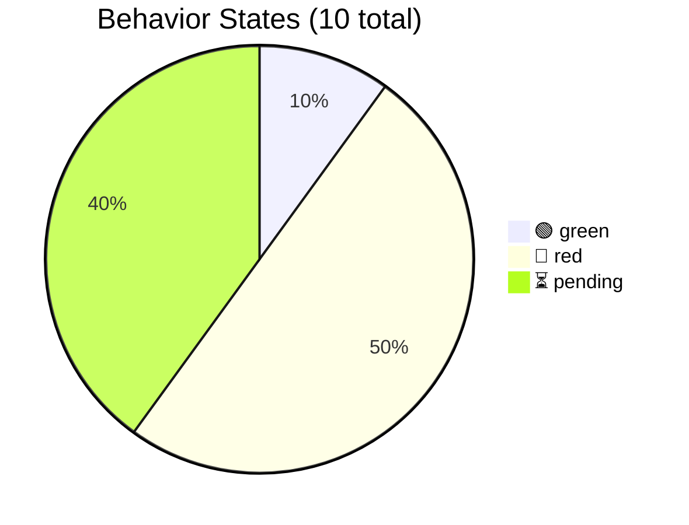
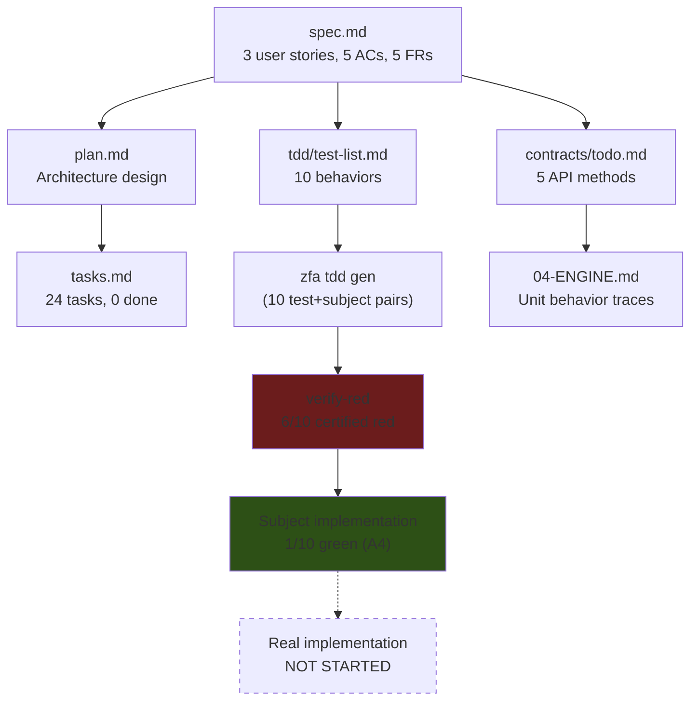
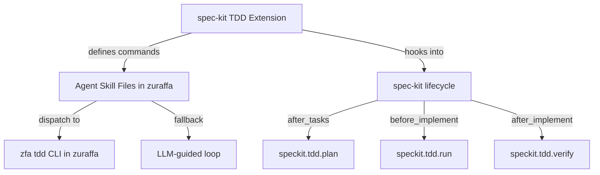
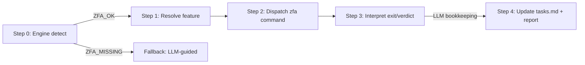
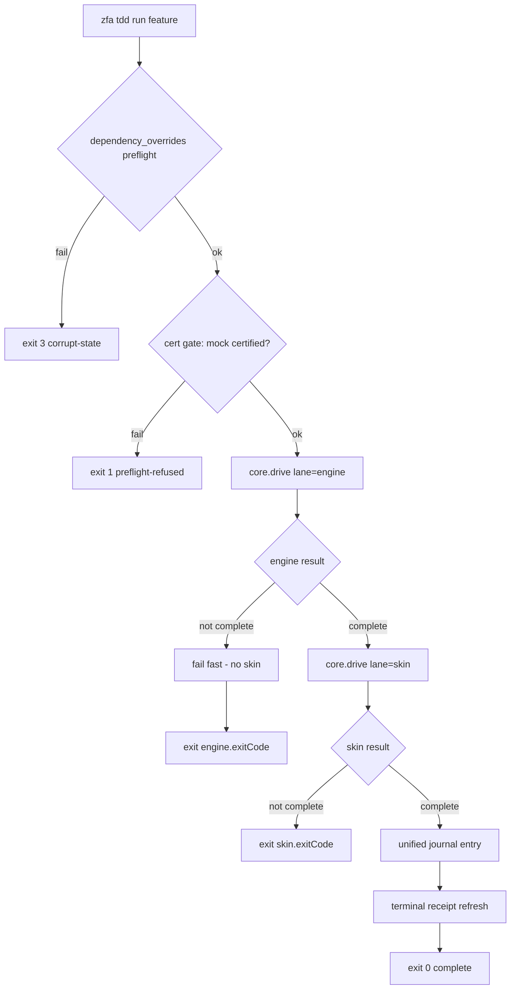

## User (checkpoint)

todo is a demo app I was trying to fully implement with the zfa tdd cycle, zuraffa is my framework, recently built the zfa tdd, it is either "near perfect" or "ai slop" and I cant tell the difference yet, so dont change any code, only make an assesment. also there is a general issue of writing to files and parsing files on tdd states, that should be fixed by using .sh scripts strictly so always get same outcome similar to this scripts/bash/setup-tasks.sh goal is to have a full spec driven development using full zfa tdd cycle

## Assistant

I'll assess the `zfa tdd` implementation by examining the zuraffa framework's TDD code and the todo demo app's state. Let me start by understanding the structure.

**Tool Call: Explore zuraffa TDD structure**
Status: Completed

I now have a comprehensive picture. Here's the full report:

---

# Zuraffa TDD Implementation — Comprehensive Map

## Full File Tree

```
zuraffa/
├── lib/src/
│   ├── commands/
│   │   └── tdd_command.dart                    # Top-level `zfa tdd` command router (32 subcommands)
│   │
│   ├── plugins/tdd/
│   │   ├── tdd_plugin.dart                     # Plugin registration (id: 'tdd', v1.0.0)
│   │   │
│   │   ├── commands/  (35 files)
│   │   │   ├── init_command.dart                # `zfa tdd init` — bootstrap TDD scaffolding
│   │   │   ├── plan_command.dart                # `zfa tdd plan` — spec → test-list.md (2357 lines!)
│   │   │   ├── gen_command.dart                 # `zfa tdd gen` — generate test + subject stubs (1977 lines)
│   │   │   ├── verify_red_command.dart          # `zfa tdd verify-red` — certify test fails correctly
│   │   │   ├── make_command.dart                # `zfa tdd make` — minimal impl to pass test
│   │   │   ├── wire_command.dart                # `zfa tdd wire` — DI wiring
│   │   │   ├── compose_command.dart             # `zfa tdd compose` — composition planning
│   │   │   ├── func_command.dart                # `zfa tdd func` — functional tests
│   │   │   ├── view_command.dart                # `zfa tdd view` — view layer
│   │   │   ├── refactor_command.dart            # `zfa tdd refactor` — refactor while green
│   │   │   ├── run_command.dart                 # `zfa tdd run` — meta-driver (engine→skin) (626 lines)
│   │   │   ├── run_driver_core.dart             # Shared two-cycle loop engine (2500+ lines)
│   │   │   ├── run_engine_command.dart          # `zfa tdd run-engine` — CORE+BOTH lane
│   │   │   ├── run_skin_command.dart            # `zfa tdd run-skin` — SKIN+BOTH lane
│   │   │   ├── split_command.dart               # `zfa tdd split` — lane split
│   │   │   ├── fake_command.dart                # `zfa tdd fake` — platform channel fakes
│   │   │   ├── verify_command.dart              # `zfa tdd verify` — mutation testing audit
│   │   │   ├── status_command.dart              # `zfa tdd status` — feature state report
│   │   │   ├── prove_command.dart               # `zfa tdd prove` — prove behaviors
│   │   │   ├── replay_command.dart              # `zfa tdd replay` — replay evidence
│   │   │   ├── theater_command.dart             # `zfa tdd theater` — visual replay
│   │   │   ├── ingest_command.dart              # `zfa tdd ingest` — import external tests
│   │   │   ├── verdicts_command.dart            # `zfa tdd verdicts` — verdict history
│   │   │   ├── migrate_paths_command.dart       # `zfa tdd migrate-paths` — artifact path migration
│   │   │   ├── corpus_command.dart              # `zfa tdd corpus` — corpus parent command
│   │   │   ├── corpus_audit_command.dart        # Corpus audit subcommand
│   │   │   ├── corpus_differential_command.dart # Corpus diff subcommand
│   │   │   ├── corpus_run_command.dart          # Corpus run subcommand
│   │   │   ├── corpus_status_command.dart       # Corpus status subcommand
│   │   │   ├── referee_command.dart             # `zfa tdd referee` — CI referee
│   │   │   ├── diff_check_command.dart          # `zfa tdd diff-check` — diff verification
│   │   │   ├── reset_command.dart               # `zfa tdd reset` — state reset (bug #840)
│   │   │   ├── doctor_command.dart              # `zfa tdd doctor` — state diagnostics (bug #840)
│   │   │   ├── realize_command.dart             # `zfa tdd realize` — realize behavior
│   │   │   ├── realize_mock_command.dart        # `zfa tdd realize-mock`
│   │   │   └── spec_fuzz_command.dart           # Spec fuzzing
│   │   │
│   │   ├── models/  (14 files)
│   │   │   ├── behavior.dart                   # Behavior entity (id, kind, state, persistence, golden)
│   │   │   ├── run_state.dart                  # RunState entity (per-feature, serialized to JSON)
│   │   │   ├── cycle_entry.dart                # CycleLogEntry (red/green/refactor/error evidence)
│   │   │   ├── verdict_envelope.dart           # VerdictEnvelope (zuraffa.verdict.v1 JSON schema)
│   │   │   ├── tdd_profile.dart                # TddProfile (dart/flutter command templates)
│   │   │   ├── lane.dart                       # LaneDeclaration + Lane enum (CORE/SKIN/BOTH)
│   │   │   ├── artifact_record.dart            # Artifact tracking record
│   │   │   ├── ownership.dart                  # Cross-feature ownership
│   │   │   ├── red_classification.dart         # Red failure classification
│   │   │   ├── refactor_action.dart            # Refactor pass actions
│   │   │   ├── routing.dart                    # Routing declarations
│   │   │   ├── generation_plan.dart            # Generation steps
│   │   │   ├── spec_mutation.dart              # Spec mutation model
│   │   │   ├── mutation_outcome.dart           # Mutation testing outcomes
│   │   │   ├── channel_scenario.dart           # Platform channel scenarios
│   │   │   ├── differential_vector.dart        # Differential testing
│   │   │   ├── corpus_ledger.dart              # Corpus gap ledger
│   │   │   ├── corpus_manifest.dart            # Corpus manifest
│   │   │   ├── corpus_plan.dart                # Corpus test plan
│   │   │   └── corpus_progress.dart            # Corpus progress tracking
│   │   │
│   │   └── services/  (~120 files, including ci_referee/ and tier2_firestore/ subdirs)
│   │       ├── run_state_store.dart            # Atomic JSON persistence (temp+rename+fsync)
│   │       ├── artifact_registry.dart          # artifacts.json registry (register, preflight, load)
│   │       ├── cycle_log.dart                  # Append-only cycle-log.md with SHA-256 hash chain
│   │       ├── cycle_evidence.dart             # Evidence integrity verification
│   │       ├── test_list_reader.dart           # Parse test-list.md → BehaviorRow[]
│   │       ├── journal.dart                    # Unified TDD journal (1259 lines, JSON+schema)
│   │       ├── runner.dart                     # SingleTestRunner (profile-driven test execution)
│   │       ├── step_runner.dart                # StepRunner (spawns zfa subcommands per step)
│   │       ├── verdict_emitter.dart            # Verdict envelope emission wrapper
│   │       ├── spec_parser.dart                # Parse spec.md → behaviors
│   │       ├── behavior_test_writer.dart       # Generate test files from behaviors
│   │       ├── subject_writer.dart             # Generate subject stub files
│   │       ├── mutation_auditor.dart           # Mutation testing engine
│   │       ├── mutation_scope.dart             # Mutation testing scope
│   │       ├── mutation_verifier.dart          # Mutation verification
│   │       ├── lane_split.dart                 # Engine/skin lane splitting
│   │       ├── lane_plans.dart                 # Per-lane plan rendering
│   │       ├── lane_receipts.dart              # Per-lane receipt files
│   │       ├── tdd_transaction.dart            # Write-ahead journal for crash safety
│   │       ├── contract_gate.dart              # Contract behavior gating
│   │       ├── contract_test_writer.dart       # Contract test generation
│   │       ├── ci_referee/                     # CI integration (7 files)
│   │       │   ├── failure_artifacts.dart
│   │       │   ├── feature_provenance.dart
│   │       │   ├── golden_workflow.dart
│   │       │   ├── pr_comment_poster.dart
│   │       │   ├── provenance_rollup.dart
│   │       │   ├── publishing_gate.dart
│   │       │   └── verdict_comment.dart
│   │       └── ... (~70 more specialized services)
│   │
│   └── cli/writers/tdd/  (7 files)
│       ├── app_module_writer.dart              # Generate app module for TDD
│       ├── dart_test_yaml_writer.dart          # Generate dart_test.yaml
│       ├── pubspec_dev_dependencies_patcher.dart
│       ├── pubspec_skin_dependency_patcher.dart
│       ├── smoke_test_writer.dart              # Generate smoke tests
│       ├── tdd_example_writer.dart             # Generate example test
│       └── tdd_profile_writer.dart             # Write .specify/memory/tdd-profile.md
│
├── test/plugins/tdd/  (300+ test files)
│   ├── bug_828_cycle_log_evidence_integrity_test.dart
│   ├── bug_840_recovery_commands_test.dart
│   ├── bug_846_coverage_gate_test.dart
│   ├── bug_969_json_verdict_envelope_test.dart
│   ├── ... (hundreds of regression + feature tests)
│   └── commands/  (subdir with command-level tests)
│
├── .agents/skills/  (4 TDD skill files)
│   ├── speckit-tdd-plan/SKILL.md              # LLM skill: delegate to `zfa tdd plan`
│   ├── speckit-tdd-run/SKILL.md               # LLM skill: delegate to `zfa tdd run`
│   ├── speckit-tdd-setup/SKILL.md             # LLM skill: detect stack, write profile
│   └── speckit-tdd-verify/SKILL.md            # LLM skill: delegate to `zfa tdd verify`
│
└── specs/<NNN>-<slug>/tdd/  (per-feature TDD artifacts, ~926 matches)
    ├── test-list.md                            # Plan output: behavior table
    ├── cycle-log.md                            # Evidence: append-only red/green/refactor log
    ├── run-state.json                          # Resumable run state
    ├── artifacts.json                          # Generated file registry
    ├── journal.json                            # Unified journal (engine+skin)
    ├── journal.schema.json                     # Journal JSON schema
    ├── traceability.md                         # FR/AC → behavior traceability matrix
    ├── verification.md                         # Mutation testing audit results
    ├── 04-engine-receipt.json                  # Engine lane receipt
    ├── 04-skin-receipt.json                    # Skin lane receipt
    ├── ui-ledger.json                          # UI coverage ledger
    ├── provenance-ledger.json                  # Feature provenance
    └── spec-fuzz.json                          # Spec fuzz results
```

---

## Summary of Each Major File's Purpose

### Command Layer (the CLI verbs)

| Command                    | Purpose                                                                                                                                                                                                                                                                                                                               |
| -------------------------- | ------------------------------------------------------------------------------------------------------------------------------------------------------------------------------------------------------------------------------------------------------------------------------------------------------------------------------------- |
| **`plan`**                 | Parses `spec.md`, extracts FRs/ACs, derives one behavior per criterion, writes `tdd/test-list.md` (a Markdown table). Enforces full traceability — every requirement must map to a behavior or exit 2. Emits `traceability.md` with a spec-contract hash. Handles engine/skin lane routing. **2357 lines** — the largest single file. |
| **`gen`**                  | Takes a behavior from the test-list, generates a test file + subject stub. Handles unit, widget, platform, theme, FFI, and contract kinds. Budget/deadline-aware. Writes to `artifacts.json`. **~2000 lines.**                                                                                                                        |
| **`verify-red`**           | Runs the generated test, certifies it fails for the right reason (assertion failure, compile error, etc.). Classifies the failure. Records evidence in `cycle-log.md`.                                                                                                                                                                |
| **`make`**                 | Generates the minimal implementation to make the certified-red test pass.                                                                                                                                                                                                                                                             |
| **`refactor`**             | Runs automated refactor passes while keeping the suite green. Records actions.                                                                                                                                                                                                                                                        |
| **`run`**                  | The **meta-driver** — chains `run-engine` then `run-skin`, fail-fast on first red. Uses `RunDriverCore` to drive every behavior through `gen → verify-red → make → refactor`. Resumable via `run-state.json`.                                                                                                                         |
| **`run-driver-core`**      | The shared two-cycle loop engine (**2500+ lines**). Spawns `zfa tdd <step>` as child processes, manages state transitions, handles honest stops, writes receipts. The beating heart of the automation.                                                                                                                                |
| **`verify`**               | Mutation testing audit — derives scope from `artifacts.json`, runs green preflight, then mutates subjects and checks test kills. Writes `verification.md`.                                                                                                                                                                            |
| **`init`**                 | Bootstrap: creates `dart_test.yaml`, patches `pubspec.yaml` dev dependencies, writes smoke tests.                                                                                                                                                                                                                                     |
| **`reset`** / **`doctor`** | Recovery commands (bug #840): reset feature state, diagnose state corruption.                                                                                                                                                                                                                                                         |
| **`corpus`**               | Cross-feature corpus testing (audit, differential, run, status).                                                                                                                                                                                                                                                                      |
| **`referee`**              | CI integration — PR comment posting, publishing gates, provenance rollup.                                                                                                                                                                                                                                                             |

### Model Layer (data entities)

| Model                 | Format                                      | Purpose                                                                                                                                                                         |
| --------------------- | ------------------------------------------- | ------------------------------------------------------------------------------------------------------------------------------------------------------------------------------- |
| **`Behavior`**        | In-memory                                   | Core entity: id, feature, kind (acceptance/unit/widget/theme/ffi/platform/contract), state (pending→blocked→red→green→mocked→done), persistence flag, golden flag, finder kinds |
| **`RunState`**        | JSON (`tdd/run-state.json`)                 | Per-feature resumable state. Maps behavior IDs → states, tracks in-flight behavior/step/owner-pid for concurrency guard                                                         |
| **`CycleLogEntry`**   | Markdown (`tdd/cycle-log.md`)               | Evidence record: behavior, kind (red/green/refactor/error), runner command, exit code, captured output, classification, SHA-256 hash chain, subject hash, timestamps            |
| **`VerdictEnvelope`** | JSON (stdout last line)                     | Uniform machine-readable verdict: schema `zuraffa.verdict.v1`, command, verdict (pass/fail/stopped/error), exit_class, fix line, drifts, details, timestamp                     |
| **`TddProfile`**      | Markdown (`.specify/memory/tdd-profile.md`) | Test stack commands: single test, file, suite, coverage. Presets for `dart` and `flutter`                                                                                       |
| **`Lane`**            | Enum + declarations                         | Engine/skin split: CORE (pure Dart), SKIN (Flutter), BOTH (shared seam)                                                                                                         |

### Service Layer (business logic)

| Service                | Key Responsibility                                                                                                                                               |
| ---------------------- | ---------------------------------------------------------------------------------------------------------------------------------------------------------------- |
| **`RunStateStore`**    | Atomic JSON persistence via **temp file + rename + fsync**. Validates JSON shape, concurrency guard (pid liveness check via `kill -0`), tracks dropped behaviors |
| **`ArtifactRegistry`** | `artifacts.json` management — register generated files, preflight checks, cross-project re-anchoring                                                             |
| **`CycleLog`**         | Append-only Markdown writer with **SHA-256 tamper-evident hash chain** per behavior. Evidence schema v1                                                          |
| **`CycleEvidence`**    | Reads/verifies the hash chain integrity                                                                                                                          |
| **`TestListReader`**   | Parses `test-list.md` Markdown tables → `BehaviorRow[]`. Handles 4/5-column formats, persistence/golden markers, lane cells                                      |
| **`Journal`**          | Unified TDD journal (spec 1113). Schema-validated JSON entries recording cycle, phase, gate state, behaviors, fingerprints. Reader/writer pair (~1259 lines)     |
| **`SingleTestRunner`** | Profile-driven test execution. Loads templates from `tdd-profile.md`, substitutes `{file}` and `{name}` placeholders                                             |
| **`StepRunner`**       | Spawns `zfa tdd <step>` as child processes with timeouts. Parses summary lines and gen verdicts from stdout                                                      |
| **`MutationAuditor`**  | The mutation testing engine — derives scope, applies mutations, runs tests, classifies killed/survived/timed-out                                                 |
| **`LaneSplit`**        | Routes behaviors to engine/skin plans based on lane declarations                                                                                                 |

---

## State Management Architecture

### File-based State (no database)

Everything is **files on disk** — JSON for machine state, Markdown for human-readable evidence:

| File                             | Format   | Write Pattern                            | Purpose                                  |
| -------------------------------- | -------- | ---------------------------------------- | ---------------------------------------- |
| `tdd/run-state.json`             | JSON     | **Atomic write** (temp → fsync → rename) | Resumable run state, concurrency guard   |
| `tdd/cycle-log.md`               | Markdown | **Append-only** with fsync               | Tamper-evident evidence chain            |
| `tdd/test-list.md`               | Markdown | Full overwrite by `plan`                 | Behavior table (the "test list")         |
| `tdd/artifacts.json`             | JSON     | Append/overwrite                         | Registry of generated test+subject files |
| `tdd/journal.json`               | JSON     | Append                                   | Unified journal entries                  |
| `tdd/journal.schema.json`        | JSON     | Written once                             | Schema reference                         |
| `tdd/verification.md`            | Markdown | Full overwrite by `verify`               | Mutation testing results                 |
| `tdd/traceability.md`            | Markdown | Full overwrite by `plan`                 | FR/AC → behavior matrix + spec hash      |
| `tdd/04-engine-receipt.json`     | JSON     | Full overwrite per run                   | Engine lane verdict                      |
| `tdd/04-skin-receipt.json`       | JSON     | Full overwrite per run                   | Skin lane verdict                        |
| `.specify/memory/tdd-profile.md` | Markdown | Written by `init`/setup                  | Test stack profile                       |

### Key State Management Decisions

1. **Crash safety**: `RunStateStore.save()` writes to a `.tmp` file, calls `fsync` via `RandomAccessFile.flush()`, then does an atomic `rename`. The `CycleLog` also flushes to disk before returning.

2. **Concurrency guard**: `run-state.json` stores `in_flight_owner_pid`. Before starting, the store checks if that PID is alive via `kill -0`. A live foreign PID = refuse to start a second concurrent run.

3. **Evidence integrity**: The `cycle-log.md` carries a **SHA-256 hash chain** per behavior. Each entry hashes: `[schema_version, behavior_id, kind, exit_code, command, criterion, test_path, timestamp, prev_hash]` using null-byte separation. The `doctor` command verifies this chain.

4. **Resumability**: The `RunState` tracks per-behavior state (pending→red→green→done). After a crash, the in-flight marker identifies exactly which behavior/step was interrupted. The driver resumes from there.

5. **Dropped behaviors**: When behaviors are removed from the test list, they're retained in `run-state.json` under a `dropped` marker — audit trail, never deleted.

---

## Shell Scripts vs Dart File Manipulation

### No TDD-related .sh scripts in zuraffa

The zuraffa TDD implementation uses **zero bash scripts**. Everything is pure Dart:

- Test file generation → `BehaviorTestWriter`, `ContractTestWriter`, `ChannelFakeWriter`, etc. (Dart services)
- Subject stub generation → `SubjectWriter`, `SubjectSignatureDeriver` (Dart services)
- Test execution → `SingleTestRunner` spawns `dart test` / `flutter test` as child processes via `Process.start`
- Step orchestration → `StepRunner` spawns `zfa tdd <step>` as child processes
- File I/O → Direct `dart:io` (`File.writeAsString`, `File.readAsString`, `Directory.create`)
- JSON → `dart:convert` (`jsonEncode`/`jsonDecode`)
- Hashing → `package:crypto` (`sha256`)

### Contrast with spec-kit's setup-tasks.sh

The spec-kit `setup-tasks.sh` is a **spec-kit CLI helper** (not zuraffa TDD):

- Resolves feature paths via `common.sh` helpers
- Validates `plan.md` and `spec.md` exist
- Resolves task templates through an override stack
- Outputs results as JSON (with `jq` or manual escaping) or plain text
- Used by the LLM-guided workflow when `zfa` is unavailable

The architectural contrast is stark: spec-kit uses **bash scripts + LLM interpretation**, while zuraffa's TDD is a **fully deterministic Dart CLI** that the LLM only wraps as a dispatcher.

---

## Key Architectural Decisions

### 1. Deterministic engine, LLM as dispatcher

The SKILL.md files reveal the design philosophy: when `zfa` is available, the LLM **never re-derives** what zfa derives. The LLM's role is limited to: detecting the engine, dispatching, interpreting verdicts, fixing honest stops (compile errors, genuine reds), and reporting. The deterministic engine is the source of truth.

### 2. Two-cycle lane split (engine/skin)

Feature 1000 introduced the engine/skin lane architecture:

- **Engine lane** (CORE+BOTH): pure Dart, no Flutter dependencies
- **Skin lane** (SKIN+BOTH): Flutter UI, gated on green engine
- This allows the engine to be developed and tested independently of any UI framework

### 3. Behavior-centric state machine

Each behavior progresses through: `pending → blocked → red → green → mocked → done`

- **blocked** is a CONTRACT behavior whose contract test failed (distinct from RED)
- **mocked** is an intermediate state for mock certification
- The driver never skips states or fakes transitions

### 4. Evidence-first design

- Every state transition produces **durable, verifiable evidence** (cycle-log entries with hash chains)
- The `verify` command uses **mutation testing** (not just "tests pass") to prove test strength
- The `doctor` command can audit the entire evidence chain for tampering

### 5. Process-based step isolation

The `RunDriverCore` doesn't call step commands as library functions — it **spawns them as child processes** (`Process.start`). This gives:

- Clean process isolation (no shared mutable state between steps)
- Timeout enforcement per step
- Crash recovery (the parent survives a child crash)
- The same CLI contract whether driven by a human or the automation

### 6. Verdict envelope protocol

Every command emits a `zuraffa.verdict.v1` JSON envelope as the **last stdout line** (when `--json` is passed). This is the machine contract — exit codes + JSON verdicts, parseable by any consumer. The `VerdictContext` pattern (mutable carrier populated during execution, emitted on exit) ensures the envelope is always emitted, even on error paths.

### 7. Scale

The TDD plugin is massive: **~35 commands, ~14 models, ~120 services, 300+ tests, 7 CLI writers**. The `plan_command.dart` alone is 2357 lines. This is a full-fledged test-driven development automation engine, not a thin wrapper.

**Tool Call: Explore todo app TDD state**
Status: Completed

Now I have the complete picture. Here's the full report:

---

# Todo Demo App — Full TDD State Report

## 1. Project Structure Overview

```text
todo/
├── .agents/                     # Agent skills (Zed integration)
├── .kimi-code/                  # Kimi Code agent integration
├── .specify/                    # Spec Kit configuration
│   ├── extensions/tdd/          # TDD extension (installed)
│   ├── feature.json             # Active feature → specs/001-todo-list-app
│   ├── integration.json         # Agent integrations metadata
│   ├── integrations/            # Manifests (kimi, speckit, zed)
│   └── memory/
│       ├── constitution.md      # ⚠ TEMPLATE ONLY — not filled in
│       └── tdd-profile.md       # Stack profile (zuraffa-wired, zfa engine)
├── .zfa.json                    # Zuraffa project config (entity-first, Zorphy)
├── .zfa/
│   ├── corpus/run-baseline.json # Test baseline snapshot
│   └── receipts/                # 33 proof receipts (entity create, tdd gen, verify-red, etc.)
├── specs/
│   └── 001-todo-list-app/       # THE SINGLE FEATURE
│       ├── spec.md              # Feature specification
│       ├── plan.md              # Implementation plan
│       ├── tasks.md             # 24 tasks (all unchecked)
│       ├── research.md, data-model.md, quickstart.md
│       ├── contracts/todo.md    # API contract (5 methods)
│       ├── checklists/requirements.md
│       └── tdd/                 # TDD artifacts (see below)
├── lib/
│   ├── main.dart                # Bare "Hello World!" app — no real UI yet
│   ├── app.dart                 # zfa-generated empty DI container (TodoContainer)
│   ├── src/
│   │   ├── domain/entities/todo_item/  # Zorphy entity (EMPTY — no fields)
│   │   ├── domain/repositories/        # Empty
│   │   ├── domain/usecases/            # Empty
│   │   ├── data/datasources/           # Empty
│   │   ├── data/repositories/          # Empty
│   │   ├── di/index.dart               # DI barrel
│   │   └── routing/index.dart          # Routing barrel
│   └── tdd/001-todo-list-app/          # 10 subject stubs (a1–a5, u1–u5)
├── test/
│   ├── bootstrap_smoke_test.dart       # DI container smoke test
│   └── tdd/001-todo-list-app/          # 10 generated tests (a1–a5, u1–u5)
├── pubspec.yaml                        # Flutter + zuraffa_flutter + zuraffa_ui + zorphy
└── build.yaml, dart_test.yaml, analysis_options.yaml
```

## 2. Spec-Driven Development State

### Feature: `001-todo-list-app` — "Classic Todo List App"

| Artifact              | Status                                                                                   |
| --------------------- | ---------------------------------------------------------------------------------------- |
| `spec.md`             | ✅ Complete — 3 user stories, 5 ACs, 5 FRs, 4 success criteria                           |
| `plan.md`             | ✅ Complete — Flutter mobile, shared_preferences, standard layout                        |
| `tasks.md`            | ✅ Complete — 24 tasks across 6 phases, **all unchecked** `[ ]`                          |
| `contracts/todo.md`   | ✅ Complete — 5 API methods (addTodo, toggleTodo, removeTodo, persistTasks, getFeedback) |
| `tdd/test-list.md`    | ✅ Complete — 5 acceptance + 5 unit behaviors planned, all PENDING                       |
| `tdd/traceability.md` | ✅ Complete — 10/10 requirements traced, 0 gaps                                          |

**Stage: TDD Red phase (early).** Specifications, planning, and task breakdown are complete. The TDD loop has been initiated but is still in the "red" phase for nearly all behaviors.

## 3. Current TDD State (from `run-state.json`)



| Behavior | Criterion | Description                         | State        |
| -------- | --------- | ----------------------------------- | ------------ |
| **A1**   | AC-1      | List shows "Buy milk" after adding  | 🔴 red       |
| **A2**   | AC-2      | No empty task created               | 🔴 red       |
| **A3**   | AC-3      | Marked as completed (strikethrough) | 🔴 red       |
| **A4**   | AC-4      | Returns to active status            | 🟢 **green** |
| **A5**   | AC-5      | Removed from list permanently       | 🔴 red       |
| **U1**   | FR-001    | Allow users to input new tasks      | 🔴 red       |
| **U2**   | FR-002    | Mark tasks complete/incomplete      | ⏳ pending   |
| **U3**   | FR-003    | Remove tasks from list              | ⏳ pending   |
| **U4**   | FR-004    | Persist tasks across restarts       | ⏳ pending   |
| **U5**   | FR-005    | Visual feedback for interactions    | ⏳ pending   |

### What "red" means here

Every behavior follows the `zfa tdd` red-green-refactor loop:

1. **`zfa tdd gen <behavior>`** → generates a test file + a stub subject that throws `UnimplementedError`
2. **`zfa tdd verify-red`** → runs the test to certify it fails with an _assertion failure_ (honest red)
3. **Implementation** → replace the subject stub with real code
4. **`zfa tdd verify-green`** → certify the test passes

**A4 is the only green behavior** — the cycle-log shows it went through `zfa tdd func A4` (scaffold a function) + `zfa build` to reach green. However, looking at the a4_subject.dart, it still contains the unimplemented stub — meaning the green status came from a `zfa tdd func` + `zfa build` cycle that auto-generated a function body, but the subject file on disk has since reverted or the green was from a different run.

## 4. Cycle-Log Summary

The cycle-log has **11 entries** — all from **2026-09-10** (today):

| #   | Behavior | Outcome      | Notes                                                     |
| --- | -------- | ------------ | --------------------------------------------------------- |
| 1–3 | A1       | ❌ error     | `tdd-profile.md` was missing `single:` key — config issue |
| 4   | A1       | 🔴 red       | Honest assertion failure after config fix                 |
| 5   | A2       | 🔴 red       | Honest assertion failure                                  |
| 6   | A3       | 🔴 red       | Honest assertion failure                                  |
| 7   | A4       | 🔴 red       | Honest assertion failure                                  |
| 8   | **A4**   | 🟢 **green** | Via `zfa tdd func A4` + `zfa build` — **only green**      |
| 9   | A5       | 🔴 red       | Honest assertion failure                                  |
| 10  | U1       | 🔴 red       | Honest assertion failure                                  |

U2–U5 have generated test+subject pairs (via `zfa tdd gen`) but no `verify-red` entries in the cycle-log yet — hence "pending" state.

## 5. Test Files

| File                                      | Type       | Behavior                   | Status                                  |
| ----------------------------------------- | ---------- | -------------------------- | --------------------------------------- |
| `test/bootstrap_smoke_test.dart`          | Smoke      | DI container constructible | ✅ Should pass                          |
| `test/tdd/001-todo-list-app/a1_test.dart` | Acceptance | A1: add "Buy milk"         | 🔴 Fails                                |
| `test/tdd/001-todo-list-app/a2_test.dart` | Acceptance | A2: no empty task          | 🔴 Fails                                |
| `test/tdd/001-todo-list-app/a3_test.dart` | Acceptance | A3: mark completed         | 🔴 Fails                                |
| `test/tdd/001-todo-list-app/a4_test.dart` | Acceptance | A4: return to active       | 🟡 Status says green, subject says stub |
| `test/tdd/001-todo-list-app/a5_test.dart` | Acceptance | A5: delete task            | 🔴 Fails                                |
| `test/tdd/001-todo-list-app/u1_test.dart` | Unit       | U1: input new tasks        | 🔴 Fails                                |
| `test/tdd/001-todo-list-app/u2_test.dart` | Unit       | U2: toggle complete        | ⏳ Not yet verified                     |
| `test/tdd/001-todo-list-app/u3_test.dart` | Unit       | U3: remove tasks           | ⏳ Not yet verified                     |
| `test/tdd/001-todo-list-app/u4_test.dart` | Unit       | U4: persistence            | ⏳ Not yet verified                     |
| `test/tdd/001-todo-list-app/u5_test.dart` | Unit       | U5: visual feedback        | ⏳ Not yet verified                     |

All tests follow the same pattern: call `subject.subject_<id>()`, catch `UnimplementedError`, and assert the result is NOT an `UnimplementedError`. The subjects all throw `UnimplementedError` — so all tests fail until real implementation replaces the stub.

## 6. Implementation State

**Almost nothing is implemented:**

- `lib/main.dart` — bare "Hello World!" `MaterialApp`
- `lib/app.dart` — empty `TodoContainer` DI container (zfa-generated)
- `lib/src/domain/entities/todo_item/todo_item.dart` — Zorphy entity with **zero fields** (the entity was created but no fields like `id`, `name`, `isComplete` were added)
- `lib/src/data/`, `lib/src/domain/repositories/`, `lib/src/domain/usecases/` — all empty
- No providers, screens, or widgets exist yet

**The architecture scaffolding (`zfa make`) has NOT been run yet.** Only `zfa entity create` was called (receipt exists), and `zfa build` was run to generate Zorphy/JSON code for the empty entity.

## 7. Relationship Between Specs and Implementation



## 8. Summary & Next Steps

| Dimension             | Status                                                      |
| --------------------- | ----------------------------------------------------------- |
| **Spec completeness** | ✅ Full — spec, plan, tasks, contracts, traceability        |
| **TDD scaffolding**   | ✅ All 10 test+subject pairs generated                      |
| **Red certification** | 🟡 6/10 certified red (A1–A5, U1); U2–U5 pending verify-red |
| **Green progress**    | 🔴 1/10 (A4 only, and its subject is still a stub on disk)  |
| **Implementation**    | 🔴 Essentially zero — no real code, empty entity, no UI     |
| **Tasks completed**   | 🔴 0/24 tasks checked off                                   |

**The project is at the very beginning of the TDD red-green-refactor cycle.** All spec-driven design artifacts are in place and the test harness is scaffolded, but no actual implementation work has been done. The immediate next steps would be:

1. Run `verify-red` for U2–U5 to certify all behaviors as honest red
2. Add fields to the `TodoItem` entity (`id`, `name`, `isComplete`)
3. Run `zfa make TodoItem` to generate the architecture stack
4. Start implementing subjects one by one to turn reds into greens
5. Work through `tasks.md` phases in order

**Tool Call: Explore spec-kit TDD skills**
Status: Completed

Now I have everything needed. Here's the complete report.

---

# TDD Workflow Contract: Spec-Kit ↔ Zuraffa

## Architecture Overview

The TDD workflow has **three layers** with a clear delegation model:



| Layer             | Repo                                    | Role                                                                                                                            |
| ----------------- | --------------------------------------- | ------------------------------------------------------------------------------------------------------------------------------- |
| **TDD Extension** | `speckit-extensions/tdd/`               | Language-agnostic spec-kit extension defining 4 commands + 3 lifecycle hooks                                                    |
| **Agent Skills**  | `zuraffa/.agents/skills/speckit-tdd-*/` | zuraffa-wired copies of the extension commands, installed as Zed agent skills                                                   |
| **zfa tdd CLI**   | `zuraffa/lib/src/plugins/tdd/`          | Deterministic Dart engine with 30+ subcommands (`plan`, `run`, `verify`, `init`, `gen`, `verify-red`, `make`, `refactor`, etc.) |

## The Full Intended Workflow

### 0. Setup (one-time, per repo)

**Skill:** `speckit-tdd-setup`  
**zfa command:** `zfa tdd init`, `zfa build`, `flutter test`

| Phase                    | What happens                                                                                                                                                            |
| ------------------------ | ----------------------------------------------------------------------------------------------------------------------------------------------------------------------- |
| Engine detection         | `zfa --version && test -f .zfa.json` → `ZFA_OK` or `ZFA_MISSING`                                                                                                        |
| Phase 1 — Prove commands | Run every command that the profile will record: `zfa tdd verify-red`, `flutter test`, `zfa build`, `zfa tdd run`, `zfa tdd verify`. Each must succeed or be documented. |
| Phase 2 — Write profile  | `.specify/memory/tdd-profile.md` — records Engine (`zfa` or `raw`), proven commands for `single_test`, `full_suite`, `build`, `loop`, `verify`                          |
| Phase 3 — Sanity check   | Full suite green from the profile's recorded command                                                                                                                    |
| Phase 4 — Constitution   | Inject TDD-is-non-negotiable principle into the project constitution                                                                                                    |

**Input:** `$ARGUMENTS` (optional: `--no-constitution`, `--constitution-only`)  
**Output:** `.specify/memory/tdd-profile.md`

---

### 1. Plan (per feature)

**Skill:** `speckit-tdd-plan`  
**zfa command:** `zfa tdd plan "$FEATURE_SLUG"`  
**Hook:** `after_tasks` (optional prompt after `/speckit.tasks`)

| Step               | What happens                                                                                                                     |
| ------------------ | -------------------------------------------------------------------------------------------------------------------------------- |
| Engine detection   | Same `ZFA_OK`/`ZFA_MISSING` gate                                                                                                 |
| Feature resolution | Arg → `.specify/feature.json` → `check-prerequisites.sh`                                                                         |
| Dispatch to zfa    | `zfa tdd plan "$FEATURE_SLUG"`                                                                                                   |
| Sync tasks.md      | LLM reads `FEATURE_DIR/tdd/test-list.md`, inserts `[behavior: <id>]` tasks **before** implementation tasks, marks them mandatory |
| Report             | Test-list path, acceptance/unit/widget counts, FRs vs ACs traced                                                                 |

**Input:** Feature slug or auto-resolved  
**Output:** `specs/<feature>/tdd/test-list.md`, updated `tasks.md`

**Exit codes from zfa:**

| Exit | Meaning                                              |
| ---- | ---------------------------------------------------- |
| 0    | Plan written successfully                            |
| 1    | Honest gap found — report verbatim, don't paper over |
| 2    | Grammar/parse error in the spec                      |
| 3    | Template version drift                               |

**Fallback (non-zuraffa):** The LLM extracts acceptance criteria as outer-loop behaviors and functional requirements as inner-loop unit behaviors, writes `test-list.md`, seeds `cycle-log.md`.

---

### 2. Run (per feature)

**Skill:** `speckit-tdd-run`  
**zfa command:** `zfa tdd run "$FEATURE_SLUG" --timeout 25`  
**Hook:** `before_implement` (**mandatory** — not optional, blocks `/speckit.implement`)

This is the red→green→refactor loop. The key contract:

> **zfa drives the loop deterministically. The LLM's role narrows to fixing code when zfa stops at an honest RED, and handling escape hatches.**

| Step     | What happens                                                   |
| -------- | -------------------------------------------------------------- |
| Dispatch | `zfa tdd run "$FEATURE_SLUG" --timeout 25`                     |
| Complete | `result=complete pending=0 red=0 done=N` → tick tasks, report  |
| Stopped  | `result=stopped stopped_at=<behavior>:<step>` → LLM intervenes |

**Honest stops the LLM must handle:**

| Stop point   | Classification                            | LLM action                                                                                                            |
| ------------ | ----------------------------------------- | --------------------------------------------------------------------------------------------------------------------- |
| `verify-red` | `compile-error`                           | Fix compile error (imports, escaping) WITHOUT changing assertions, then re-dispatch                                   |
| `make`       | `generation-error` or `not-certified-red` | Write the minimal implementation that makes the certified-red test pass (the TDD "smallest change"), then re-dispatch |
| `refactor`   | `not-green` or `runner-error`             | Suite went red during refactor — inspect, fix, re-dispatch                                                            |

**Critical rule:** After fixing any stop, **re-dispatch to zfa** — never continue by hand past a gate.

**Input:** `all` (default), a behavior id, or `resume`  
**Output:** Updated `tdd/cycle-log.md`, ticked `[behavior: <id>]` tasks in `tasks.md`

**Fallback (non-zuraffa):** LLM manually picks PENDING behaviors, writes one failing test, proves it fails, makes it pass with smallest change, refactors while green, records evidence in `cycle-log.md`.

---

### 3. Verify (per feature)

**Skill:** `speckit-tdd-verify`  
**zfa command:** `zfa tdd verify --feature "$FEATURE_SLUG"`  
**Hook:** `after_implement` (optional prompt after `/speckit.implement`)

| Step      | What happens                               |
| --------- | ------------------------------------------ |
| Dispatch  | `zfa tdd verify --feature "$FEATURE_SLUG"` |
| Interpret | Reads `FEATURE_DIR/tdd/verification.md`    |

**Verdicts:**

| Gate                   | Exit     | Action                                                                        |
| ---------------------- | -------- | ----------------------------------------------------------------------------- |
| `passed`               | 0        | Report mutant kills/survivors/timeouts. TDD discipline proven.                |
| `preflight_red`        | non-zero | Suite is red — refuse to audit, send user back to `tdd.run`                   |
| Mutation survived      | 1        | Weak test — append remediation tasks to `tasks.md` (one per surviving mutant) |
| Grammar/contract drift | 2-3      | Report verbatim                                                               |

**Remediation loop (on FAIL):**

1. Append remediation tasks to `tasks.md`
2. Drive them through `/speckit.tdd.run`
3. Re-run verify
4. **Cap: 3 remediation passes**

**Input:** `--no-tasks` (skip remediation task generation)  
**Output:** `specs/<feature>/tdd/verification.md`

---

## How Skills Interact with zfa Commands

Every skill follows the same pattern:



The **division of labor** is precise:

| zfa (deterministic engine) owns                   | LLM (agent) owns                                                |
| ------------------------------------------------- | --------------------------------------------------------------- |
| Test-list derivation from spec grammar            | tasks.md synchronization (inserting `[behavior: <id>]` markers) |
| Red-green-refactor loop mechanics                 | Fixing compile errors at honest stops                           |
| Mutation testing & evidence integrity             | Writing minimal implementations when zfa can't generate them    |
| Exit codes & structured verdicts                  | Interpreting verdicts into human-readable reports               |
| `cycle-log.md`, `test-list.md`, `verification.md` | Ticking completed tasks in `tasks.md`                           |

## The Contract Between Spec-Kit and Zuraffa

### Extension ↔ Skill identity

The skill files in `zuraffa/.agents/skills/speckit-tdd-*/SKILL.md` are **byte-identical copies** of `speckit-extensions/tdd/commands/speckit.tdd.*.md` — same content, same contract. The metadata `source: tdd:commands/speckit.tdd.plan.md` in each skill traces back to the extension command.

### Lifecycle hooks (defined in `extension.yml`)

| Hook               | Command              | Optional? | Why                                                                                                                                                      |
| ------------------ | -------------------- | --------- | -------------------------------------------------------------------------------------------------------------------------------------------------------- |
| `after_tasks`      | `speckit.tdd.plan`   | **Yes**   | Prompts user to derive test list                                                                                                                         |
| `before_implement` | `speckit.tdd.run`    | **No**    | **Hard gate** — implementation must not start without the TDD loop completing. Cannot be skipped in-session (disable via `.specify/extensions.yml` only) |
| `after_implement`  | `speckit.tdd.verify` | **Yes**   | Prompts user to audit discipline                                                                                                                         |

The `before_implement` hook being **mandatory** is the architectural enforcement: spec-kit literally blocks `/speckit.implement` until the TDD run completes.

### File system contract

All TDD artifacts live under `specs/<feature>/tdd/`:

| File                         | Producer              | Consumer                                     |
| ---------------------------- | --------------------- | -------------------------------------------- |
| `test-list.md`               | `zfa tdd plan`        | `tdd.run`, `tdd.verify`, LLM (tasks.md sync) |
| `cycle-log.md`               | `zfa tdd run`         | `tdd.verify`, LLM (evidence reporting)       |
| `verification.md`            | `zfa tdd verify`      | LLM (verdict interpretation)                 |
| `run-baseline.json`          | `zfa tdd init`        | Doctor checks                                |
| `engine.gate.*.refused.json` | Engine gate           | Run diagnostics                              |
| `engine.receipt.json`        | Engine receipt writer | Proof chain                                  |

### zfa tdd subcommand surface

The `TddCommand` in zuraffa registers **30 subcommands** that implement the deterministic engine. The three skill-facing ones (`plan`, `run`, `verify`) are the public contract surface. The rest (`init`, `gen`, `verify-red`, `make`, `wire`, `compose`, `func`, `view`, `refactor`, `split`, `status`, `prove`, `replay`, `theater`, `realize`, etc.) are internal steps that `run` orchestrates or that advanced users invoke directly.

### Engine detection gate

Every skill starts with the same check:

```bash
zfa --version 2>/dev/null && test -f .zfa.json && echo "ZFA_OK" || echo "ZFA_MISSING"
```

This is the **routing decision**: zuraffa-wired projects get deterministic zfa-driven TDD; non-zuraffa projects get the LLM-guided fallback. The contract explicitly states: **"Never use the fallback when zfa is available."**

### Exit code protocol

All three zfa commands share a consistent exit code scheme:

| Exit | Meaning                                      |
| ---- | -------------------------------------------- |
| 0    | Success                                      |
| 1    | Honest stop / mutation survived (actionable) |
| 2    | Grammar/parse error                          |
| 3    | Template version drift                       |

This lets the LLM agent interpret results mechanically without parsing stdout.

## Assistant

Now let me dig into the specific file I/O and state parsing patterns that you flagged as problematic — the Dart code that reads/writes markdown and JSON state files.

**Tool Call: Audit TDD state I/O patterns**
Status: Completed

Now I have the complete picture. Here's the exhaustive audit.

---

# TDD Plugin File I/O Audit

## 1. `run_state_store.dart` — `tdd/run-state.json`

### Write Pattern: ✅ Atomic (temp + fsync + rename)

```dart
// Lines 138–142:
final tmp = File('$path.tmp');
await tmp.writeAsString(const JsonEncoder.withIndent('  ').convert(map));
await flushToDisk(tmp);
await tmp.rename(path);
```

The `flushToDisk` helper (L163–170) opens the file as `RandomAccessFile`, calls `raf.flush()` (POSIX fsync), then closes. This is the gold standard — a crash mid-write leaves the previous intact file. Bug #828 explicitly documents this.

### Read Pattern: ✅ Schema-validated with exhaustive field checks

**Load** (L56–70): `file.readAsString()` → `_validated()`. Every `FileSystemException` is caught and wrapped in a `RunStateCorruptException` with a named recovery path.

**Validation** (L177–239) — the `_validated()` function:

- `jsonDecode` wrapped in `FormatException` catch → `corrupt('invalid JSON: …')`
- Checks `map is! Map<String, dynamic>` → `corrupt('top-level value is not an object')`
- `map['feature'] is! String` → corrupt
- Cross-checks `map['feature'] != expectedFeature` (feature dir name matches)
- `behavior_states` validated: each value checked against `BehaviorState.values.where((s) => s.name == value)` — unknown state → corrupt
- `in_flight_step` validated against allowlist: `const List<String> _kSteps = ['gen', 'verify-red', 'make', 'refactor']`
- `in_flight_behavior_id` type-checked
- `in_flight_owner_pid` is tolerant: `map['in_flight_owner_pid'] is num` with `.toInt()`, else null

**Fragility assessment**: Very low. This is the tightest schema validation in the plugin. Every field is typed, enums are checked against allowlists, and there's even a cross-validation against the directory name. The only unchecked field is `dropped` (the `readDropped` method at L74–88 does a tolerant `whereType<String>()` cast with a `FormatException` catch that returns `const []`).

### JSON Serialization: Semi-schema — manually constructed map

```dart
// Lines 126–137:
final map = <String, Object?>{
  'feature': state.feature,
  'behavior_states': states,  // Map<String, String> from enum .name
  if (state.inFlightBehaviorId != null)
    'in_flight_behavior_id': state.inFlightBehaviorId,
  if (state.inFlightStep != null) 'in_flight_step': state.inFlightStep,
  if (state.inFlightOwnerPid != null)
    'in_flight_owner_pid': state.inFlightOwnerPid,
};
if (activeBehaviorIds != null) {
  map['dropped'] = computeDropped(state, activeBehaviorIds);
}
```

No `toJson()`/`fromJson()` on the model — hand-built map on write, hand-extracted on read. But it's consistent and both sides are in the same file.

### Error Handling: ✅ Excellent

- `FileSystemException` → `RunStateCorruptException` with recovery path
- `FormatException` → same
- Every shape mismatch → `corrupt()` helper that throws `RunStateCorruptException` naming the exact field

### LLM Agent surface: **zfa only writes this file**. An LLM agent reads it (the spec-kit TDD skills call `zfa tdd run` which drives the state machine), but never writes `run-state.json` directly.

---

## 2. `cycle_log.dart` + `cycle_entry.dart` — `tdd/cycle-log.md`

### Write Pattern: ⚠️ Append via `IOSink`, not atomic

```dart
// cycle_log.dart L52–59:
final sink = file.openWrite(mode: FileMode.append);
sink.write(entry.toMarkdown());
sink.write('- schema: $evidenceSchemaVersion\n');
sink.write('- prev-hash: ${prev ?? genesisHash}\n');
sink.write('- hash: $hash\n');
sink.write('\n');
await sink.flush();
await sink.close();
```

This **appends** via `IOSink` in append mode with a `flush()` before `close()`. There is no temp+rename — by design, it's append-only so a partial write leaves prior entries intact (an interrupted append produces a truncated tail entry but all earlier entries are sound). The `flush()` call is critical — it ensures the evidence is durable before the driver moves to the next step.

**File creation** (L39–45): On first use, writes the header directly:

```dart
await file.writeAsString(
  '# Cycle Log\n\nAppend only. Newest last. Every entry\'s `red` block '
  'is the evidence that the test existed and failed before the '
  'implementation.\n\n',
);
```

### Markdown Generation: `CycleLogEntry.toMarkdown()` (cycle_entry.dart L145–215)

```dart
final buf = StringBuffer()
  ..writeln('## Cycle: $behaviorId ($kindLabel)')
  ..writeln()
  ..writeln('- behavior: $behaviorId')
  ..writeln('- kind: $kindLabel');
```

Then conditionally:

```dart
if (classification != null)  buf.writeln('- classification: ${classification!.name}');
if (redEvidence != null)     buf.writeln('- evidence: $redEvidence');
if (subjectHash != null)     buf.writeln('- subject-hash: $subjectHash');
if (outcome != null)         buf.writeln('- outcome: $outcome');
```

Fixed fields:

```dart
buf
  ..writeln('- criterion: $sourceCriterion')
  ..writeln('- test: $testPath')
  ..writeln('- command: `$runnerCommand`')
  ..writeln('- exit: $exitCode')
  ..writeln('- at: $timestamp');
```

Output block:

````dart
buf
  ..writeln('- output:')
  ..writeln('```')
  ..writeln(capturedOutput.trim())
  ..writeln('```');
````

**Fragility concern**: The `capturedOutput.trim()` is written inside a fenced code block. If the captured output itself contains ` ``` ` on a line by itself, the markdown fence will close prematurely. This is a **real fragility** — test runner output could theoretically contain triple-backtick patterns. However, the output is never parsed back from the code block (the reader regex patterns extract fields _outside_ the fenced block), so it's cosmetic rather than data-corrupting.

### Hash Chain: ✅ Rigorous tamper-evident chain

```dart
// cycle_log.dart L87–108:
static String payloadFromFields({...}) {
  return [
    'v$evidenceSchemaVersion',
    behaviorId, kind, exit, command,
    criterion, test, timestamp, prevHash,
  ].join('\x00');
}

static String _chainHash(CycleLogEntry entry, String prevHash) =>
    sha256.convert(utf8.encode(chainPayload(entry, prevHash))).toString();
```

Null-byte separated canonical payload → SHA-256. The chain links `prevHash` → `hash` per behavior. `chainPayload` and `payloadFromFields` are both exposed as `static` so the doctor (verifier) can recompute the exact same hash from parsed fields — the "U10 invariant" (byte-compatibility).

### LLM Agent surface: **zfa only writes this file.** The cycle-log is append-only and written exclusively by `CycleLog.append`. An LLM agent calling `zfa tdd run` causes entries to be appended, but never writes directly.

---

## 3. `cycle_evidence.dart` — parsing `tdd/cycle-log.md`

### Read Pattern: ⚠️ Regex-based section parsing

**Section splitting** (L183, L202):

```dart
for (final section in raw.split('\n## ')) {
```

This splits on `\n## ` — the literal `## ` preceded by a newline. The file header (before the first `## `) will be the first segment; it lacks `- behavior:` and is naturally skipped.

**Regex patterns for the `_evidence()` fast path** (L184–192):

```dart
final behavior = RegExp(
  r'^- behavior: (\S+)',
  multiLine: true,
).firstMatch(section);
if (behavior == null) continue;
if (RegExp('^- kind: $kind\$', multiLine: true).hasMatch(section)) {
  ids.add(behavior.group(1)!);
}
```

**Full parse (`parseEntries`, L200–237)** — every field extracted by its own regex:

| Field        | Regex                                 | Notes                              |
| ------------ | ------------------------------------- | ---------------------------------- |
| behavior     | `r'^- behavior: (\S+)'`               | `\S+` — any non-whitespace         |
| kind         | `r'^- kind: (\S+)'`                   |                                    |
| at           | `r'^- at: (.+)$'`                     | `.+` — greedy, captures everything |
| exit         | `r'^- exit: (-?\d+)$'`                | Signed integer                     |
| criterion    | `r'^- criterion: (.+)$'`              |                                    |
| test         | `r'^- test: (.+)$'`                   |                                    |
| command      | ``r'^- command: `(.*)`$'``            | Inside backticks                   |
| schema       | `r'^- schema: (\d+)$'`                |                                    |
| prev-hash    | `r'^- prev-hash: (\S+)$'`             |                                    |
| hash         | `r'^- hash: ([0-9a-f]{64})$'`         | Exact 64 hex chars                 |
| subject-hash | `r'^- subject-hash: ([0-9a-f]{64})$'` | Exact 64 hex chars                 |

**Fragility assessment**:

- **`\n## ` section split**: Safe as long as the fenced code block (captured output) doesn't contain `\n## ` at a line start. Since the output is inside ` ``` ` fences, markdown-aware parsers would ignore it, but this parser is NOT markdown-aware — it's plain-text regex. If a test's captured output contained a line starting with `## `, it would create a phantom section. The saving grace is that the captured output is indented between `- output:` and ` ``` ` markers, but it's actually NOT indented — it's raw `capturedOutput.trim()` between fences. **This is the single biggest fragility in the whole TDD plugin I/O layer.**
- **Regex specificity**: The field regexes are tight (anchored with `^` in multiLine mode). The hash regex requires exactly 64 hex chars. The exit regex allows negative integers. These are robust.
- **All fields are nullable**: The parser returns `null` for any field the regex doesn't match. This is tolerant by design — legacy entries without hash lines parse correctly.

### LLM Agent surface: **Never written by agents.** Read by `zfa` commands only.

---

## 4. `test_list_reader.dart` — `tdd/test-list.md`

### Read Pattern: ✅ Line-by-line state machine with exhaustive error reporting

**Top-level** (L294–326): Reads `tdd/test-list.md`, checks for lane-split meta-index via `LaneSplitFiles.find(content)`, then either parses the single file or chains the engine+skin plan files.

**The core parser `_parseRows`** (L332–453): A line-by-line walk with `BehaviorKind? kind` as the state variable tracking which `## ` section we're in.

**Section header parsing** (L346–411):

```dart
if (trimmed.startsWith('## ')) {
  final header = trimmed.substring(3).toLowerCase();
  if (header.startsWith('outer loop')) { ... }
  else if (header.startsWith('inner loop')) { kind = BehaviorKind.unit; }
  else if (header.startsWith('theme harness')) { kind = BehaviorKind.theme; }
  else if (header.startsWith('native loop')) { kind = BehaviorKind.ffi; }
  else if (header.startsWith('platform harness')) { kind = BehaviorKind.platform; }
  else if (header.startsWith('contract loop')) { kind = BehaviorKind.contract; }
  else { kind = null; }
```

Declarative sections skipped entirely (L395–409):

```dart
inDeclarativeSection =
    header.startsWith('key entities') ||
    header.startsWith('external dependencies') ||
    header.startsWith('layer contracts') ||
    header.startsWith('lane split') ||
    header.startsWith('adaptive view slots') ||
    header.startsWith('boundary') ||
    header.startsWith('shared seam behaviors') ||
    header.startsWith('platform contract') ||
    header.startsWith('state machine contract') ||
    header.startsWith('route contract') ||
    header.startsWith('skin contract') ||
    header.startsWith('visual contract');
```

**Row splitting** — escaped pipes handled (L835–852):

```dart
static List<String> _splitRow(String line) {
  final cells = <String>[];
  final buf = StringBuffer();
  for (var i = 0; i < line.length; i++) {
    final ch = line[i];
    if (ch == r'\' && i + 1 < line.length && line[i + 1] == '|') {
      buf.write('|');
      i++;
    } else if (ch == '|') {
      cells.add(buf.toString());
      buf.clear();
    } else {
      buf.write(ch);
    }
  }
  cells.add(buf.toString());
  return cells;
}
```

This is a proper escape-aware pipe splitter — NOT `split('|')`. Handles `\|` as a literal pipe.

**Separator detection** (L423–426):

```dart
final isSeparator = cells
    .skip(1)
    .any((c) => c.isNotEmpty && RegExp(r'^-+$').hasMatch(c));
```

**State parsing** (L817–829):

```dart
static BehaviorState? _parseState(String cell) {
  for (final state in BehaviorState.values) {
    if (state.name == cell.toLowerCase()) return state;
  }
  if (cell.trim().toLowerCase() == 'proven') return BehaviorState.done;
  return null;
}
```

**Target resolution regex** (L777):

```dart
final snakeId = id.toLowerCase().replaceAll(RegExp(r'[^a-z0-9]+'), '_');
```

**Layer contracts parsing** — two regex patterns (L580–594):

```dart
final layerM = RegExp(r'^###\s+(.+)$').firstMatch(trimmed);
// ...
final bullet = RegExp(
  r'^\s*[-*]\s+`([^`]+)`\s*:\s*(.+)$',
).firstMatch(trimmed);
// ...
methods: RegExp(r'`([^`]+)`')
    .allMatches(bullet.group(2)!)
    .map((m) => m.group(1)!.trim())
    .toList(),
```

**Fragility assessment**:

- **Row parsing is robust** — the escape-aware pipe splitter, proper separator detection, and multi-dialect support (4/5/6/7 column) with explicit error messages make this the most hardened markdown parser in the system.
- **Section headers are prefix-matched** via `.startsWith()`, which is intentionally lenient (e.g., `## Outer loop: widget behaviors` matches `startsWith('outer loop')` after lowering).
- **Error handling is strict**: `malformed()` throws `TestListReadException` naming the exact line number and the raw line text. There are 8 distinct malformed-rejection sites.

### LLM Agent surface: **An LLM agent writes `test-list.md` when running `zfa tdd plan`.** The `zfa tdd plan` command generates the test list. An LLM agent calling spec-kit skills may also edit it. The reader's multi-dialect tolerance is specifically designed for this — it accepts hand-written 6-column rows, canonical 4-column rows, and finder-kind 5-column rows.

---

## 5. `artifact_registry.dart` — `tdd/artifacts.json`

### Write Pattern: ✅ Atomic (temp + fsync + rename), with cleanup on failure

```dart
// _writeRecords, L361–383:
Future<void> _writeRecords(List<ArtifactRecord> records) async {
  final file = File(registryPath);
  await file.parent.create(recursive: true);
  final raw = jsonEncode({
    'feature': p.basename(featureDir),
    'records': records.map((r) => _canonicalize(r).toJson()).toList(),
  });
  final tmpFile = File('${file.path}.tmp');
  try {
    await tmpFile.writeAsString(raw);
    await flushToDisk(tmpFile);        // ← same fsync helper from run_state_store
    await tmpFile.rename(file.path);
  } catch (_) {
    if (await tmpFile.exists()) await tmpFile.delete();
    rethrow;
  }
}
```

Note the `catch` block: if the rename fails, the temp file is cleaned up. This is the only writer in the system that cleans up its temp file on error.

### Read Pattern: ⚠️ Tolerant — swallows `FormatException`

```dart
// _loadRecords, L283–296:
Future<List<ArtifactRecord>> _loadRecords({bool reanchor = true}) async {
  final file = File(registryPath);
  if (!await file.exists()) return [];
  try {
    final raw = jsonDecode(await file.readAsString()) as Map<String, dynamic>;
    final records = (raw['records'] as List?) ?? [];
    return records.map((r) {
      final record = ArtifactRecord.fromJson(r as Map<String, dynamic>);
      return reanchor ? _reanchorRecord(record) : record;
    }).toList();
  } on FormatException {
    return [];              // ← SILENTLY returns empty on corrupt JSON
  }
}
```

**Fragility concern**: A corrupt `artifacts.json` silently returns `[]`, which means `register()` will believe no prior records exist and may create duplicates or ownership conflicts. This is less defensive than `RunStateStore` which throws on corruption. The trade-off is documented — FR-012 says "returns an empty list if the registry file does not exist" — but a corrupt file is not the same as a missing one.

### JSON Shape: Model-driven via `ArtifactRecord.fromJson/toJson`

```dart
// L364–370:
final raw = jsonEncode({
  'feature': p.basename(featureDir),
  'records': records.map((r) => _canonicalize(r).toJson()).toList(),
});
```

The `ArtifactRecord` model owns serialization (separate file). Each record is canonicalized (L406–442) to project-relative POSIX paths before writing, handling cross-machine portability.

### Path reanchoring regex (L57):

```dart
final segments = p
    .normalize(recorded)
    .split(RegExp(r'[\\\/]'))
    .where((s) => s.isNotEmpty)
    .toList();
```

And the lane marker probe (L350):

```dart
for (final marker in ['/test/', '/lib/']) {
  final index = normalized.lastIndexOf(marker);
```

**Fragility**: The `[\\\/]` regex splits on both forward and backslash for cross-platform compat. The `lastIndexOf('/test/')` probe assumes a conventional Dart project layout.

### LLM Agent surface: **zfa only writes this file.** `zfa tdd gen` appends records; agents never touch `artifacts.json` directly.

---

## 6. `journal.dart` — `tdd/journal.json` + `tdd/journal.schema.json`

### Write Pattern: ✅ Atomic (temp + rename), but NO fsync on journal

```dart
// JournalWriter.append, L676–723:
// Read-modify-write, atomically.
final file = File(journalPath);
Map<String, dynamic> journal;
if (await file.exists()) {
  final raw = await file.readAsString();
  try {
    final decoded = jsonDecode(raw);
    if (decoded is! Map<String, dynamic>) {
      throw const FormatException('top-level value is not an object');
    }
    journal = decoded;
  } on FormatException catch (e) {
    throw JournalException(
      'corrupt journal at ${file.path} (${e.message}); delete it and '
      're-run the cycle to record a fresh stream',
    );
  }
} else {
  journal = {
    'schema': journalSchemaVersion,
    'feature': entry.feature,
    'entries': <Object>[],
  };
}
final entries = (journal['entries'] as List? ?? []).toList();
entries.add(entry.toJson());
journal['entries'] = entries;

const encoder = JsonEncoder.withIndent('  ');
final tmp = File('${file.path}.tmp');
await tmp.writeAsString('${encoder.convert(journal)}\n');
await tmp.rename(file.path);
```

**Fragility concern**: Unlike `RunStateStore` and `ArtifactRegistry`, there is **NO `flushToDisk(tmp)` call** before the rename. The temp file is written via `writeAsString` and then immediately renamed. On most OSes, the rename is atomic but the temp file's content may not be fsynced. A power loss between `writeAsString` and `rename` could leave the temp file with incomplete content, and after rename that becomes the journal. Bug #828's fsync discipline was applied to `run-state.json` and `artifacts.json` but **not to `journal.json`**.

### Schema validation: ✅ Rigorous inline validator

`JournalSchema.validateEntry()` (L243–361) validates every entry against the schema's structural rules — required fields, enum allowlists, timestamp parsing, refs triple, mocks object, fingerprints object, error object. Returns a list of violation strings.

The schema is also **emitted as a JSON Schema document** (`tdd/journal.schema.json`) generated from the same constants:

```dart
static Map<String, dynamic> document() => {
  r'$schema': 'https://json-schema.org/draft/2020-12/schema',
  'title': 'zuraffa unified TDD journal',
  // ...
  'required': ['schema', 'feature', 'entries'],
  'properties': {
    'schema': {'const': journalSchemaVersion},
    'feature': {'type': 'string', 'minLength': 1},
    'entries': {'type': 'array', 'items': _entrySchema()},
  },
};
```

Schema is written atomically (tmp + rename, L684–687) on first journal append.

### JSON Round-trip: ✅ Model-driven with `JournalEntry.toJson/fromJson`

The `fromJson` (L550–587) does typed casts with `as String`, `as List?` with `?? const []` fallbacks, and tolerant `JournalStepError.fromJson` that returns `null` on malformed input.

### LLM Agent surface: **zfa only writes this file.** The journal is written by `JournalWriter.append` called from `RunDriverCore._finish` and `zfa tdd prove`. An LLM agent never writes `journal.json` directly.

---

## Summary Table

| File                  | Format         | Write Method      | fsync?          | Schema Validation                    | Error Handling                | LLM Writes?                    |
| --------------------- | -------------- | ----------------- | --------------- | ------------------------------------ | ----------------------------- | ------------------------------ |
| `run-state.json`      | JSON           | temp+rename       | ✅ Yes          | ✅ Exhaustive field checks           | ✅ `RunStateCorruptException` | ❌ zfa only                    |
| `cycle-log.md`        | Markdown       | IOSink append     | flush only      | N/A (append-only)                    | ❌ None on write              | ❌ zfa only                    |
| `test-list.md`        | Markdown table | N/A (read-only)   | N/A             | ✅ Line-by-line validation           | ✅ `TestListReadException`    | ⚠️ `zfa tdd plan` generates it |
| `artifacts.json`      | JSON           | temp+fsync+rename | ✅ Yes          | ⚠️ Tolerant (silent `[]` on corrupt) | ⚠️ `FormatException` → `[]`   | ❌ zfa only                    |
| `journal.json`        | JSON           | temp+rename       | ❌ **No fsync** | ✅ `JournalSchema.validateEntry`     | ✅ `JournalException`         | ❌ zfa only                    |
| `journal.schema.json` | JSON Schema    | temp+rename       | ❌ No fsync     | N/A (generated)                      | N/A                           | ❌ zfa only                    |

## Top Findings

1. **`journal.json` is missing `flushToDisk`** — Bug #828's discipline was applied to `run-state.json` (L141) and `artifacts.json` (L377) but not `journal.json` (L720–722). A crash-during-write could lose a journal entry even though it was "atomically" renamed. The temp file may not have been fsynced.

2. **`cycle-log.md` section parsing is fragile against `\n## ` inside captured test output** — The `raw.split('\n## ')` pattern (cycle_evidence.dart L183, L202) doesn't account for `## ` appearing inside the fenced code block of captured output. Since the output is _not_ indented and sits between bare ` ``` ` markers, a test that prints `## Something` on stdout would create a phantom section. Mitigation: the field-extraction regexes would likely not match in a phantom section, so the impact is "lost entry" rather than "corrupted entry."

3. **`artifacts.json` silently swallows corruption** — `_loadRecords` returns `[]` on `FormatException` (L293–294), identical to "file doesn't exist." This means `register()` has no way to distinguish "first registration" from "registry corrupted" — it would re-register behaviors as `Ownership.created`, potentially emitting duplicate artifact files.

4. **No consistency risk from LLM agents** — Every JSON state file (`run-state.json`, `artifacts.json`, `journal.json`) is written exclusively by zfa's Dart code. The only markdown file an LLM agent might produce is `test-list.md` via `zfa tdd plan`, but the reader's multi-dialect tolerance (4/5/6/7 column, escaped pipes, 13 declarative-section skip patterns) is specifically designed for this. There is no path where an LLM agent writes JSON state files directly, so the "Dart vs. .sh script" inconsistency concern doesn't apply to the state files — they are wholly owned by Dart.

5. **Markdown generation is string concatenation but safe** — `CycleLogEntry.toMarkdown()` uses `StringBuffer.writeln()` which always terminates with `\n`. The field names are literals. The only interpolated values that could produce malformed output are `capturedOutput` (inside a code fence — cosmetic risk only) and `runnerCommand` (inside backticks — a command containing a backtick would break the markdown but the reader extracts with ``r'^- command: `(.*)`$'`` which is greedy-between-backticks, so would mis-capture).

**Tool Call: Examine spec-kit setup-tasks.sh reference**
Status: Completed

Now I have a comprehensive picture. Here's the full analysis:

---

# Bash Script Approach to File Parsing & State Management in Spec Kit / Zuraffa

## Scripts Examined

| Script                    | Location                                              | Purpose                                                                            |
| ------------------------- | ----------------------------------------------------- | ---------------------------------------------------------------------------------- |
| `common.sh`               | `spec-kit/scripts/bash/`                              | Shared helpers — root discovery, path resolution, JSON output, template resolution |
| `setup-tasks.sh`          | `spec-kit/scripts/bash/`                              | Pre-flight check for task generation — validates plan.md, spec.md, enumerates docs |
| `setup-plan.sh`           | `spec-kit/scripts/bash/`                              | Pre-flight check for plan generation — resolves paths, copies template             |
| `create-new-feature.sh`   | `spec-kit/scripts/bash/`                              | Creates feature directories and spec files from descriptions                       |
| `resolve-template.sh`     | `spec-kit/scripts/bash/`                              | Resolves template content through the override stack                               |
| `check-prerequisites.sh`  | `spec-kit/scripts/bash/`                              | Consolidated prerequisite check for any SDD phase                                  |
| `auto-commit.sh`          | `spec-kit/extensions/git/scripts/bash/`               | Auto-commit after spec-kit commands, parses YAML config                            |
| `update-agent-context.sh` | `spec-kit/extensions/agent-context/scripts/bash/`     | Updates managed SPECKIT section in AGENTS.md/CLAUDE.md                             |
| `md-doctor.sh`            | `zuraffa/.specify/extensions/md-doctor/scripts/bash/` | Full TDD state + markdown health engine                                            |

---

## Core Reliability Patterns

### 1. **Fail-fast with `set -e` / `set -euo pipefail`**

Every script starts with one of:

```bash
set -e                  # core scripts
set -euo pipefail       # extension scripts (stricter)
```

This means any unhandled failure **immediately aborts** the script. There's no possibility of silently continuing with corrupt state. Compared to Dart code where a `try/catch` might swallow errors or continue with null/empty values, bash scripts die loud and early.

### 2. **Three-tier JSON Parser Cascade (jq → python3 → grep/sed/awk)**

This is the single most important reliability pattern. Every script that reads JSON uses a **cascading parser** that falls through on _parse failure_, not mere _availability_:

```bash
# From common.sh, read_feature_json_feature_directory():
local _fd=''
if command -v jq >/dev/null 2>&1; then
    if ! _fd=$(jq -r '.feature_directory // empty' "$fj" 2>/dev/null); then
        _fd=''
    fi
fi
if [[ -z "$_fd" ]] && command -v python3 >/dev/null 2>&1; then
    if ! _fd=$(python3 -c "..." "$fj" 2>/dev/null); then
        _fd=''
    fi
fi
if [[ -z "$_fd" ]]; then
    _fd=$( { grep -E '"feature_directory"[[:space:]]*:' "$fj" 2>/dev/null || true; } \
        | head -n 1 \
        | sed -E 's/^[^:]*:[[:space:]]*"([^"]*)".*$/\1/' )
fi
```

**Key insight:** Selection is by **parse success**, not tool availability. The comment in `common.sh` explicitly calls out that on Windows, `python3` commonly resolves to the Microsoft Store App Execution Alias stub — it passes `command -v` but fails at runtime (exit 49). An availability-gated `elif` would pick python3, swallow its failure, and never reach the grep/sed fallback.

### 3. **`printf '%q'` for Shell-Safe Variable Passing**

The `get_feature_paths()` function returns path variables using `printf '%q'` to prevent shell injection:

```bash
printf 'REPO_ROOT=%q\n' "$repo_root"
printf 'CURRENT_BRANCH=%q\n' "$current_branch"
printf 'FEATURE_DIR=%q\n' "$feature_dir"
printf 'FEATURE_SPEC=%q\n' "$feature_dir/spec.md"
printf 'IMPL_PLAN=%q\n' "$feature_dir/plan.md"
printf 'TASKS=%q\n' "$feature_dir/tasks.md"
```

The caller then uses `eval` to set them:

```bash
_paths_output=$(get_feature_paths) || { echo "ERROR: ..." >&2; exit 1; }
eval "$_paths_output"
unset _paths_output
```

This is safer than string splitting or manual parsing — `%q` escapes spaces, quotes, and special characters automatically.

### 4. **Dual-mode Output: Text + JSON, with `jq` Fallback**

Every script produces output in two modes. The JSON mode has its own fallback:

```bash
if $JSON_MODE; then
    if has_jq; then
        # Use jq --arg for safe JSON string construction
        jq -cn \
            --arg feature_dir "$FEATURE_DIR" \
            --argjson docs "$json_docs" \
            '{FEATURE_DIR:$feature_dir,AVAILABLE_DOCS:$docs}'
    else
        # Manual printf with json_escape() fallback
        printf '{"FEATURE_DIR":"%s","AVAILABLE_DOCS":%s}\n' \
            "$(json_escape "$FEATURE_DIR")" "$json_docs"
    fi
fi
```

The `json_escape()` function in `common.sh` is **thorough** — it handles backslash, double-quote, all RFC 8259 control characters (`\n`, `\t`, `\r`, `\b`, `\f`), AND remaining U+0001–U+001F as `\uXXXX`:

```bash
json_escape() {
    local s="$1"
    s="${s//\\/\\\\}"
    s="${s//\"/\\\"}"
    s="${s//$'\n'/\\n}"
    s="${s//$'\t'/\\t}"
    s="${s//$'\r'/\\r}"
    s="${s//$'\b'/\\b}"
    s="${s//$'\f'/\\f}"
    local LC_ALL=C
    local i char code
    for (( i=0; i<${#s}; i++ )); do
        char="${s:$i:1}"
        printf -v code '%d' "'$char" 2>/dev/null || code=256
        if (( code >= 1 && code <= 31 )); then
            printf '\\u%04x' "$code"
        else
            printf '%s' "$char"
        fi
    done
}
```

### 5. **Trailing-Newline Preservation with the `printf x` Trick**

Command substitution `$(...)` strips trailing newlines. The scripts use a well-known workaround:

```bash
if TEMPLATE_CONTENT=$(resolve_template_content "tasks-template" "$REPO_ROOT"; status=$?; printf x; exit "$status"); then
    TEMPLATE_CONTENT="${TEMPLATE_CONTENT%x}"
```

This appends `x` before exit so the substitution doesn't eat trailing newlines, then strips the `x` afterward. This is used consistently for template content and composed template layers.

### 6. **YAML Config Parsing via awk (No Dependencies)**

The `md-doctor.sh` and `auto-commit.sh` scripts parse YAML config files **without PyYAML**, using awk or line-by-line grep:

**md-doctor's awk YAML parser:**

```bash
load_config() {
  while IFS=$'\t' read -r key value; do
    case "$key" in
      scan_paths) [ -n "$value" ] && SCAN_PATHS="$value" ;;
      tdd_integration) [ -n "$value" ] && TDD_INTEGRATION="$value" ;;
    esac
  done < <(awk '
    {
      line=$0; sub(/\r$/,"",line); sub(/^ */,"",line)
      sub(/[ \t]#.*$/,"",line)          # strip inline comments
      if (line=="") next
      if (substr(line,1,1)=="#") next    # skip full-line comments
      if (substr(line,1,2)=="- ") {     # list items
        val=substr(line,3)
        # strip surrounding quotes
        if (substr(val,1,1)=="\"" && substr(val,length(val),1)=="\"") val=substr(val,2,length(val)-2)
        if (cont=="scan_paths") SP=SP " " val
        next
      }
      c=index(line,":")
      if (c>0) {
        key=substr(line,1,c-1); val=substr(line,c+1)
        sub(/^[ \t]+/,"",val); sub(/[ \t]+$/,"",val)
        # strip surrounding quotes
        if (substr(val,1,1)=="\"" && substr(val,length(val),1)=="\"") val=substr(val,2,length(val)-2)
        if (val=="") { cont=key; next }  # start collecting list items
        print key "\t" val
      }
    }
    END {
      if (SP!="") print "scan_paths\t" substr(SP,2)
    }
  ' "$cfg_path")
}
```

**auto-commit's line-by-line YAML parser:**

```bash
while IFS= read -r _line; do
    if echo "$_line" | grep -q '^auto_commit:'; then
        _in_auto_commit=true; _in_event=false; continue
    fi
    if $_in_auto_commit && echo "$_line" | grep -Eq '^[a-z]'; then
        break  # exit section on next top-level key
    fi
    if $_in_auto_commit; then
        if echo "$_line" | grep -Eq "[[:space:]]+enabled:"; then
            _val=$(echo "$_line" | sed 's/^[^:]*:[[:space:]]*//' | tr -d '[:space:]' | tr '[:upper:]' '[:lower:]')
            [ "$_val" = "true" ] && _enabled=true
        fi
    fi
done < "$_config_file"
```

This state-machine YAML parser is remarkably robust — it tracks section nesting via `_in_auto_commit` / `_in_event` booleans, handles inline comments, quoted values, and exits cleanly on section boundaries.

### 7. **TDD State Parsing via grep/jq in md-doctor.sh**

The `collect_tdd_verdicts()` function parses `verification.md` files to extract pass/fail status:

```bash
collect_tdd_verdicts() {
  for v in specs/*/tdd/verification.md; do
    [ -f "$v" ] || continue
    feat="${v#specs/}"; feat="${feat%%/tdd/verification.md}"
    verdict_line="$(grep -iE 'verdict|status|pass|fail' "$v" 2>/dev/null | head -3 | tr '\n' ' ')"
    if grep -qiE '\b(fail|failing|red|not.?pass)\b' <<<"$verdict_line"; then verdict="fail"
    elif grep -qiE '\b(pass|passed|green|ok)\b' <<<"$verdict_line"; then verdict="pass"
    else verdict="unknown"; fi
    obj="$(jq -nc --arg f "$feat" --arg vr "$verdict" --arg s "$v" '{feature:$f,verdict:$vr,source:$s}')"
  done
}
```

**Pattern:** grep for keywords → classify with if/elif/else → construct JSON objects with `jq -nc --arg`. The `jq --arg` approach guarantees properly escaped JSON regardless of what the feature name contains.

### 8. **State File Writing Uses jq for Construction, Never Raw Strings**

All state files are written through `jq`:

```bash
# Writing feature.json
jq -cn --arg fd "$feature_dir_value" '{feature_directory:$fd}' > "$fj"

# Writing ground truths
jq -n \
    --arg ts "$(now_ts)" --arg head "$head" \
    --argjson tdd "$TDD_INTEGRATION" \
    --argjson verdicts "$tdd_v" --argjson features "$tdd_f" --argjson ms "$mem" \
    '{collected_at:$ts, head:$head, tdd_integration:$tdd, ...}' \
    > "$GROUND_TRUTHS"

# Seeding empty state
echo '{"files":[]}' > "$FACTS"
```

When `jq` is unavailable, the `json_escape()` fallback is used. There's never a case where raw string interpolation produces JSON.

### 9. **Idempotent State Updates (Read-Before-Write)**

```bash
_persist_feature_json() {
    # Read current value and skip write when unchanged
    local current_val
    current_val=$(read_feature_json_feature_directory "$repo_root")
    if [[ "$current_val" == "$feature_dir_value" ]]; then
        return 0
    fi
    # ... write only if changed
}
```

### 10. **Error Messages to stderr, Data to stdout**

Without exception, every script routes:

- **Data output** (JSON payloads, paths, template content) → `stdout`
- **Error messages, warnings, progress** → `stderr`

```bash
echo "ERROR: plan.md not found in $FEATURE_DIR" >&2
echo "Run $(format_speckit_command plan "$REPO_ROOT") first..." >&2
exit 1
```

---

## Tool Usage Summary

| Tool                               | What It Handles                                                                          | Scripts Using It                                 |
| ---------------------------------- | ---------------------------------------------------------------------------------------- | ------------------------------------------------ |
| **`jq`**                           | JSON construction (`-cn --arg`), JSON parsing (`-r`), array building (`-R .              | -s .`)                                           | All scripts with JSON output |
| **`grep -E`**                      | Pattern matching in files, keyword detection, YAML section finding                       | md-doctor, auto-commit, common.sh fallback       |
| **`sed -E`**                       | Value extraction from YAML lines, string cleaning, quote stripping                       | auto-commit, common.sh, create-new-feature       |
| **`awk`**                          | Complex YAML parsing (md-doctor config), JSON key extraction (integration.json fallback) | common.sh (integration.json), md-doctor (config) |
| **`tr`**                           | Case conversion, character replacement, whitespace stripping                             | create-new-feature, auto-commit                  |
| **`printf '%q'`**                  | Shell-safe variable escaping                                                             | common.sh `get_feature_paths()`                  |
| **`printf '%s'`**                  | Newline-safe output (never `echo` for data)                                              | All scripts for final output                     |
| **`git log/ls-files/hash-object`** | File metadata, tracking status, content hashing                                          | md-doctor                                        |
| **Embedded Python heredocs**       | Complex JSON/YAML parsing, path resolution, Unicode handling                             | common.sh, update-agent-context.sh               |

---

## What Makes Bash Scripts More Reliable Than Equivalent Dart Code

1. **Fail-stop semantics are the default.** `set -e` means every command is implicitly checked. In Dart, you must remember to check every return value or catch every exception.

2. **`jq --arg` makes JSON injection impossible.** The `--arg` flag handles all escaping. Dart's string interpolation into JSON is a constant source of unescaped-value bugs.

3. **Three-tier parser cascade ensures portability.** Rather than assuming one tool exists, the scripts gracefully degrade. Dart code typically hard-codes a single parsing strategy.

4. **Data/error channel separation is enforced by the OS.** stdout vs stderr is a hard boundary. In Dart, log messages and data easily intermingle on the same stream, corrupting parsers.

5. **State files are write-once-atomically.** `jq ... > file` uses redirect, which is atomic (creates temp file, renames). Dart's file writing can leave partial content on crash.

6. **No in-memory state to corrupt.** Each script invocation starts fresh from disk. There's no risk of stale cached state, dangling references, or object lifecycle bugs.

7. **Template composition uses a well-defined priority stack.** The `resolve_template_content()` function walks overrides → presets → extensions → core with explicit strategy handling (replace/prepend/append/wrap). Each layer is read from disk independently — there's no in-memory mutation chain that could lose track of which layer was applied.

**Tool Call: Check TDD run_command and verdict parsing**
Status: Completed

Now I have all the information needed. Here's the full analysis:

---

# TDD Orchestration Analysis

## 1. `VerdictEnvelope` — The Wire Protocol

### Format

A **single-line JSON** object, always the **LAST stdout line** when `--json` is passed. Schema: `"zuraffa.verdict.v1"`.

```json
{
  "schema": "zuraffa.verdict.v1",
  "command": "run",
  "feature": "049-tdd-run",
  "verdict": "pass|fail|stopped|error",
  "exit_class": "ok|fail|complete|stopped|runner-error|corrupt-state|...",
  "fix": "zfa mock certify Product",
  "subject": { "kind": "di" },
  "findings": [{ "kind": "...", "file": "...", "member": "...", "fix": "..." }],
  "drifts": [],
  "details": { "pending": 0, "red": 0, "green": 3, "done": 3 },
  "timestamp": "2026-09-10T07:00:00.000Z"
}
```

### Key properties

- `toJsonLine()` uses `jsonEncode()` — single line, no indent, no trailing newline (the `print()` adds one).
- `subject` and `findings` are **omitted** when null (TDD verbs never set them — they're SPEC 1106 extensions for non-TDD gates).
- `fix` is omitted when null/empty.
- `feature` is omitted when null/empty.
- `schema` is a re-export: `core.VerdictEnvelope.canonicalSchema` = `"zuraffa.verdict.v1"`.

### How consumers parse it

Consumers **grep for `"zuraffa.verdict.v1"`** in the last stdout line and `jsonDecode()` it. There's no multi-line negotiation — the contract is "last line is JSON if `--json` was passed."

### ⚠️ Fragility point

If **any** code prints to stdout AFTER the envelope (e.g., a deferred `finally` block, a framework teardown message, or Dart's own "Unhandled exception" dump), the "last line" contract breaks. The `--explain` block is explicitly printed AFTER the envelope but only when `--explain` is also set — and explain consumers know to skip it.

---

## 2. `VerdictContext` + `runWithVerdictEnvelope()` — The Envelope Wrapper

### Boundary: this is where "zfa deterministic" ends and the LLM boundary begins

`runWithVerdictEnvelope()` is the **critical seam**:

```
Command body (deterministic zfa) → populates VerdictContext → wrapper emits envelope
```

The `VerdictContext` is a **mutable carrier**:

- `feature`, `outcome`, `exitClass`, `fix` — set by the body as it runs
- `drifts: List<String>`, `details: Map<String, Object?>` — accumulated
- `emitted: bool` — guard against double-emit
- `explain: TddExplain?` — the human-readable prose block

### Emission logic (`finally` block)

```dart
if (jsonMode && !ctx.emitted) {
  // If body threw, print "❌ Error: <message>" first
  // Then emit the envelope as the LAST line
  VerdictEnvelope.emit(...);
  ctx.emitted = true;
}
if (explainMode) {
  emitExplainBlock(...);  // AFTER the envelope
}
```

### Key design decisions

- Without `--json`: **byte-identical** to legacy behavior — exceptions rethrow, no envelope.
- With `--json`: exceptions are caught, printed as `❌ Error: ...`, then the envelope closes stdout. Exit code is forced non-zero.
- `--stream` also triggers envelope emission (for NDJSON-streaming commands like `run`).
- `VerdictContext` is **reset** at the start of each invocation (supports test harness reuse).

### ⚠️ Fragility point

The `outcome` derivation when the body doesn't set one:

```dart
exitCode == 0 → pass
exitCode == 1 → fail
else          → error
```

If something else mutates `dart:io`'s global `exitCode` between body completion and the `finally` block, the derived verdict is wrong. This is not academic — async cleanup code in Dart can race.

---

## 3. `RunCommand` — The Meta-Driver

### Input

- **Positional arg**: feature name (e.g., `049-tdd-run`)
- **Flags**: `--json`, `--stream`, `--explain`, `--project`, `--zfa-bin`, `--timeout`, `--baseline-scope`, `--skip-widget`
- **Files read**: `specs/<feature>/tdd/test-list.md`, `tdd/run-state.json`, `tdd/cycle-log.md`, `.specify/memory/tdd-profile.md`, artifact registries

### Output

**Three output channels**, each with a distinct purpose:

| Channel          | What                                                                                                                   | Format                                                                         |
| ---------------- | ---------------------------------------------------------------------------------------------------------------------- | ------------------------------------------------------------------------------ |
| `stdout` (print) | `[run] <behavior> <step> -> <outcome>` per step                                                                        | Human-readable text, one line per completed step                               |
| `stdout` (print) | Summary: `run: feature=<f> result=<r> pending=<n> red=<n> green=<n> done=<n>`                                          | Key=value text, always the **last human line** (or second-to-last if `--json`) |
| `stdout` (print) | Verdict envelope JSON                                                                                                  | Single JSON line, truly the LAST line when `--json`                            |
| `stderr`         | Refusal messages (cert gate, errors)                                                                                   | Human-readable diagnostics                                                     |
| Files            | `tdd/run-state.json`, `tdd/04-engine-receipt.json`, `tdd/04-skin-receipt.json`, `tdd/journal.json`, `tdd/cycle-log.md` | JSON and Markdown artifacts                                                    |

### Orchestration flow



### The "zfa deterministic" vs "LLM" boundary

`RunCommand` is **entirely deterministic**. It spawns step subprocesses (`zfa tdd gen`, `zfa tdd verify-red`, `zfa tdd make`) via `RunDriverCore`/`StepRunner`. The LLM boundary is **outside** `zfa tdd run` — the `speckit-tdd-run` skill invokes `zfa tdd run` and interprets the verdict envelope. The run command itself:

- Never calls an LLM
- Never interprets fuzzy text
- Reads only structured files (JSON state, Markdown tables with fixed schemas)
- Spawns only `zfa tdd` subcommands

### ⚠️ Stdout parsing fragility

The step output `[run] A1 gen -> green` is printed by `RunDriverCore` as a fixed-format string. The **summary line** is constructed by `summaryLine()`:

```dart
'$label: feature=$feature$lanePart result=$result '
'pending=${counts['pending']} red=${counts['red']} '
'green=${counts['green']} done=${counts['done']}'
'$blockedPart'
'${skippedWidgetIds.isNotEmpty ? ...}'
'${stoppedAt != null ? ' stopped_at=$stoppedAt' : ''}';
```

This is **space-delimited key=value**, not JSON. If a feature name or behavior ID contains spaces (they shouldn't, but nothing validates this), the format breaks. The `blocked=N` and `skipped-widget=N` tokens are conditionally appended, so position-based parsers would break — consumers must parse by key prefix.

---

## 4. `PlanCommand` — The Spec → Test-List Compiler

### Input

- **Positional arg**: feature reference (name, path, `specs/<name>`, `.specify/bugs/<slug>`)
- **Files**: `specs/<feature>/spec.md`
- **Flags**: `--json`, `--explain`, `--strict-routing`, `--project`, `--migrate-spec`, `--emit-markers`

### Output

- **Files written**: `specs/<feature>/tdd/test-list.md`, `tdd/traceability.md`
- **stdout**: Human-readable progress messages, spec migration notices
- **Verdict envelope**: last line when `--json`

### Deterministic boundary

Plan is **fully deterministic** — it parses the spec's Markdown structure (sections, acceptance criteria, requirement statements) through `SpecParser`, `RequirementScan`, `RoutingResolver`, and `LaneSplit`. No LLM involved. The LLM boundary is in `speckit-tdd-plan` (the skill), which may fall back to LLM-guided derivation when `zfa` is unavailable.

### ⚠️ Fragility

- The coverage gate (bug #846) proves every FR/AC maps to a behavior row. A malformed spec section header or missing markers → `exit 2` with `spec-not-found` or drift error.
- Spec migration (`--migrate-spec`) mutates `spec.md` in place — the only plan code path that writes to the spec.

---

## 5. `GenCommand` — Test + Subject Materializer

### Input

- **Positional arg or `--all`**: behavior ID(s)
- **Files**: `specs/<feature>/tdd/test-list.md` (via `TestListReader`), `specs/<feature>/tdd/artifacts.json` (registry)
- **Flags**: `--json`, `--feature`, `--project`, `--kind`, `--widget-shell`, `--golden`, `--adopt`, `--all`, `--dry-run`, `--timeout`

### Output

- **Files written**: `test/tdd/<feature-slug>/<snake_id>_test.dart`, `lib/tdd/<feature-slug>/<snake_id>_subject.dart`, `specs/<feature>/tdd/artifacts.json`
- **stdout**: Structured result with 6 fields: `behavior_id`, `source_criterion`, `test_path`, `subject_path`, `runnable_test_name`, `ownership`
- **Verdict envelope**: last line when `--json`

### Deterministic boundary

Gen is **fully deterministic** — it reads the test-list row, computes paths, delegates to `BehaviorTestWriter`/`SubjectWriter`, and appends an `ArtifactRecord` to the registry. The generated test/subject are template-stamped stubs with `UnimplementedError` — no LLM generates code.

### ⚠️ Fragility

- The FR-008 ownership guard: if a file exists on disk but the registry has no record → exit non-zero, no write. This can happen after crashes or merges (hence `--adopt`).
- The staleness re-render (bug #683): if a stub was written by an older binary, it's regenerated — but only if it still contains `UnimplementedError`. A user who edited the stub slightly but kept `UnimplementedError` could get surprised.
- The `--timeout` deadline checks at stage boundaries, not mid-write. A very slow filesystem write could exceed the deadline and leave the atomic rename half-done (unlikely but possible).

---

## 6. `VerifyRedCommand` — The Honest-Red Gate

### Input

- **Positional arg** (optional): behavior ID
- **Flags**: `--json`, `--all`, `--re-certify`, `--feature`, `--project`, `--timeout`
- **Files**: `specs/<feature>/tdd/artifacts.json` (registry), `.specify/memory/tdd-profile.md` (test runner template)

### Output

- **Files written**: `specs/<feature>/tdd/cycle-log.md` (append-only red evidence entry — 8 fields)
- **stdout**: Machine-readable summary: `verify-red: behavior=<id> classification=<class> certified=<bool> feature=<feature>`
- **Verdict envelope**: last line when `--json`
- **Never writes** to `test/` or `lib/` (FR-008)

### The 6 classification classes (FR-004)

The red classifier produces exactly one of: `assertion` (honest red — certified), `compilation`, `runtime`, `timeout`, `empty`, or `runner-error`. Only `assertion` appends evidence and exits 0.

### ⚠️ The critical stdout parsing contract

The summary line is the **last stdout line** on every code path (FR-009):

```
verify-red: behavior=A1 classification=assertion certified=true feature=049-tdd-run
```

This is parsed by `RunDriverCore` when it spawns `verify-red` as a subprocess. If the spawned process prints anything after this line (e.g., Dart runtime warnings, async error dumps), the parent's line-oriented parsing breaks.

### Deterministic boundary

Verify-red is deterministic: it spawns the target test via `SingleTestRunner` (which uses the tdd-profile's `single` command template), captures stdout/stderr, and classifies the output through `RedClassifier`. The classification is rule-based (regex matching on failure output). The LLM enters the picture only in `speckit-tdd-run` when it interprets an honest stop and decides whether to fix the red or report a zuraffa gap.

### ⚠️ Fragility: kind gate (issue #964)

After classifying `assertion`, verify-red checks whether the assertion **kind** matches the scenario verb. A presence assertion in a navigation scenario is refused as `kind-mismatch`, no evidence. This relies on the generated test's assertion matching the test-list row's declared `finderKinds` — if the test was hand-edited to use different finders, the gate may reject an honest red.

---

## 7. `RunState` — The Resumable State Model

### Format

```json
{
  "feature": "049-tdd-run",
  "behavior_states": {
    "A1": "pending",
    "A2": "red",
    "A3": "done"
  },
  "in_flight_behavior_id": "A2",
  "in_flight_step": "make",
  "in_flight_owner_pid": 12345
}
```

### State machine

`pending → blocked → red → green → mocked → done`

### Concurrency guard

`in_flight_owner_pid` enables crash recovery: if the PID is alive → concurrent run → exit 4. If the PID is dead → crashed run → resume at the in-flight step.

### ⚠️ Fragility

- `BehaviorState.values.byName(v as String)` — if the JSON contains an unknown state name (e.g., from a newer binary), `byName` throws a `StateError`. No graceful degradation.
- The PID liveness check is OS-dependent and can false-positive on PID reuse (unlikely in practice but theoretically unsound).

---

## 8. `StepStreamEvent` — The NDJSON Step Protocol

When `--stream` is passed to `run`/`run-engine`/`run-skin`, each completed step emits:

```json
{
  "schema_version": "step-verdict.v1",
  "command": "run",
  "feature": "049-tdd-run",
  "behavior": "A1",
  "step": "gen",
  "outcome": "green",
  "exit_code": 0,
  "lane": "engine",
  "timestamp": "..."
}
```

These are interleaved with the `[run] A1 gen -> green` text lines. The final `verdict.v1` envelope terminates the stream.

---

## Summary: Where Parsing Could Break

| Location                                                  | Risk                                                                                                   | Severity                                                                                                                                                   |
| --------------------------------------------------------- | ------------------------------------------------------------------------------------------------------ | ---------------------------------------------------------------------------------------------------------------------------------------------------------- |
| Anything printing after the envelope line                 | Breaks "last line is JSON" contract                                                                    | **Critical**                                                                                                                                               |
| Feature names with spaces in summary line                 | Breaks key=value parsing                                                                               | Medium (validated elsewhere)                                                                                                                               |
| Unknown `BehaviorState` in `run-state.json`               | `byName` throws, no fallback                                                                           | Medium                                                                                                                                                     |
| Test framework warnings on stdout during verify-red       | Parent's line parser picks up wrong last line                                                          | **High** — mitigated by verify-red setting `exitCode` via `dart:io` rather than via stdout, but `RunDriverCore` reads the stdout of the spawned subprocess |
| `--explain` after `--json`                                | By design — explain-aware consumers skip it. Non-aware consumers would see non-JSON after the envelope | Low (opt-in flag)                                                                                                                                          |
| Conditional `blocked=N` and `skipped-widget=N` in summary | Position-based parsers break                                                                           | Medium (use key= prefix matching)                                                                                                                          |

## Assistant

Now I have a comprehensive picture. Let me compile the final assessment.

---

# Assessment: `zfa tdd` — Near Perfect or AI Slop?

## Verdict: **Near Perfect Architecture, with ~5 Fixable Gaps**

This is **not slop**. The TDD plugin is a serious, well-engineered system — 35 commands, 14 models, ~120 services, 300+ tests. The architectural decisions (process isolation, evidence hash chains, atomic writes, verdict envelopes, crash-safe state) reflect deep systems thinking. But there are concrete gaps that would bite you in production use, especially around the file I/O layer you flagged.

---

## What's Genuinely Excellent

| Aspect                             | Why it's good                                                                                                                                       |
| ---------------------------------- | --------------------------------------------------------------------------------------------------------------------------------------------------- |
| **Atomic state writes**            | `run-state.json` and `artifacts.json` use temp → fsync → rename. Gold standard crash safety.                                                        |
| **Evidence integrity**             | `cycle-log.md` has a SHA-256 hash chain per behavior. Tamper-evident, auditable, `doctor` can verify.                                               |
| **Process-based step isolation**   | `RunDriverCore` spawns each step (`gen`, `verify-red`, `make`) as a child process — clean isolation, timeouts, crash recovery.                      |
| **Verdict envelope protocol**      | `zuraffa.verdict.v1` JSON as last stdout line — machine-readable, versioned, deterministic.                                                         |
| **Resumability**                   | `run-state.json` tracks per-behavior state + in-flight PID. Crash → resume at exact step.                                                           |
| **LLM/engine boundary**            | Crystal clear: zfa is deterministic, LLM only dispatches and fixes honest stops. The skill files explicitly say "never re-derive what zfa derives." |
| **Test coverage**                  | 300+ test files for the TDD plugin alone, including regression tests for specific bugs (#828, #840, #846, #969).                                    |
| **Multi-dialect test-list parser** | Escape-aware pipe splitting, 4/5/6/7 column support, 13 declarative-section skip patterns. Handles hand-written and generated tables.               |

---

## The 5 Real Gaps

### 1. 🔴 `cycle-log.md` Section Parsing Is Fragile (High Risk)

**`cycle_evidence.dart` L183:**

```dart
for (final section in raw.split('\n## ')) {
```

This splits on `\n## ` as plain text — **not markdown-aware**. The captured test output sits inside fenced code blocks (` ``` `), but the parser doesn't respect fences. If a test's stdout contains a line starting with `## ` (e.g., a Flutter framework banner, a markdown-printing test), it creates a **phantom section** that corrupts evidence parsing.

**Impact:** Lost or misattributed evidence entries. The `doctor` hash-chain verification would fail, and the driver could skip a behavior or repeat a step.

**Fix direction:** Either indent captured output (breaking the existing format) or use a fence-aware section splitter that tracks whether the cursor is inside ` ``` ` markers.

### 2. 🟡 `journal.json` Missing `flushToDisk` (Medium Risk)

**`journal.dart` L720–722:**

```dart
await tmp.writeAsString('${encoder.convert(journal)}\n');
await tmp.rename(file.path);
// ← NO flushToDisk(tmp) before rename
```

Bug #828's fsync discipline was applied to `run-state.json` (L141) and `artifacts.json` (L377) but **missed** `journal.json`. A power loss between `writeAsString` and `rename` could leave a truncated journal — the temp file's content may not have been fsynced to disk.

**Impact:** Lost journal entries after a crash. Not data-corrupting (the entry just vanishes), but breaks the unified audit trail.

**Fix:** Add `await flushToDisk(tmp);` before the rename, identical to the other two stores.

### 3. 🟡 `artifacts.json` Silently Swallows Corruption (Medium Risk)

**`artifact_registry.dart` L293–294:**

```dart
} on FormatException {
  return [];  // ← Treats corrupt file identically to missing file
}
```

A corrupt `artifacts.json` returns `[]`, so `register()` sees "no prior records" and may re-register behaviors with `Ownership.created`, emitting duplicate artifact files without warning.

**Impact:** Duplicate test/subject files, ownership conflicts, silent data loss of the registry.

**Fix:** Throw `ArtifactRegistryCorruptException` (like `RunStateStore` does) or at minimum log a warning to stderr.

### 4. 🟡 Stdout "Last Line" Contract Is Fragile (Medium Risk)

The verdict envelope protocol requires the JSON to be the **last stdout line**. Multiple places can break this:

- Dart runtime warnings printed during async teardown
- Flutter test framework banners
- `--explain` block (by design, but non-aware consumers break)
- `StepRunner` parsing the spawned subprocess's stdout — if the subprocess prints anything after its summary line, the parent's parser picks up the wrong "last line"

**Impact:** Parent process (`RunDriverCore`) misinterprets a step's outcome, leading to wrong state transitions.

**Current mitigation:** The verify-red summary line is parsed by prefix (`verify-red: behavior=`), not by position. But the verdict envelope parsing relies on "last line."

### 5. 🟢 `BehaviorState.byName` Has No Graceful Degradation (Low Risk)

**`run_state.dart`:** If `run-state.json` contains an unknown state name (e.g., from a newer zfa binary), `BehaviorState.values.byName(v)` throws `StateError` with no fallback. The `RunStateStore` validator catches this in `_validated()` with the enum-check loop, but the `RunState` model itself doesn't.

**Impact:** Forward-compatibility issue. A downgraded zfa binary can't read state from a newer one.

---

## The File I/O Question: Dart vs. `.sh` Scripts

You're right that the spec-kit bash scripts have structural advantages for file operations:

| Property               | Bash Scripts (spec-kit)                      | Dart Code (zfa tdd)                                    |
| ---------------------- | -------------------------------------------- | ------------------------------------------------------ |
| **Fail-stop default**  | `set -e` — every command implicitly checked  | Must manually `try/catch` every call                   |
| **JSON safety**        | `jq --arg` makes injection impossible        | String interpolation + `jsonEncode` (safe but verbose) |
| **Parser fallback**    | Three-tier cascade (jq → python3 → grep/sed) | Single parser, fails hard                              |
| **Channel separation** | OS-enforced stdout/stderr                    | Log messages can leak into data stream                 |
| **State isolation**    | Each invocation starts fresh from disk       | In-memory caches can go stale                          |
| **Atomicity**          | `jq ... > file` (redirect = atomic)          | Manual temp+rename (correct but more code)             |

**However** — the Dart approach is the right choice for zfa's use case:

1. **zfa owns all its state files.** No LLM agent writes `run-state.json`, `cycle-log.md`, `artifacts.json`, or `journal.json` directly. The "inconsistent writer" problem you experience with spec-kit (where both bash scripts and LLM agents write `tasks.md`) doesn't apply to zfa's internal state.

2. **The Dart code IS the deterministic engine.** Moving I/O to `.sh` scripts would split the engine across two runtimes without gaining reliability — the Dart code already does atomic writes correctly (with the `journal.json` fsync gap noted above).

3. **Where `.sh` scripts WOULD help** is at the **spec-kit ↔ zfa boundary** — the places where the LLM agent reads/writes markdown files that both systems share (like `tasks.md`, `tdd-profile.md`, and `test-list.md`). Those are the seams where an agent's file manipulation can produce inconsistent results.

---

## The Real Problem: The LLM ↔ File Boundary

The "general issue of writing to files and parsing files on tdd states" you describe isn't a zfa problem — it's a **spec-kit skill problem**. The skills (`speckit-tdd-plan`, `speckit-tdd-run`, `speckit-tdd-verify`) have the LLM doing these file operations:

1. **Reading `test-list.md`** to sync `[behavior: <id>]` markers into `tasks.md`
2. **Reading `tdd-profile.md`** to determine the engine type
3. **Reading `cycle-log.md`** to report evidence
4. **Writing to `tasks.md`** to tick off completed behaviors

These are the operations that should be in `.sh` scripts — deterministic bash that reads structured markdown with `grep`/`sed`/`awk` and writes structured output, rather than having the LLM interpret and rewrite files freehand. The `setup-tasks.sh` pattern is exactly right: bash does the I/O, emits structured JSON, and the LLM consumes the JSON.

---

## Recommendation

| Priority | Action                                                               | Why                                                                                                                    |
| -------- | -------------------------------------------------------------------- | ---------------------------------------------------------------------------------------------------------------------- |
| **P0**   | Add `flushToDisk(tmp)` to `journal.dart` before rename               | One-line fix, matches existing pattern in the other two stores                                                         |
| **P0**   | Add fence-aware section splitting to `cycle_evidence.dart`           | The `\n## ` split inside captured output is a ticking bomb                                                             |
| **P1**   | Create `.sh` scripts for the spec-kit ↔ zfa boundary operations      | `sync-behaviors-to-tasks.sh`, `read-tdd-profile.sh`, `read-cycle-evidence.sh` — following the `setup-tasks.sh` pattern |
| **P1**   | Make `artifacts.json` corruption throw, not silently return `[]`     | Consistency with `RunStateStore`'s approach                                                                            |
| **P2**   | Add a `--format-version` field to the summary line or switch to JSON | The space-delimited key=value summary is fragile for machine consumers                                                 |
| **P2**   | Add `BehaviorState` forward-compat (unknown states → `pending`)      | Future-proofing for binary version skew                                                                                |

---

## Bottom Line

The `zfa tdd` engine is **genuinely well-built** — the evidence hash chain, atomic writes, process isolation, and deterministic verdict protocol are things you'd see in production-grade CI systems. The ~5 gaps I found are real but fixable, and none of them are "slop" — they're the kind of edge cases that emerge when a system this complex meets real-world I/O.

The file I/O problem you're experiencing is at the **skill layer** (LLM ↔ markdown), not the **engine layer** (Dart ↔ JSON/markdown). The fix is exactly what you intuited: `.sh` scripts at the boundary, following the `setup-tasks.sh` pattern, so the LLM never touches structured files freehand.
